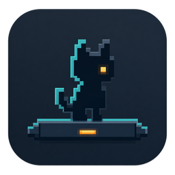
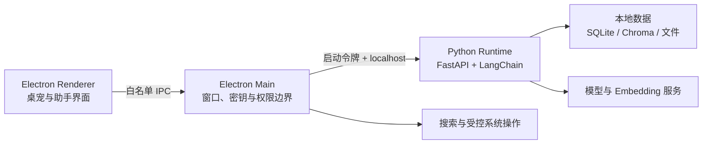

<p align="center">
  
</p>

<h1 align="center">PetDock</h1>

<p align="center">
  常驻桌面的可扩展 AI 助手，让桌宠不只是动画。
</p>

<p align="center">
  <a href="LICENSE"></a>
  
  
  
</p>

PetDock 是一个 Windows 桌面宠物与 AI 助手应用。它使用 Electron 提供透明桌宠、动画、拖拽和托盘交互，并由本地 Python Runtime 承载对话、记忆、知识库、附件分析、文件生成和 Skill 扩展。

项目目前处于早期开发阶段，优先支持 Windows 10/11。界面、配置格式和扩展协议仍可能调整。

## 功能

### 桌面宠物

- 透明、无边框、可置顶的桌面窗口
- spritesheet 动画、拖拽移动和屏幕边界约束
- 待机、挥手、跳跃、等待、工作、检查和失败等状态
- 托盘菜单、右键菜单、点击穿透和开机启动
- 内置与用户自定义桌宠切换
- 双击桌宠打开 AI 助手

### AI 助手

- OpenAI-compatible 模型接入与流式 Markdown 对话
- 会话历史、长期偏好和记忆候选管理
- PDF、DOCX、XLSX、PPTX、文本与图片附件
- 本地知识库、来源引用和可切换 Embedding Provider
- 受控 Artifact 文件生成与原生“另存为”
- 本地目录或 GitHub 公共仓库 Skill 安装
- Brave Search、火山引擎豆包搜索与网页读取
- 主模型、视觉模型、Embedding 和搜索能力独立启停

未配置在线模型时，助手自动使用离线 Mock 后端，方便体验界面和验证本地流程；Mock 后端不提供真实模型推理。

## 运行方式



- Renderer 不直接访问 Node.js、API Key、Runtime 端口或本地真实路径。
- Electron Main 管理密钥、IPC、文件对话框和系统操作，并重新校验工具风险。
- Python Runtime 负责任务编排、模型适配、记忆、检索和文档处理。
- Runtime 仅监听随机本机端口，并通过启动令牌鉴权。

更完整的进程边界和数据流参见 [AI 助手架构](docs/architecture/AI_ASSISTANT_ARCHITECTURE.md)。

## 快速开始

### 环境要求

- Windows 10/11
- Node.js `22.12+`
- Python `3.11+`
- npm

### 安装依赖

克隆仓库并进入项目目录后执行：

```powershell
npm.cmd ci

python -m venv python-runtime\.venv
python-runtime\.venv\Scripts\python.exe -m pip install -r python-runtime\requirements.lock
```

### 启动开发模式

```powershell
npm.cmd run dev
```

启动后双击桌宠打开助手。点击输入框旁的设置按钮，可以配置主模型、视觉模型、Embedding 和联网搜索。

主模型需要填写模型名称、API Key，以及可选的 OpenAI-compatible Base URL。API Key 使用 Electron `safeStorage` 加密保存在当前系统用户目录，不会写入仓库或回填到 Renderer。

## 能力配置

| 能力 | 默认行为 | 可选配置 |
| --- | --- | --- |
| 主模型 | 无密钥时使用 Mock 后端 | OpenAI-compatible API |
| 图片理解 | 默认沿用主模型配置 | 独立视觉模型和凭据 |
| Embedding | 离线 Hash 基线 | 白名单 ONNX 本地模型或在线 API |
| 联网搜索 | 默认关闭 | Brave Search 或火山引擎豆包搜索 |

图片附件只有在视觉能力主动探测通过后才会启用。切换 Embedding Provider 会重新加载知识库索引；在线 Embedding 会把待向量化的文本发送给所选服务。

环境变量仍可用于开发、CI 和故障排查：

| 变量 | 说明 |
| --- | --- |
| `PETDOCK_ASSISTANT_BACKEND` | `auto`、`mock` 或 `langchain` |
| `PETDOCK_LLM_API_KEY` | 主模型 API Key |
| `PETDOCK_LLM_BASE_URL` | OpenAI-compatible Base URL |
| `PETDOCK_LLM_MODEL` | 主模型名称，默认 `gpt-4o-mini` |
| `PETDOCK_PYTHON` | 开发模式下使用的 Python 解释器 |

应用设置优先用于普通使用场景。完整环境变量和开发约定参见 [开发指南](docs/guides/DEVELOPMENT.md)。

## 项目结构

```text
desktop-pet/
├─ assets/                 应用图标、助手静态配置和内置桌宠
├─ docs/                   架构、功能、开发指南和路线文档
├─ python-runtime/
│  ├─ app.py               Runtime 进程入口
│  ├─ petdock_runtime/
│  │  ├─ agent/            Agent 编排、后端适配和工具目录
│  │  ├─ api/              FastAPI 接口与资源装配
│  │  ├─ attachments/      附件存储、索引与分析
│  │  ├─ knowledge/        知识库服务
│  │  ├─ memory/           会话与长期记忆
│  │  ├─ rag/              检索、评分与向量存储
│  │  └─ skills/           Skill 安装、注册与持久化
│  └─ tests/               Python Runtime 测试
├─ src/
│  ├─ main/                Electron Main 与安全边界
│  ├─ preload/             受限 IPC API
│  ├─ renderer/            桌宠和助手界面
│  └─ shared/              跨进程共享类型
└─ tools/                  构建、冒烟测试和检索评估脚本
```

## 常用命令

| 命令 | 用途 |
| --- | --- |
| `npm.cmd run dev` | 启动开发模式 |
| `npm.cmd run debug` | 启动开发模式并打开 DevTools |
| `npm.cmd run typecheck` | TypeScript 类型检查 |
| `npm.cmd test` | 运行 Vitest 单元测试 |
| `npm.cmd run test:contracts` | 校验 Managed Service OpenAPI、Schema、样例和安全边界 |
| `npm.cmd run test:runtime` | 运行 Python Runtime 测试 |
| `npm.cmd run test:retrieval` | 运行检索评估 |
| `npm.cmd run build` | 构建 Electron 应用代码 |
| `npm.cmd run check` | 执行类型检查、测试、检索评估和构建 |
| `npm.cmd run pack` | 生成 Windows 解包应用 |
| `npm.cmd run dist` | 生成 NSIS 安装包和便携版 |

完整检查：

```powershell
npm.cmd run check
```

构建产物输出到 `release/`。`pack` 和 `dist` 会先使用 PyInstaller 构建 Python Runtime，因此需要已经初始化 `python-runtime\.venv`。

## 自定义桌宠

一个桌宠资源至少包含 manifest 和 spritesheet：

```text
assets/pets/<pet-id>/
├─ pet.json
└─ spritesheet.webp
```

最小 manifest：

```json
{
  "id": "my-pet",
  "displayName": "我的桌宠",
  "description": "自定义桌宠",
  "spritesheetPath": "spritesheet.webp"
}
```

未声明 `atlas` 和 `states` 时，默认使用 `8 x 9` 图集、`192 x 208` 单帧以及内置状态协议。用户资源也可以放入 PetDock 用户数据目录的 `pets` 文件夹，并通过托盘菜单刷新加载。

## 文档

- [文档索引](docs/README.md)
- [开发指南](docs/guides/DEVELOPMENT.md)
- [AI 助手架构](docs/architecture/AI_ASSISTANT_ARCHITECTURE.md)
- [官方托管服务进度与交接](docs/roadmap/MANAGED_SERVICE_PROGRESS.md)
- [附件、Artifact 与联网能力](docs/features/CONVERSATION_RESOURCE_CAPABILITIES.md)
- [RAG 检索设计](docs/features/RAG_RETRIEVAL_OPTIMIZATION.md)
- [Skill 系统](docs/features/SKILL_SYSTEM_DEVELOPMENT.md)
- [双模式服务实施计划](docs/architecture/MANAGED_SERVICE_IMPLEMENTATION_PLAN.md)

## 安全与隐私

PetDock 会处理模型密钥、本地文件和可能触发系统操作的工具调用。提交安全问题前请阅读 [安全策略](SECURITY.md)，不要在公开 Issue 中披露有效密钥、个人数据或可直接利用的漏洞细节。

在线模型、Embedding、视觉和搜索服务只在用户主动配置后使用。相关数据范围见 [隐私说明](PRIVACY.md) 和 [第三方在线服务说明](THIRD_PARTY_SERVICES.md)。

## Roadmap

当前版本以本地 Runtime 和用户自选模型服务为主。后续计划在保持本地模式的同时，增加官方账号与托管能力入口，两种模式共享客户端领域协议并保持服务实现解耦。设计基线见 [双模式服务实施计划](docs/architecture/MANAGED_SERVICE_IMPLEMENTATION_PLAN.md)。

## 许可证

项目自有代码和文档采用 [MIT License](LICENSE)。图片、图标和桌宠动画不自动适用 MIT，具体授权范围以 [素材授权说明](ASSET_LICENSES.md) 为准。第三方依赖及许可证见 [第三方依赖声明](THIRD_PARTY_NOTICES.md) 和 [完整许可证清单](THIRD_PARTY_LICENSES.txt)。
