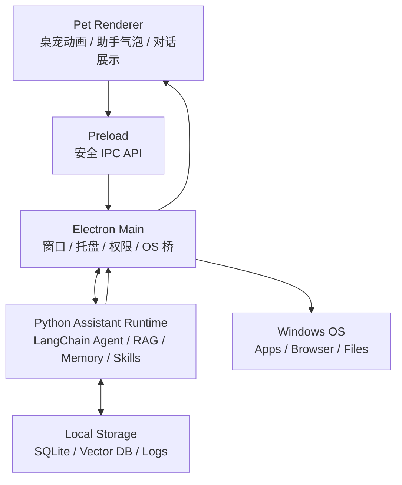

# PetDock AI 助手开发文档

## 1. 目标

PetDock 后续的 AI 能力不应该直接塞进桌宠窗口。桌宠应保持轻量，主要承担入口、交互、状态反馈和陪伴感；真正的 Agent、RAG、长期记忆、工具调用和技能系统应放在独立的 Assistant Runtime 中。

目标形态：

- 桌宠是常驻桌面的入口。
- 双击或快捷键唤起助手输入框。
- AI 能理解用户、电脑环境、常用应用、常用文件和历史偏好。
- AI 可以通过受控工具执行本地操作。
- 高风险操作必须经过权限确认。
- 后续可以引入 Python LangChain、RAG、skills、长期记忆和本地模型。

## 2. 总体架构

推荐架构是 **Electron 桌宠 + Python Assistant Runtime**。



核心分工：

- Electron Renderer：只负责 UI，不直接访问 API key、文件系统、模型或系统命令。
- Electron Main：负责桌面能力、安全边界、权限确认、启动/管理 Python Runtime。
- Python Runtime：负责 LangChain Agent、RAG、记忆、技能系统、工具规划。
- Tool Host：真正执行系统动作时优先回到 Electron Main，由 Main 做安全校验后执行。

## 3. 分层设计

```text
UI Layer
  单一透明窗口中的桌宠、助手输入框、对话展示、状态反馈和主题层

Electron Main Layer
  IPC、窗口管理、托盘、全局快捷键、权限确认、Python Runtime 生命周期

Assistant Runtime Layer
  LangChain Agent、模型调用、对话管理、多步规划、工具选择

RAG / Memory Layer
  文件索引、向量检索、长期记忆、用户偏好、电脑环境知识

Tool Layer
  打开网页、打开应用、打开文件/文件夹、受控文件操作、系统信息查询

Policy Layer
  权限等级、路径白名单、危险操作确认、执行审计、撤销策略
```

## 4. 推荐目录结构

```text
src/
  renderer/
    pet/
      animation.ts
      drag.ts
      petManifest.ts
    assistant/
      main.ts
      styles.css

  preload/
    index.ts

  main/
    index.ts
    window.ts
    tray.ts
    assistant/
      assistantPlacement.ts
      assistantManager.ts
      runtimeProcess.ts
      runtimeClient.ts
      permission.ts
      toolHost.ts

python-runtime/
  app.py
  agent/
    langchain_agent.py
    prompts.py
    planner.py
  llm/
    openai_compatible.py
    model_config.py
  tools/
    registry.py
    schemas.py
  rag/
    indexer.py
    retriever.py
    chunker.py
  memory/
    memory_store.py
    summarizer.py
  skills/
    registry.py
    loader.py
  policy/
    policy.py
    risk.py
  storage/
    sqlite.py
    vector_store.py
```

## 5. 通信方式

### v1 推荐：本地 HTTP + SSE/WebSocket

Electron Main 启动 Python Runtime，Python 只监听本机地址：

```text
127.0.0.1:<random-port>
```

建议接口：

```text
POST /v1/chat
GET  /v1/events/:taskId
POST /v1/cancel/:taskId
POST /v1/tool-result
GET  /health
```

连接约束：

- Runtime 必须绑定 `127.0.0.1`，不能绑定 `0.0.0.0`。
- Runtime 让操作系统分配随机端口，并通过 stdout 输出单行 readiness JSON；普通日志只写 stderr。
- Electron Main 每次启动生成新的 256-bit 随机令牌，通过子进程环境变量传入 Runtime。
- 除 `/health` 的启动探测外，每个请求都必须校验 `Authorization: Bearer <token>`。
- Renderer 不接触端口和令牌，只能通过受限 preload 调用 Electron Main。
- 流式事件必须携带单调递增的 `sequence`，便于检测丢失、乱序和重复事件。

Runtime 生命周期：

```text
stopped -> starting -> ready -> stopping -> stopped
                       |
                       -> failed
```

- 启动等待上限为 10 秒，超时后终止子进程并返回明确错误。
- Runtime readiness 必须包含 `protocolVersion`、`port` 和进程信息。
- 协议版本不兼容时拒绝建立连接，不能静默降级。
- 应用退出先请求优雅关闭，3 秒内未退出再终止子进程。
- Runtime 意外退出后终止当前任务；第一版允许用户手动重试，不自动无限重启。

优点：

- LangChain 流式输出容易接。
- Python 服务容易独立调试。
- 后续拆成独立本地服务成本低。

### 备选：stdio JSON-RPC

Electron `spawn` Python 进程，通过 stdin/stdout 传 JSON。

优点是少一个端口；缺点是流式调试、错误恢复和协议演进更麻烦。当前项目更推荐 HTTP + SSE/WebSocket。

## 6. 关键接口

桌宠和助手 UI 共用同一个受限 preload，只暴露当前 renderer 需要的安全 API：

```ts
window.desktopPet.openAssistant()
window.desktopPet.askAssistant(input)
window.desktopPet.cancelAssistant(taskId)
window.desktopPet.onAssistantEvent(callback)
```

Electron Main 与 Python Runtime 的消息建议使用统一结构：

```ts
interface AssistantRequest {
  protocolVersion: 1
  taskId: string
  conversationId: string
  input: string
  source: 'pet' | 'assistant-window' | 'shortcut'
  context: {
    activePetId: string
    locale: string
    timezone: string
  }
}

interface AssistantEvent {
  protocolVersion: 1
  taskId: string
  sequence: number
  type: 'message_delta' | 'tool_call' | 'permission_required' | 'tool_result' | 'done' | 'error'
  payload: unknown
}
```

TypeScript 的规范定义放在 `src/shared/assistant.ts`。Python Runtime 使用等价的 Pydantic 模型，并在协议测试中用固定 JSON fixtures 校验两端兼容性。

Tool 调用建议：

```ts
interface ToolCall {
  id: string
  name: string
  args: unknown
  risk: 'safe' | 'confirm' | 'dangerous'
  preview: string
}
```

阶段 2 已实现 `POST /v1/tool-result`。Runtime 发出 `tool_call` 后暂停当前任务，Electron Main 重新计算风险等级；安全工具直接执行，需要确认的工具通过助手确认卡片等待用户决策，执行结果再回传 Runtime 继续推理。Renderer 只能提交 `taskId`、`toolCallId` 和决策，不能覆盖 Main 保存的工具参数。

## 7. 权限与安全边界

原则：**Python Agent 可以规划，但不能直接执行高风险系统操作。**

工具执行路径：

```text
LangChain 生成 tool call
  -> Python Runtime 发给 Electron Main
  -> Electron Main 做 policy 检查
  -> 必要时弹确认框
  -> Electron Main 执行 OS 操作
  -> 结果返回 Python Runtime
  -> Agent 继续推理并回复用户
```

风险等级：

```text
safe
  打开网页
  查询应用路径
  打开已允许目录
  读取小型文本文件

confirm
  打开本地应用
  创建文件
  修改文件
  移动文件
  写入配置

dangerous
  删除文件
  批量移动/重命名
  执行 shell
  修改系统设置
  访问敏感目录
```

默认策略：

- Renderer 永远不能直接拿到 API key。
- Renderer 永远不能直接调用 Node 文件系统。
- 单一 renderer 使用最小化 preload，IPC handler 必须校验调用窗口身份。
- Electron renderer 启用 sandbox、context isolation 和 CSP。
- Python Runtime 不直接执行 shell。
- API key 生产环境使用 Electron `safeStorage` 加密保存；开发环境可从未提交的环境变量读取。
- API key 不写入 `settings.json`、日志、Runtime readiness 或 IPC payload。
- 文件操作限制在用户授权目录。
- 删除、覆盖、批量操作必须确认。
- 每次工具执行写入审计日志。

阶段 2 工具边界：

- `open_url` 只允许 `http` 和 `https`，通过 `shell.openExternal` 执行。
- `open_app` 只允许 `notepad`、`explorer`、`calculator`，且每次调用需要确认。
- `open_file_or_folder` 只允许打开已经存在且可以解析真实路径的文件或目录，每次调用需要确认。
- 未注册工具、shell、删除、写入和系统设置操作直接拒绝。
- 确认请求 60 秒过期，助手关闭、任务取消或 Runtime 退出时失效。
- 审计日志保存于用户数据目录下的 `logs/tools.log`。

## 8. 能力列表

### v1 基础能力

- 双击桌宠打开助手输入框。
- 输入框支持发送、取消、加载状态。
- 支持普通 AI 对话。
- 支持打开网页。
- 支持打开常用应用。
- 支持打开文件或文件夹。
- 支持工具调用前确认。
- 支持基础执行日志。

### v2 本地助手能力

- 常用应用索引。
- 常用目录白名单。
- 文件搜索。
- 小文本文件读取和总结。
- 创建文件。
- 移动文件。
- 修改文件前生成 diff 或摘要。
- SQLite 会话历史。
- 用户偏好记忆。

### v3 RAG 能力

- 本地文件索引。
- 文档 chunk。
- embedding。
- 向量检索。
- 项目级知识库。
- 最近文件/最近项目上下文。
- 对话摘要记忆。

### v4 Skill 能力

- skill 注册表。
- skill manifest。
- skill 权限声明。
- skill 参数 schema。
- skill 启停与版本管理。
- 用户自定义 skill 目录。

### v5 重 Agent 能力

- 多步任务规划。
- 长任务后台执行。
- 任务暂停/恢复。
- 任务状态面板。
- 本地模型或混合模型路由。
- 多端控制或远程同步。

## 9. Skill 系统占位设计

Skill 系统用于把特定领域能力做成可安装、可启用、可禁用的能力包。当前阶段先保留架构占位，不急于实现完整插件市场或复杂运行时。

初步目标：

- 支持用户安装本地 skill。
- 支持 skill 声明名称、版本、描述、入口、参数 schema。
- 支持 skill 声明所需权限。
- 支持启用/禁用 skill。
- 支持将 skill 暴露给 Agent 作为工具或工作流。
- 支持后续扩展为脚本型 skill、Python skill、HTTP skill 或 MCP-like skill。

建议目录：

```text
PetDock userData/
  skills/
    open-browser/
      skill.json
      README.md
      handler.py
    project-helper/
      skill.json
      handler.py
```

skill manifest 占位：

```json
{
  "id": "project-helper",
  "name": "Project Helper",
  "version": "0.1.0",
  "description": "Project-specific assistant utilities.",
  "entry": "handler.py",
  "runtime": "python",
  "permissions": ["read_files", "open_url"],
  "tools": [
    {
      "name": "summarize_project",
      "description": "Summarize a project directory.",
      "schema": {}
    }
  ]
}
```

待决策问题：

- skill 是否允许联网。
- skill 是否允许执行本地进程。
- skill 是否允许访问用户文件。
- skill 的权限授权是安装时确认，还是首次调用时确认。
- skill 是否需要签名或来源校验。
- skill 是否允许热更新。
- skill 日志和错误如何展示给用户。

安全原则：

- skill 不能绕过 Electron Main 的权限系统。
- skill 的文件访问必须走授权目录。
- skill 执行日志必须可追踪。
- 危险 skill 默认禁用。
- 第三方 skill 不默认拥有 shell 权限。

第一阶段只建议实现：

- 本地 skill 目录扫描。
- manifest 读取和校验。
- 启用/禁用状态存储。
- 将安全 skill 注册为 Agent tool。

## 10. RAG 文档管理设计

RAG 文档管理用于让 PetDock 理解用户指定的文档、项目、笔记和本地知识库。阶段 4 已实现首个完整闭环，文件索引逻辑保持在独立知识库模块中。后续检索路由、Embedding、召回、精排和评测以 `docs/RAG_RETRIEVAL_OPTIMIZATION.md` 为实现基线。

初步目标：

- 用户可以添加文档库。
- 用户可以选择允许索引的目录。
- 支持手动触发索引。
- 支持查看索引状态。
- 支持暂停、恢复、删除索引。
- 支持按项目、目录、标签组织文档。
- 支持后续接入 embedding 和向量检索。

建议概念模型：

```text
Knowledge Library
  一个用户配置的知识库，例如“工作项目”“个人笔记”“学习资料”

Document Source
  知识库中的一个来源，例如某个目录、单个文件、网页导出、Markdown 集合

Document
  被索引的文件或资料

Chunk
  文档切分后的检索单元

Embedding
  Chunk 对应的向量表示
```

阶段 4 数据模型：

```text
knowledge_libraries
  id
  name
  source_path
  display_path
  status / progress / error
  created_at
  updated_at
  last_indexed_at

documents
  id
  library_id
  relative_path
  title
  content_hash
  modified_ns
  embedding_state
  indexed_at

document_chunks
  id
  document_id
  chunk_index
  content
  token_count

document_chunks_fts
  chunk_id
  library_id
  content

Chroma collection: petdock_knowledge_v1
  chunk id
  embedding
  libraryId / documentId metadata
```

阶段 4 已决策：

- 向量库使用 Chroma 1.5，本地 embedding 使用 384 维确定性 hash 基线。
- 第一版仅索引允许扩展名内、UTF-8 编码且不超过 2 MB 的文本文件。
- 使用手动增量刷新，不启用文件系统 watcher。
- 默认排除隐藏目录、构建目录、依赖目录、符号链接和敏感文件名。
- 删除知识库同时删除 SQLite/FTS5/Chroma 数据，不删除来源文件。
- 知识库默认不参与对话；用户主动勾选后，命中片段才进入当前模型上下文。

后续待决策：

- 语义 embedding provider、模型和维度。
- PDF、DOCX、PPTX 解析策略。
- watcher、父子分块、query rewrite 和 reranker。

安全原则：

- 默认不索引整个用户目录。
- 用户必须显式添加允许目录。
- 索引状态必须可见。
- 用户可以删除知识库和索引数据。
- 云端 embedding 或云端模型使用文档内容前必须有明确配置。
- 不索引 `.env`、密钥、浏览器配置、系统凭据等敏感文件。

阶段 4 已实现：

- `knowledge.db` 业务主存储与 Chroma 可重建向量索引。
- Electron Main 原生目录授权和脱敏来源展示。
- UTF-8 文本、Markdown、配置文件和常见源码扫描。
- 本地 embedding、SQLite FTS5 与 Chroma 混合召回。
- 增量刷新、暂停、恢复、错误状态和结构化引用。
- 敏感文件、链接、构建目录、超大文件和非文本内容排除。

## 11. 存储设计

建议使用 SQLite 作为第一存储：

```text
assistant.db
  conversations
  messages
  memories
  tool_logs
  app_index
  file_index
  permissions
```

向量库可以后置：

```text
vector_index/
  files
  projects
  notes
```

第一版不要急着接复杂向量库。先把接口留出来：

```python
class Retriever:
    def search(self, query: str, limit: int) -> list[RetrievedChunk]:
        ...
```

## 12. LangChain 集成位置

LangChain 应只存在于 Python Runtime 内部，不应进入 Electron UI 层。

建议抽象：

```python
class AgentBackend:
    async def run(self, request: AssistantRequest) -> AsyncIterator[AssistantEvent]:
        ...
```

可替换实现：

```text
LangChainBackend
NativeToolCallingBackend
CustomPlannerBackend
```

这样未来即使从 LangChain 切换到其他 Agent 框架，Electron UI、权限系统、工具执行层也不需要重构。

## 13. 打包与部署

Python Runtime 有两种打包方式：

### 方式 A：跟随 Electron 安装包

使用 PyInstaller 或类似工具把 Python Runtime 打成可执行文件：

```text
resources/
  python-runtime/
    petdock-assistant.exe
```

Electron 启动时 spawn 该 exe。

优点：

- 用户无需安装 Python。
- 安装体验简单。

缺点：

- 包体变大。
- Python 依赖升级需要重新打包。

### 方式 B：开发期使用系统 Python

开发阶段可以直接运行：

```text
python python-runtime/app.py
```

Electron Main 连接本地端口。

生产环境仍推荐方式 A。

阶段 1 已实现两种方式：

- 开发环境优先使用 `python-runtime/.venv/Scripts/python.exe`，也可通过 `PETDOCK_PYTHON` 指定解释器。
- `npm.cmd run build:runtime` 使用 PyInstaller 生成独立 `petdock-assistant.exe`。
- electron-builder 将 exe 复制到 `resources/python-runtime/petdock-assistant.exe`。
- Runtime backend 默认为 `auto`：存在 `PETDOCK_LLM_API_KEY` 时使用 LangChain，否则使用离线 mock。

OpenAI-compatible 配置：

```text
PETDOCK_ASSISTANT_BACKEND=auto | mock | langchain
PETDOCK_LLM_API_KEY=<secret>
PETDOCK_LLM_BASE_URL=<optional OpenAI-compatible base URL>
PETDOCK_LLM_MODEL=<model name, default gpt-4o-mini>
PETDOCK_PYTHON=<optional development Python executable>
```

这些变量只由 Electron Main 继承并传给 Runtime，不通过 preload 或 IPC 暴露给 Renderer。

## 14. 演进路线

### 阶段 1：输入框 + 普通聊天

- 桌宠与助手使用同一个透明窗口；展开时扩大组合窗口，收起时恢复桌宠尺寸。
- 根据桌宠两侧可用空间决定停靠方向，输入框从桌宠一侧向外展开。
- 展开状态拖动整个组合窗口，桌宠和输入框使用同一坐标系，不存在双窗口跟随延迟。
- 助手可切换五套主题；主题只覆盖可见控件，不改变透明窗口背景和布局契约。
- 当前主题写入用户设置，启动时恢复；新增主题只需扩展主题 ID、变量和菜单注册。
- 双击桌宠改为唤起助手；跳跃动作继续保留在托盘和右键菜单。
- Electron Main 启动 Python Runtime。
- 支持普通 LangChain 对话。
- 支持流式回复。

验收：

- 双击桌宠能唤起输入框。
- 输入后能得到 AI 回复。
- 关闭输入框不影响桌宠运行。

### 阶段 2：工具调用

状态：已完成

- 加工具注册表。
- 支持 `open_url`。
- 支持 `open_app`。
- 支持 `open_file_or_folder`。
- 加权限确认弹窗。

验收：

- AI 可以打开网页。
- AI 可以打开白名单应用。
- 高风险操作会先询问用户。

### 阶段 3：记忆

- SQLite 会话历史、用户偏好、常用应用、常用目录和工具执行日志。
- Runtime 通过 `/v1/memory`、`/v1/memory/conversation/:id`、`/v1/memory/item` 和 `/v1/memory/clear` 提供受鉴权的查询、恢复和清理接口。
- 数据库位于 Electron 用户数据目录的 `assistant.db`，由 Python Runtime 管理，Renderer 不直接访问文件。
- 目录和工具参数返回 Renderer 前必须脱敏；工具审计仍保留独立 JSONL 日志。
- 助手窗口提供会话历史、长期记忆、使用记录和清理操作，不新增独立窗口。
- LangChain 主代理可以调用 Runtime 内部的 `remember_preference`、`forget_memory` 和 `list_memories` 工具；这些工具只操作本地记忆，不经过 OS 工具权限流程。
- 每轮主代理任务结束后，Runtime 异步运行受约束的记忆分析器，生成待确认候选；候选默认不写入正式记忆，用户确认后才生效。

验收：

- AI 能记住用户常用应用。
- AI 能引用最近对话上下文。
- 用户可清理记忆。

### 阶段 4：RAG

- 独立 SQLite 知识库主存储与 Chroma 持久化向量索引。
- 安全文件扫描、文档 chunk 和本地 embedding。
- FTS5 + Chroma 混合检索与 RRF 排序。
- 项目知识库、后台增量索引和来源引用。
- 索引暂停、恢复、刷新和删除。

验收：

- AI 能基于指定目录回答问题。
- 用户可指定哪些目录允许索引。
- 索引过程可暂停/恢复。

### 阶段 5：Skill 系统

- skills 目录。
- skill manifest。
- 参数 schema。
- 权限声明。
- skill 热加载。

验收：

- 用户能安装/启用/禁用 skill。
- skill 不能绕过权限系统。

## 15. 当前建议

第一版不要直接做完整重 Agent。建议先实现最小闭环：

```text
桌宠双击
  -> 打开输入框
  -> Electron Main 调 Python Runtime
  -> LangChain 返回回复
  -> 输入框显示回复
```

随后再加入：

```text
open_url
open_app
open_file_or_folder
permission_confirm
```

这样边界是正确的，后续接 RAG、tool、skill 不需要推翻重做。
