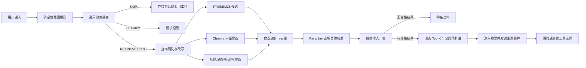

# PetDock RAG 召回与检索质量优化方案

版本：1.1
更新日期：2026-07-28
状态：现行开发基线（R0/R3/R4 部分完成、R1 完成、R2 主体已实现但未完成正式验收）

## 1. 文档目的

本文档用于约束 PetDock 后续 RAG 检索优化的方向、边界、实施顺序和验收标准。后续涉及检索路由、Chunk、Embedding、Chroma、FTS5、融合排序、Reranker、来源引用和检索评测的开发，应以本文档为实现基线。

相关文档：

- 总体架构：`docs/AI_ASSISTANT_ARCHITECTURE.md`
- 阶段进度：`docs/AI_ASSISTANT_PROGRESS.md`
- 本地模型清单：`docs/EMBEDDING_MODEL_WHITELIST.md`
- 机器可读白名单：`assets/assistant/embedding-model-whitelist.json`

本文中的“召回优化”不是单独提高 Recall@K。PetDock 必须同时解决以下问题：

- 需要检索时尽量找全相关资料。
- 不需要检索时不访问知识库。
- 知识库没有答案时允许返回零条资料。
- 最终注入模型的资料应少而相关，避免干扰回答和工具调用。
- 不同设备、模型和知识库规模下仍然可评测、可回滚、可解释。

## 2. 当前实现基线

当前 RAG v2 实现如下：

- 用户主动勾选知识库后，Electron Main 将知识库 ID 附加到聊天请求。
- Runtime 使用确定性 `RetrievalPlan` 区分 `SKIP`、`RETRIEVE`、`BOTH` 和 `CLARIFY`，明确目标的工具请求和普通闲聊默认不检索。
- 文档使用 Chunk v2 按结构块和 Token 预算切分，目标 320 tokens、上限 448 tokens、字符重叠 96。
- SQLite 保存知识库、文档、Chunk、Embedding Signature 和索引任务，FTS5 提供关键词召回。
- Chroma 按 Index Signature 使用独立 collection，支持 Hash、本地 ONNX 和 OpenAI-compatible 在线 Provider。
- 向量和关键词通道各取 40 个候选，通过 Weighted RRF、多信号准入和去重得到动态 `0-5` 条最终来源。
- Provider 使用各自的候选与最终相似度门槛；查询锚点和最终分数共同决定是否允许零结果。
- 活动向量检索失败时仅降级到独立 Hash 影子索引和 FTS5，不混用不同向量空间。
- `retrieval_sources` 只在检索完成且来源通过最终准入后发送。
- 每次检索记录脱敏 Trace，管线版本固定为 `rag-v2`；当前固定评测集包含 32 条用例并生成 JSON 报告。

当前实现已经完成 R1 误召回治理和 R2 的主要基础设施，但 R0 评测规模与 R2 真实模型验收尚未达到本文完成门槛。

### 2.1 当前剩余问题

1. 固定评测集只有 32 条，尚未达到 200 条以上的阶段门槛，当前满分不能代表复杂真实知识库质量。
2. 本地 ONNX Provider 虽已实现并完成单模型 Runtime 加载验证，但两个模型的打包版下载、索引、查询、切换和回滚尚未完成完整验收。
3. Provider 阈值仍是首版配置，尚未按足够规模的数据集分别校准。
4. Chunk v2 已按结构和 Token 预算切分，但父子分块、标题层级增强和相邻 Chunk 扩展尚未实现。
5. 当前最终准入使用确定性多信号评分，没有接入经过独立评测的 Reranker。
6. 评测报告尚未覆盖完整的 Recall@K、分类型统计、P50/P95、峰值内存和磁盘占用。

## 3. 优化目标与非目标

### 3.1 优化目标

- 建立检索前路由，纯工具请求和普通闲聊默认跳过 RAG。
- 建立可插拔 Embedding Provider，支持白名单本地 ONNX、在线 API 和 Hash 降级。
- 使用结构化、模型长度安全的 Chunk，提高候选召回和上下文纯度。
- 保留 FTS5 与 Chroma 混合召回，并补充标题、路径和精确标识符信号。
- 建立候选融合、精排、去重和最终准入门槛。
- 动态返回 `0-5` 条资料，普通单问题默认不超过 3 条。
- 建立固定评测集、指标报告和检索 Trace，所有优化用数据验收。
- 模型切换、索引重建和故障降级不破坏现有可用索引。

### 3.2 当前非目标

- 第一轮优化不支持每个知识库使用不同 Embedding 模型。
- 第一轮优化不自动微调 Embedding 或 Reranker。
- 没有评测收益前不引入 HyDE、大规模多查询或复杂 Agentic RAG。
- 不把 Chroma 作为业务主数据库，SQLite 仍然保存可核查原文和索引状态。
- 不允许用户输入任意本地模型下载地址；本地模型必须来自内置白名单。

## 4. 不可偏离的技术原则

1. **先路由，后检索。** 不能继续以“勾选了知识库”作为每轮必定检索的条件。
2. **允许零召回。** 有候选不代表候选相关，最终准入可以返回空结果。
3. **向量空间严格隔离。** 不同模型、版本、维度、池化或前缀产生的向量不能混用。
4. **阈值必须经过评测校准。** 不允许把一个模型的余弦距离阈值直接复制给另一个模型。
5. **RRF 不是相关性判定器。** RRF 只用于候选融合，最终必须有精排或准入判断。
6. **检索原文以 SQLite 为准。** Chroma 中只保存向量和最小过滤 metadata，索引可删除重建。
7. **模型切换必须原子化。** 新索引完成前继续使用旧索引，不允许半成品索引接管查询。
8. **降级不能混查向量。** 在线模型失败后不能使用 Hash 查询在线模型生成的 collection。
9. **引用只展示最终结果。** 被精排或阈值淘汰的候选不得发送给 Renderer 或模型。
10. **资料不能扩大工具权限。** 检索内容始终是不可信上下文，不能授权工具调用。
11. **隐私选择必须显式。** 在线 Embedding 会发送 Chunk 和查询，必须在配置前明确告知用户。
12. **优化必须可回归。** 模型、Chunk、融合权重或阈值变化必须生成固定评测报告。

## 5. 目标检索流程



每个阶段必须保留结构化 Trace，便于回答“为什么检索”“为什么召回这条”“为什么淘汰这条”。

## 6. 检索路由

### 6.1 路由结果

```text
SKIP
  不访问知识库，直接对话或执行工具。

RETRIEVE
  需要知识库依据，执行检索后回答。

BOTH
  需要先读取知识库，再根据资料回答或调用工具。

CLARIFY
  意图或操作目标不明确，先向用户澄清。
```

建议数据结构：

```text
RetrievalPlan
  route
  reason
  confidence
  originalQuery
  retrievalQuery
  exactTerms
  selectedLibraryIds
```

### 6.2 确定性规则优先

以下高置信请求直接 `SKIP`：

- 打开明确的 `http` 或 `https` URL。
- 打开明确应用、文件或目录。
- 关闭、切换、暂停等纯桌面工具命令。
- 简单寒暄、感谢、确认和取消。
- 工具结果续轮，除非原始计划为 `BOTH` 且明确需要再次检索。

以下请求进入 `RETRIEVE`：

- 明确询问已选知识库中的文档、配置、流程、事实或代码。
- 要求总结、比较、定位或引用本地资料。
- 问题包含“项目里”“文档中”“知识库中”等资料范围表达。

以下请求进入 `BOTH`：

- “打开项目文档中提到的测试网址”。
- “找到部署说明并打开对应目录”。
- 其他必须先从知识库确定工具参数的请求。

路由不能仅依赖大模型。确定性规则先处理明确工具命令，剩余请求再由轻量分类器或主模型给出结构化判断。路由失败时应记录错误并采用可解释降级，不得静默恢复为每轮无条件检索。

## 7. 查询处理

### 7.1 原始查询与检索查询分离

- `originalQuery` 用于最终回答和工具意图理解。
- `retrievalQuery` 只用于知识库检索。
- URL、协议、纯工具动词和无信息域名后缀不应污染向量查询。
- 类名、方法名、配置键、错误码、文件名和路径片段必须作为 `exactTerms` 保留。

示例：

```text
原始查询：打开项目文档里记录的 staging API 地址
检索查询：项目文档 staging API 地址
精确词：staging, API
路由：BOTH
```

### 7.2 Query Rewrite 边界

- 初版最多生成一个改写查询，原查询必须同时保留。
- 改写不能删除版本号、错误码、标识符或否定词。
- 改写模型失败时直接使用清洗后的原查询。
- 多查询扩展只有在固定评测集证明 Recall@K 明显提升且误召回可控后才能启用。

## 8. 文档解析与 Chunk 策略

### 8.1 从固定字符切分升级为结构化切分

建议新增 `chunkStrategyVersion=v2`：

- Markdown 按标题层级、段落、列表和代码块切分。
- 源码优先按类、函数、方法和顶层声明切分。
- JSON、YAML、TOML 按对象或配置段切分。
- 普通文本按段落和句子边界切分。
- 超长结构块再按 Token 上限二次切分。
- 不在标题、代码标识符或单词中间硬切。

首轮校准默认值：

| 参数 | 初始值 | 说明 |
| --- | ---: | --- |
| Child 目标长度 | 320 tokens | 用于候选命中 |
| Child 最大长度 | 448 tokens | 为 512 Token 模型预留查询前缀和特殊 Token 空间 |
| 重叠长度 | 48 tokens | 只在二次切分时使用 |
| Parent 长度 | 900-1400 tokens | 命中后扩展回答上下文，不直接生成向量 |

这些数值是首轮实现参数，不是永久结论。最终值必须通过不同文档类型的 Recall、Precision 和上下文冗余率确定。

### 8.2 Chunk Metadata

SQLite 至少需要保存：

```text
libraryId
documentId
relativePath
title
headingPath
sourceType
language
chunkIndex
parentChunkId
contentHash
chunkStrategyVersion
tokenCount
```

结构解析结果和最终向量 Chunk 应分层保存。切换 Embedding 模型时可以复用文档解析结果，但如果模型 Tokenizer 或最大长度导致 Chunk 内容变化，必须生成新的 Chunk/索引版本。

### 8.3 去重

- 完全相同的 Chunk 按内容 Hash 去重。
- 同一文档相邻 Chunk 高度重叠时，只保留排名最高者，再按需扩展父段落。
- 最终结果默认限制同一文档最多 2 条，除非问题明确需要多个章节。
- 不同文档中的重复模板内容应降低权重，避免模板占满 Top-K。

## 9. Embedding Provider 与模型策略

### 9.1 统一接口

```python
class EmbeddingProvider(Protocol):
    """统一封装本地、在线和 Hash 向量模型。"""

    @property
    def descriptor(self) -> EmbeddingDescriptor:
        ...

    async def health_check(self) -> None:
        ...

    async def embed_documents(self, texts: list[str]) -> list[list[float]]:
        ...

    async def embed_query(self, text: str) -> list[float]:
        ...
```

必须区分 `embed_documents` 和 `embed_query`，因为 BGE、E5 等模型使用不同查询指令、文档前缀或池化方式。

已实现：

- `OnnxLocalEmbeddingProvider`
- `OpenAICompatibleEmbeddingProvider`
- `HashEmbeddingProvider`

### 9.2 首版本地模型白名单

| 模型 | 档位 | 下载体积 | 维度 | 主要范围 |
| --- | --- | ---: | ---: | --- |
| BGE Small 中文 v1.5 INT8 | 轻量 | 24.5 MB | 512 | 低配置中文知识库 |
| BGE Base 中文 v1.5 INT8 | 均衡 | 103.3 MB | 768 | 中文项目文档 |
| Multilingual E5 Small INT8 | 均衡 | 135.4 MB | 384 | 中英文混合资料 |
| BGE Large 中文 v1.5 INT8 | 高质量 | 327.8 MB | 1024 | 大型中文知识库 |

模型文件、revision、池化、前缀和 SHA-256 以 `assets/assistant/embedding-model-whitelist.json` 为唯一事实来源。

白名单不代表默认推荐顺序。默认模型必须根据 PetDock 自有评测集决定，不能依据模型大小、公开榜单或少量人工示例直接确定。

### 9.3 模型下载与健康检查

- Electron Main 负责下载，Renderer 不接触任意 URL 和真实模型路径。
- 文件先写入 `.partial`，完成后校验长度和 SHA-256，再原子重命名。
- Runtime 启动模型时验证 ONNX 输入、输出维度、有限数值、池化和归一化。
- 模型健康检查失败时不得创建或切换活动索引。
- 第三方 ONNX 转换产物正式发布前应在 PetDock CI 中复验，长期建议自行导出并托管审核产物。

### 9.4 在线模型

在线 Provider 至少配置：

```text
providerId
baseUrl
model
dimensions
apiKeyReference
batchSize
timeout
```

- API Key 由 Electron `safeStorage` 加密保存。
- 启用前明确提示“建库会上传 Chunk，查询会上传问题”。
- 在线模型失败后立即使用 FTS5，并在存在独立 Hash 影子索引时加入 Hash 候选。
- 不允许使用 Hash 查询在线模型建立的 Chroma collection。

### 9.5 Hash 降级

Hash Embedding 保留为零下载兼容基线，不作为语义模型宣传。启用语义模型后，建议继续维护独立 Hash 影子 collection：

- 文档变化时同步更新 Hash 向量。
- 本地模型损坏、在线服务超时或用户离线时可以立即降级。
- Hash 命中必须使用单独校准阈值，并与 FTS5 结合。
- UI 和日志明确记录当前是否处于降级状态。

## 10. 索引版本与原子切换

### 10.1 Index Signature

以下字段共同生成稳定的 `indexSignature`：

```text
providerType
modelId
modelRevision
dimensions
distanceMetric
pooling
normalize
queryPrefix
documentPrefix
chunkStrategyVersion
tokenizerVersion
```

Chroma collection 使用版本化名称：

```text
petdock_knowledge_<indexSignature 前 16 位>
```

### 10.2 切换规则

1. 用户选择新模型。
2. 模型下载并通过健康检查。
3. 后台创建新索引版本，旧索引继续服务。
4. SQLite 记录每个知识库的新索引进度和错误。
5. 全部目标知识库达到 `ready` 后原子切换活动签名。
6. 保留上一版索引用于回滚，确认稳定后再清理。

第一版只支持一个全局活动 Embedding Profile。每库独立模型会带来跨模型分数归一化和索引管理复杂度，推迟到统一 Reranker 和评测体系稳定后再评估。

## 11. 多路候选召回

### 11.1 候选通道

首轮校准默认值：

| 通道 | 候选数 | 主要价值 |
| --- | ---: | --- |
| Chroma 向量 | 40 | 语义相似内容 |
| FTS5/BM25 正文 | 40 | 关键词和代码标识符 |
| 标题/路径/Heading | 20 | 文件定位和结构定位 |

候选数是进入融合前的上限，不是最终注入模型的数量。候选阶段优先保证 Recall，最终精度由融合、精排和准入门槛负责。

### 11.2 关键词检索

- URL 协议、域名后缀和常见停用词不应单独形成有效命中。
- 类名、方法名、配置键、文件名、错误码和带符号标识符应支持精确匹配。
- 标题、相对路径和 Heading 单独建立可加权字段，不能只检索正文。
- 中文分词策略必须通过评测验证；当前正则词元只作为兼容基线。

### 11.3 向量检索

- Chroma 使用余弦距离，collection 必须记录模型签名。
- 候选阶段只使用按模型校准的宽松门槛，避免过早损失 Recall。
- 禁止继续使用跨模型通用的固定 `distance < 0.92`。
- 原始距离必须保留到 Trace，不应在 Chroma 封装层丢失。

### 11.4 候选融合

首版继续使用 Weighted RRF，默认 `k=60`：

```text
fusedScore = Σ channelWeight / (60 + rank) + exactMatchBoost
```

初始权重仅用于启动校准：

```text
vector = 1.0
lexical = 1.0
title/path = 1.5
```

必须同时保留向量距离、BM25 分数、精确命中字段和各通道排名。RRF 分数只用于候选排序，不能直接作为最终相关性分数。

## 12. 精排、准入与动态 Top-K

### 12.1 精排阶段

目标是对融合后的前 20-30 条候选判断“该 Chunk 是否能帮助回答当前问题”。

实施顺序：

1. 在 Reranker 尚未接入时，使用多信号规则和按模型校准的分数进行过渡。
2. 建立独立 Reranker 白名单和 Provider。
3. 本地 Cross-Encoder 对候选进行精排；在线 Reranker 必须单独获得隐私授权。
4. Reranker 不可用时回退到融合排序和更严格的准入门槛。

Reranker 模型和 Embedding 模型职责不同，不能因为 Embedding 模型更大就省略最终相关性判断。

### 12.2 最终准入

最终结果必须支持零条：

- 第一名低于模型对应的最低相关性阈值：返回 0 条。
- 只有一条通过阈值：返回 1 条。
- 普通单问题默认最多返回 3 条。
- 多文档比较或多部分问题最多返回 5 条。
- 后续候选与第一名分数差距过大时提前截断。
- 同文档重复 Chunk 经过合并后再计算最终数量。

阈值按以下键保存：

```text
embeddingProfileId
rerankerProfileId
retrievalPipelineVersion
evaluationDatasetVersion
```

不能根据单次人工测试临时调整生产阈值。

### 12.3 来源发送时机

`retrieval_sources` 只能在以下步骤完成后发送：

```text
路由 → 候选召回 → 融合 → 精排 → 最终准入 → 去重/扩展
```

工具请求路由为 `SKIP` 时不生成来源。路由为 `BOTH` 时，只有真正参与回答或工具参数解析的资料才展示为引用。

## 13. 评测体系

### 13.1 评测集优先

在调整模型、Chunk、候选数量、权重或阈值之前，先建立版本化评测集。建议计划新增：

```text
python-runtime/tests/fixtures/retrieval_eval/
  documents/
  queries.jsonl

tools/evaluate_retrieval.py
outputs/rag-eval/<pipeline-version>.json
```

单条查询建议字段：

```json
{
  "id": "tool-open-url-001",
  "query": "打开网站 https://example.com",
  "expectedRoute": "SKIP",
  "relevantDocumentIds": [],
  "relevantChunkIds": [],
  "noAnswer": true,
  "tags": ["tool", "url", "negative"]
}
```

评测集至少覆盖：

- 打开 URL、应用、文件和目录。
- 寒暄、确认和普通闲聊。
- 知识库有明确答案的问题。
- 知识库没有答案的问题。
- 中文同义表达和长短查询。
- 英文、代码标识符、配置键、错误码和路径。
- 多文档比较、多跳和需要 `BOTH` 路由的请求。
- 高度相似但不相关的困难负样本。
- 同一文档相邻 Chunk 和重复模板。

初始数据量不少于 200 条，达到稳定开发后扩展到 500 条以上。数据分为校准集和独立测试集，阈值只能使用校准集调整。

### 13.2 核心指标与初期门槛

| 指标 | 含义 | 初期验收目标 |
| --- | --- | ---: |
| Route Accuracy | 是否正确决定检索 | `>= 97%` |
| 工具请求误检索率 | 纯工具请求错误进入 RAG | `<= 1%` |
| Zero-result Accuracy | 无答案时是否正确返回零条 | `>= 90%` |
| Document Recall@40 | 候选阶段是否找回相关文档 | `>= 90%` |
| Chunk Recall@40 | 候选阶段是否找回相关 Chunk | `>= 85%` |
| Precision@3 | 最终前三条相关比例 | `>= 80%` |
| MRR@5 | 第一条相关资料排名 | `>= 0.80` |
| nDCG@5 | 多相关结果排序质量 | 持续高于当前基线 |
| 最终重复率 | 最终来源高度重复比例 | `<= 10%` |

所有指标必须按查询类型和 Embedding 模型分别统计，不能只看整体平均值掩盖工具请求、代码检索或中文检索退化。

### 13.3 性能指标

性能报告必须区分冷启动、热查询和索引构建：

- 路由耗时 P50/P95。
- FTS5、Chroma、融合、Reranker 分阶段耗时。
- 单次查询总耗时 P50/P95。
- 每千个 Chunk 的索引耗时。
- 模型加载耗时和峰值内存。
- Chroma 与 Hash 影子索引磁盘占用。

正式性能门槛应在固定参考设备上跑完四个白名单模型后确定。未建立参考设备前，不使用开发机单次耗时作为上线承诺。

## 14. 检索 Trace 与日志

每轮检索建议记录：

```text
queryId
pipelineVersion
route / routeReason / routeConfidence
embeddingProfileId / indexSignature
selectedLibraryIds
normalizedQueryHash
exactTerms
vectorCandidateCount
lexicalCandidateCount
titleCandidateCount
fusedCandidateCount
rerankedCandidateCount
acceptedCount
candidateRanks / distances / scores / rejectionReason
degradedFrom / degradedTo
stageDurationMs
```

默认日志不写完整查询、文档正文、API Key 或绝对路径。调试模式需要正文时必须由用户主动启用，并清楚标记隐私影响。

开发模式可以增加检索诊断视图，但用户正常界面只显示最终来源和必要的降级状态，不显示内部评分细节。

## 15. 测试要求

### 15.1 单元测试

- 路由规则覆盖 `SKIP/RETRIEVE/BOTH/CLARIFY`。
- URL、路径、代码标识符和停用词清洗。
- BGE CLS 池化、查询前缀和归一化。
- E5 Mean Pooling、`query:`/`passage:` 前缀和归一化。
- Index Signature 对模型或 Chunk 配置变化敏感。
- 多通道融合、去重、动态 Top-K 和零结果。
- 白名单 revision、文件大小和 SHA-256 校验。

### 15.2 集成测试

- 下载暂停、恢复、校验失败和原子安装。
- 新模型后台重建时旧索引仍可查询。
- 重建失败不会切换活动索引。
- 在线 Provider 失败后只降级到独立 FTS5/Hash 索引。
- 删除模型不会误删文档原文或正在使用的索引。
- `retrieval_sources` 只包含最终通过准入的资料。

### 15.3 打包测试

- Windows x64 打包版加载白名单 ONNX 模型。
- 不依赖开发虚拟环境、全局 Python 或网络缓存。
- 模型目录包含中文路径时仍能加载。
- 冷启动、查询和退出不会遗留锁文件或 Runtime 进程。

## 16. 分阶段实施计划

### R0：评测与可观测性基线

状态：In Progress

- [ ] 建立 200 条以上固定评测集；当前为 32 条。
- [x] 给当前 Hash + FTS5 管线生成 JSON 基线报告。
- [x] 增加 Retrieval Trace 数据结构和脱敏日志。
- [x] 固定 `retrievalPipelineVersion` 为 `rag-v2`。

验收：任何后续分支都能生成与基线可对比的报告。

### R1：误召回治理

状态：Done

- [x] 增加确定性检索路由和结构化 `RetrievalPlan`。
- [x] 增加 URL/工具请求跳过规则和查询清洗。
- [x] 增加最终准入门槛、动态 `0-5` 和来源延迟发送。
- [x] 保留 Hash + FTS5 作为兼容与降级基线。

验收：截图中的“打开 URL 却显示参考资料”回归用例通过，工具请求误检索率达到目标。

### R2：Embedding 基础设施

状态：In Progress（主体实现完成，正式验收未完成）

- [x] 实现统一 Provider。
- [x] 实现白名单下载器、SHA-256 校验和模型健康检查。
- [x] 实现 Index Signature、多 collection、配置切换和失败回滚。
- [x] 实现在线 Provider 隐私确认和 Hash/FTS5 降级。
- [ ] 完成两个白名单本地模型的打包版全链路验收。

验收：至少一个本地 BGE 和一个 Multilingual E5 在打包版完成下载、索引、查询、切换和回滚闭环。

### R3：候选召回升级

状态：In Progress

- [x] 上线按结构块和 Token 预算切分的 Chunk v2。
- [ ] 增加 Parent-Child 数据结构和父段落扩展。
- [x] FTS5 增加标题、路径、检索词元和精确标识符信号。
- [x] 扩大候选池，使用 Weighted RRF 融合并保留原始信号。
- [ ] 补齐相邻 Chunk 扩展和模板去重；当前已实现基础结果去重与单文档数量限制。

验收：Document Recall@40 和 Chunk Recall@40 达到目标，且 Precision@3 不低于 R1。

### R4：精排与阈值校准

状态：In Progress（确定性准入基线已实现，Reranker 与正式校准未完成）

- [ ] 建立 Reranker 白名单和统一接口。
- [ ] 对融合候选进行精排。
- [ ] 按模型和管线版本校准最终阈值。
- [x] 建立确定性的动态 Top-K、分数间隔截断和零结果基线。

验收：Precision@3、MRR@5 和 Zero-result Accuracy 达到目标，延迟和内存报告完整。

### R5：高级召回

状态：Not Started

- 根据失败样本决定是否引入单查询改写、多查询、MMR 和查询分解。
- 对多跳问题增加受控的二次检索。
- 建立用户反馈与困难负样本回流机制。

验收：每项高级能力必须在独立消融实验中证明净收益，否则不进入默认管线。

## 17. 发布与回滚

- 新管线通过 `retrievalPipelineVersion` 和功能开关灰度启用。
- 每次发布保留上一版活动 Index Signature。
- 新模型或新阈值导致指标退化时可以不重扫文件直接切回旧索引。
- 数据库迁移必须向前兼容，失败后原阶段 4 知识库仍可读取或安全重建。
- 模型下载失败、索引构建失败和在线服务失败都不能阻断普通聊天和工具调用。

## 18. 待评测决定事项

以下问题不能在没有数据时提前定案：

- 默认本地 Embedding 模型是 BGE Base 还是 Multilingual E5 Small。
- BGE Small 是否只展示给纯中文、低配置用户。
- BGE Large 相对 Base 的质量收益是否值得内存和延迟成本。
- Reranker 的本地模型、体积档位和默认候选数量。
- 不同文档类型的最佳 Chunk 长度与重叠。
- 向量、关键词、标题和精确匹配的最终融合权重。
- 各模型最终准入阈值和动态 Top-K 分数间隔。
- 在线 Embedding 是否需要逐知识库授权，而不是全局授权。

## 19. 完成定义

召回优化不能以“接入了某个向量模型”或“Chroma 能返回结果”作为完成标准。全部满足以下条件后才视为完成：

- 检索路由、零结果、动态 Top-K 和来源发送时机正确。
- 本地、在线和 Hash Provider 的索引空间严格隔离。
- 至少两个白名单本地模型在打包版完成端到端验证。
- 模型切换和失败回滚不会造成知识库不可用。
- 固定评测集和所有核心指标已进入自动化回归。
- 误召回、召回率、最终精度、延迟、内存和磁盘占用均有报告。
- 安全、隐私、许可证和模型删除流程通过验收。
- 文档、实现、默认参数和评测报告保持一致。
