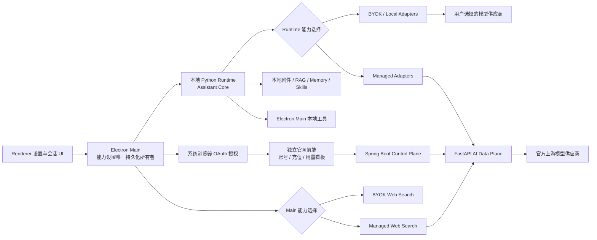
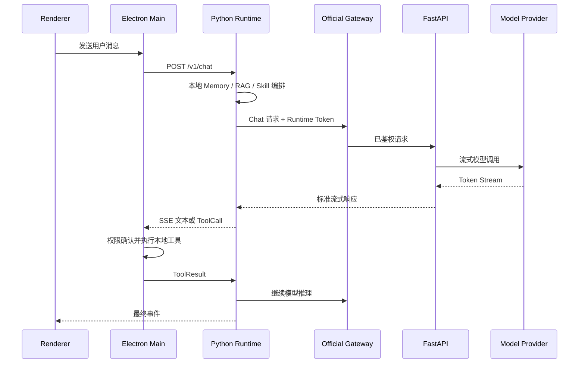
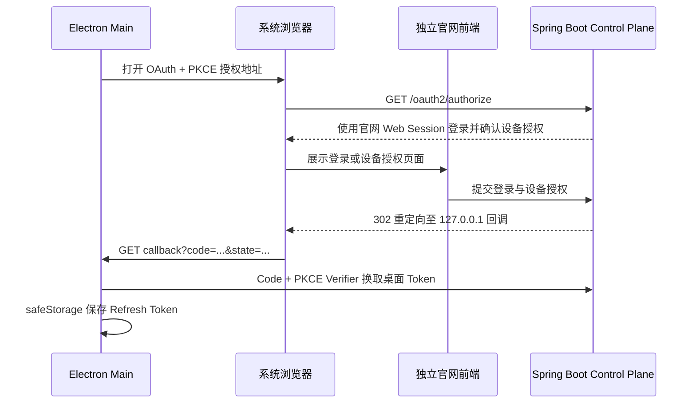

# PetDock BYOK 与官方服务双模式实施方案

## 1. 文档状态

- 状态：Phase 0 冻结基线
- 冻结日期：2026-08-13
- 适用范围：PetDock Desktop、独立官网前端、Spring Boot 控制面、FastAPI AI 数据面
- 当前基线：桌面端使用 Electron Main + Python Runtime，本地 Runtime 已按 `api`、`agent`、`providers`、`rag` 等领域拆分
- 目标：在不破坏现有 BYOK 能力的前提下，增加独立官网、桌面端官网登录和官方托管模型能力

本文档用于指导后续设计、拆分任务、接口评审、实现、测试和上线。除非经过新的架构评审，不应在开发过程中绕过本文档定义的信任边界和依赖方向。

实施状态、验证事实、下一工作项和跨会话交接统一记录在 `docs/roadmap/MANAGED_SERVICE_PROGRESS.md`。本文档只维护冻结决策、阶段要求和验收定义，不记录易过期的日常进度。

Phase 0 的现有 Provider 与模型消费者清单见 `docs/architecture/MANAGED_SERVICE_PROVIDER_INVENTORY.md`；Managed 开发前 BYOK 验证证据见 `docs/roadmap/MANAGED_SERVICE_BYOK_BASELINE_2026-08-13.md`。

## 2. 背景与目标

当前 PetDock 主要采用 BYOK（Bring Your Own Key）模式：用户自行配置主模型、在线 Embedding、视觉模型和联网搜索等能力。该模式具有成本透明、供应商自由和数据路径明确等优点，但配置门槛较高。

后续需要增加官方服务模式：

1. 用户在独立部署的 PetDock 官网完成注册、登录、充值、订阅套餐或按量计费和用量管理，并通过系统浏览器授权桌面端。
2. 桌面端获得设备级凭据和短期 Runtime Token。
3. Chat、Embedding、Vision、Web Search 等被启用的能力通过 PetDock 官方后端调用。
4. 用户可以关闭未授权或不希望使用的官方能力。
5. 现有 BYOK 用户可以继续使用原有配置，不被强制迁移。
6. 本地附件、知识库、记忆、Skill 和系统工具仍由本地 Runtime 与 Electron Main 管理。
7. 官网前端使用独立仓库和独立部署，不进入 Electron 仓库，也不承载本地 Assistant 能力。

成功标准不是简单增加一个远程接口，而是形成一套可长期演进、可审计、可限额、可回滚的双模式能力架构。

## 3. 核心架构决策

### 3.1 一套 Assistant Core，两类能力来源

BYOK 和官方服务不得实现为两套独立 Assistant。两种模式必须复用同一套本地任务编排、Prompt、RAG、Memory、Skill 和工具协议，仅在能力 Provider 层分流。

```text
Local Assistant Core
  ├─ BYOK Provider
  ├─ Managed Provider
  ├─ Local Provider
  └─ Disabled Provider
```

这样可以避免本地 Agent 与云端 Agent 出现 Prompt、工具循环、引用格式和权限行为不一致的问题。

### 3.2 本地 Runtime 继续负责 Agent 编排

第一阶段及中期版本中，下列能力继续在本地执行：

- 会话任务和 SSE 事件编排
- Agent 有限工具循环
- 本地附件解析和会话临时索引
- 本地知识库、向量库和引用选择
- 会话记忆和长期偏好
- Skill 安装、激活和资源读取
- Artifact 生命周期
- Electron Main 工具确认和本地系统操作

官方 FastAPI 后端首先作为 AI 能力数据面，不重新实现完整 Agent。未来确有服务端长任务需求时，再单独评审服务端 Agent。

### 3.3 永久唯一密钥不能作为登录密码

“官网登录后获取唯一密钥”在实现中拆分为以下概念：

- `user_id`：官网用户身份。
- `device_id`：一次桌面安装或受信设备的唯一标识。
- Refresh Token：由 Electron Main 使用 `safeStorage` 加密保存。
- Runtime Token：短期、可撤销、带能力范围的访问令牌。
- Provider Key：官方后端保存的上游模型密钥，永远不下发到客户端。

用户登录采用系统浏览器中的 OAuth 2.1/OIDC Authorization Code + PKCE 流程。第一版桌面回调冻结为仅监听 `127.0.0.1` 随机端口的 loopback redirect，避免自行设计账号密码协议。

官网浏览器会话与桌面会话必须隔离：官网前端使用安全 Cookie 或 Web Session；Electron 使用授权码换取的桌面 Refresh Token。不得把官网 Cookie 复制给 Electron，也不得把桌面 Refresh Token 下发给官网前端。

身份服务由 PetDock 自建，但必须基于成熟、持续维护的 OAuth2/OIDC 框架，不手写协议或密码学。桌面 Refresh Token 绝对有效期为 30 天，每次使用都轮换；检测到旧 Token 复用时撤销当前设备的整个 Token Family。官网普通退出只结束 Web Session，设备撤销和全部设备退出由用户显式操作。

如果产品需要展示“设备密钥”，它只能用于设备识别、恢复提示或人工支持，不能直接换取无限期模型调用权限。

### 3.4 控制面与数据面分离

Spring Boot 负责账号、授权、套餐、配额和设备等控制面业务；FastAPI 负责低延迟、流式的模型能力调用。二者通过签名令牌、内部接口和用量事件协作。

### 3.5 契约优先

桌面端、官网前端、Spring Boot 和 FastAPI 不复制彼此的 DTO 源码。跨语言协议统一由以下内容定义：

- OpenAPI
- JSON Schema
- 稳定错误码
- 事件版本
- 向后兼容规则

接口变更必须先更新契约和契约测试，再修改服务实现。

### 3.6 产品、仓库与部署边界

官方托管能力冻结为三个独立产品边界：

```text
PetDock Desktop   Electron + 本地 Python Runtime
PetDock Web       独立官网前端
PetDock Cloud     Spring Boot 控制面 + FastAPI AI 数据面
```

- `desktop-pet` 只包含桌面应用和本地 Runtime，不包含官网页面、充值、订单和完整用量看板。
- 官网前端使用独立仓库 `petdock-web` 和独立部署，只调用控制面业务 API，不直接访问 AI 数据面。
- 云端后端使用独立仓库 `petdock-cloud`，保存跨端契约、控制面、数据面和基础设施。
- Electron 只展示脱敏账号状态、套餐名称、能力状态和额度摘要；充值、订单、账单、完整用量看板和其他设备管理通过“前往官网管理”在系统浏览器中打开。
- 官网前端和 Electron 均不得接触官方上游 Provider Key。
- 首期在一台中国大陆云服务器上以独立 Docker 容器部署官网、入口网关、控制面、数据面及数据组件，不建设集群、跨可用区副本或自动容灾；宿主机只运行 Docker Engine、Compose Plugin 和 SSH 管理服务。
- 单机部署明确接受官网与 Managed 能力的单点故障，Beta 不承诺高可用 SLA；本地 BYOK 路径不得依赖该主机可用性。

## 4. 范围与非目标

### 4.1 本计划包含

- BYOK 与官方服务能力选择
- 官网登录、设备注册、Token 刷新和注销
- 独立官网中的注册、登录、充值、套餐、订单、设备和用量管理
- 官方 Chat、Embedding、Vision、Rerank、Web Search 能力
- 套餐授权、能力开关、限额和用量记录
- Provider 路由、超时、重试、熔断和错误归一化
- 本地配置迁移、灰度发布和回滚
- 全链路日志、指标和安全审计

### 4.2 第一阶段不包含

- 将本地知识库原文件长期上传到云端
- 将本地 SQLite、Chroma、Skill 包同步到云端
- 让官方后端直接操作用户电脑、文件或应用
- 云端保存完整会话正文作为默认行为
- 多端会话同步
- 对外开放用户可编程 API Key
- 完整服务端 Agent 平台
- 一开始就实现复杂的多供应商成本优化算法
- 在 Electron 中实现充值、订单、账单或完整用量看板

## 5. 目标架构



### 5.1 请求路径



官方后端只看到完成模型调用所必需的输入，不获得本地工具执行权限。

### 5.2 官网管理路径



充值、套餐购买、账单、完整用量看板和其他设备管理不回调到 Electron 内执行。桌面端只打开对应官网页面，并在用户返回应用后重新拉取脱敏能力快照。

## 6. 能力与模式模型

### 6.1 能力类型

首批统一以下能力：

```text
chat
embedding
vision
rerank
web_search
```

### 6.2 能力来源

```text
byok       用户配置的远程供应商
managed    PetDock 官方后端
local      本地模型或本地实现
disabled   明确关闭
```

不同能力允许的来源不同：

| 能力 | 允许来源 | 说明 |
| --- | --- | --- |
| Chat | `byok`、`managed`、`disabled` | `local/mock` 只用于兼容降级和测试，不作为正式用户来源 |
| Embedding | `byok`、`managed`、`local` | 不允许关闭，至少保留 Local Hash 降级 |
| Vision | `byok`、`managed`、`disabled` | 第一阶段不提供本地视觉模型 |
| Rerank | `managed`、`disabled` | 第一阶段不提供 BYOK 或本地 Rerank |
| Web Search | `byok`、`managed`、`disabled` | 网页正文抓取继续由 Electron Main 执行 |

### 6.3 配置原则

设置页可以提供“BYOK”和“官方服务”两个主要入口，但内部配置必须按能力保存来源，不能只保存一个全局布尔值。Electron Main 是能力设置的唯一持久化所有者：Main 向 Renderer 返回脱敏快照，向 Python Runtime 下发 Runtime 负责的有效配置，并在 Main 内选择 Web Search Provider。

概念配置如下：

```json
{
  "version": 1,
  "defaultMode": "managed",
  "capabilities": {
    "chat": "managed",
    "embedding": "local",
    "vision": "disabled",
    "rerank": "disabled",
    "web_search": "managed"
  }
}
```

第一版 UI 可以只开放常用组合，数据结构必须允许后续混合模式。配置保存用户选择的 `selectedSource`；对外快照返回 `selectedSource`、`effectiveSource`、`status` 和稳定 `reason`。Python Runtime 和 Electron Main 不得各自持久化另一套来源选择。

### 6.4 有效能力计算

官方能力是否真正可用，由以下交集决定：

```text
服务端 Entitlement
∩ 用户本地启用状态
∩ 当前客户端版本支持
∩ 服务端实时可用状态
```

客户端开关只是用户偏好，不能代替服务端授权。FastAPI 必须再次校验 Token 中的能力范围和服务端限额。

### 6.5 能力快照

控制面返回的能力快照至少包含：

```json
{
  "version": 1,
  "plan": "pro",
  "capabilities": {
    "chat": { "enabled": true, "remaining": 1000000, "unit": "tokens" },
    "embedding": { "enabled": true, "remaining": 500000, "unit": "tokens" },
    "vision": { "enabled": false, "remaining": 0, "unit": "requests" },
    "web_search": { "enabled": true, "remaining": 100, "unit": "requests" }
  },
  "expiresAt": "2026-08-11T12:00:00Z"
}
```

快照用于 UI 和本地预判，服务端仍是最终授权来源。

### 6.6 旧配置迁移与回退

新增能力来源配置时只迁移来源状态，不移动、不复制现有密钥：

- Chat 已配置 Key 时迁移为 `byok`；未配置时保留现有 Mock 兼容降级。
- Embedding `hash` 或 `local` 迁移为 `local`；`online` 迁移为 `byok`。
- Vision 已配置独立模型或可继承主模型时迁移为 `byok`，否则为 `disabled`。
- Web Search 已启用且当前 Provider 有 Key 时迁移为 `byok`，否则为 `disabled`。
- Rerank 初始固定为 `disabled`。

Managed 故障时不得自动使用用户的 BYOK Key。第一版只允许用户明确操作切换来源，不提供自动回退开关。

## 7. 安全与隐私边界

### 7.1 凭据所有权

| 凭据                | 持有者                               | 存储方式           | 是否下发 Renderer |
| ----------------- | --------------------------------- | -------------- | ------------- |
| 官网 Web Session   | 系统浏览器 / 控制面                    | 安全、HttpOnly Cookie | 否             |
| BYOK API Key      | Electron Main                     | `safeStorage`  | 否             |
| 官网 Refresh Token  | Electron Main                     | `safeStorage`  | 否             |
| Runtime Token     | Electron Main / Python Runtime 内存 | 短期内存           | 否             |
| 本地 Runtime Token  | Electron Main / Python Runtime    | 每次启动随机生成       | 否             |
| 官方上游 Provider Key | FastAPI 服务端                       | Secret Manager | 否             |

本地 Runtime Token 和官方 Runtime Token 是两个不同的信任域，不得复用。

### 7.2 Runtime Token 冻结规则

- 有效期固定为 15 分钟，剩余有效期不足 3 分钟时由 Main 提前刷新。
- 包含 `jti`、`sid`、`user_id`、`device_id`、`capabilities`、`entitlement_version`、`iat` 和 `exp`。
- 使用非对称签名，FastAPI 通过 JWKS 离线验签。
- 不包含上游 Provider Key。
- 控制面把设备注销、账号封禁和会话撤销写入共享撤销存储；数据面按 `sid` 和 `jti` 校验，缓存时间不得超过 30 秒。
- 撤销对新请求最多 30 秒生效。已开始的流式请求第一版允许执行至结束，但单次数据面调用总时长不得超过 5 分钟。
- 撤销存储不可用时，Managed 请求失败关闭，不得绕过校验；BYOK 不受影响。
- Python Runtime 不持有 Refresh Token；Token 即将过期时由 Main 刷新并通过本地受鉴权接口更新。
- `X-PetDock-Device-Id` 只用于链路辅助信息，不参与授权；Token 中签名后的 `device_id` 才是权威设备身份。

### 7.3 数据传输说明

启用官方能力意味着对应内容会发送到官方后端：

| 能力         | 可能发送的数据                  |
| ---------- | ------------------------ |
| Chat       | 用户消息、系统提示、必要的检索片段、工具结果摘要 |
| Embedding  | 待向量化的查询或文档 Chunk 文本      |
| Vision     | 用户明确添加的图片或派生图片           |
| Web Search | 搜索关键词和必要的搜索选项；网页正文读取 URL 不发送给官方搜索接口 |
| Rerank     | 查询和候选片段                  |

默认日志不得记录以上正文。首批用户和正式部署区域均为中国大陆，以上内容、运行日志、用量事件和备份只允许在中国大陆境内传输和处理；上游 Provider 和外围服务必须满足同一边界，第一版不做跨境或跨 Provider 自动故障切换。正式上线前必须在隐私政策和产品设置中明确这些边界。

### 7.4 服务端日志最小化

允许记录：

- Request ID、User ID 哈希、Device ID 哈希
- 能力类型、逻辑模型档位、Provider 标识
- 输入输出 Token 数、请求时长、状态码、重试次数
- 配额扣减结果和稳定错误码

默认禁止记录：

- 完整 Prompt 和回答
- 图片、附件和知识库正文
- BYOK Key、Refresh Token、Runtime Token
- Provider 原始认证头

脱敏运行日志和指标保留 30 天，安全审计日志保留 180 天，原始 Usage Event 保留至账期结束后 24 个月。Prompt、回答、图片、附件、知识片段和搜索词正文不持久化；聚合账单和交易记录按中国大陆适用要求配置。

## 8. 官方产品与服务职责

### 8.1 独立官网前端

官网前端使用独立仓库、独立构建和独立服务器部署，负责：

- 注册、登录、账号安全和用户资料
- 充值、套餐购买、按量计费开通、续费、订单、账单和退款状态
- 余额、额度和完整用量看板
- 设备列表、远程撤销和授权确认
- 套餐能力说明和安全设置

官网前端只调用 Spring Boot 控制面，不直接访问 FastAPI AI 数据面，不保存桌面 Refresh Token，也不持有任何上游 Provider Key。

### 8.2 Spring Boot 控制面

建议模块：

```text
control-plane/
  identity/       用户与登录身份映射
  device/         设备注册、撤销和最后活跃时间
  subscription/   套餐、订阅和订单状态
  entitlement/    套餐到能力授权的计算
  quota/          限额配置、预占和查询
  usage/          用量账本、汇总和对账
  session/        Runtime Token 签发与吊销
  admin/          管理后台接口
  audit/          安全操作审计
```

Spring Boot 不执行模型推理，不保存客户端 BYOK Key，不处理本地工具调用。

Spring Boot 同时为官网前端提供账号、充值、服务方案、订单、设备和用量看板 API，为 Electron 提供 OAuth、设备、Entitlement 和 Runtime Session API。

### 8.3 FastAPI AI 数据面

建议模块：

```text
ai-gateway/
  api/            Chat、Embedding、Vision、Rerank、Search 路由
  auth/           JWT/JWKS 校验和能力范围验证
  providers/      上游供应商适配器
  routing/        逻辑模型到实际模型的路由
  inference/      流式调用、超时和取消
  quota/          请求前预占与完成后结算
  usage/          用量事件与失败补偿
  observability/  日志、指标和 Trace
  errors/         稳定错误码映射
```

LangChain 只在确实能减少 Provider 适配和流式处理复杂度时使用。对于纯代理接口可以直接使用供应商 SDK，避免为“技术栈对齐”增加不必要层级。

### 8.4 仓库与部署结构

官网前端和云端后端均与桌面仓库分离：

```text
petdock-web/
  src/                     独立官网前端
  tests/

petdock-cloud/
  contracts/
    openapi/
    schemas/
    error-codes/
  services/
    control-plane/    Spring Boot
    ai-gateway/       FastAPI
  infra/
    gateway/
    database/
    redis/
    deployment/
    monitoring/
  tests/
    contract/
    integration/
    load/
```

`petdock-web` 和 `desktop-pet` 分别通过版本化 OpenAPI 产物或生成客户端消费 `petdock-cloud/contracts` 契约。三者独立发布，任何官网前端发布不得要求重新构建 Electron 安装包。

首期物理部署收敛到一台中国大陆云服务器：入口网关统一终止 TLS，官网、控制面、数据面、数据库和撤销存储以独立 Docker 容器运行，业务容器不直接暴露公网端口。第一版不部署应用集群、数据库集群、跨可用区副本、冷备服务器或自动故障转移。

单机仍必须具备健康检查、进程自动拉起、资源上限、容量告警、发布前备份和可验证恢复步骤。账号、设备、套餐、用量和审计数据定期加密备份到中国大陆境内的主机外存储；正式充值前至少完成一次手工恢复演练。完整边界以 `contracts/managed-service/v1/DEPLOYMENT_BASELINE.md` 为准。

## 9. API 契约草案

### 9.1 身份与设备接口

优先使用标准 OIDC/OAuth2 端点：

```text
GET  /oauth2/authorize
POST /oauth2/token
GET  /.well-known/openid-configuration
GET  /.well-known/jwks.json
```

PetDock 业务接口：

```text
POST   /api/v1/devices
GET    /api/v1/devices/current
DELETE /api/v1/devices/{deviceId}
GET    /api/v1/entitlements
POST   /api/v1/runtime-sessions
DELETE /api/v1/runtime-sessions/{sessionId}
GET    /api/v1/usage/summary
```

官网账号、充值、订单、套餐、设备列表和完整用量接口由控制面单独定义 Web API 契约。它们使用官网 Web Session，不与桌面 Runtime Token 接口混用。

### 9.2 AI 数据面接口

Chat 和 Embedding 优先兼容 OpenAI 请求语义，便于复用当前 LangChain/OpenAI-compatible 适配器：

```text
POST /ai/v1/chat/completions
POST /ai/v1/embeddings
POST /ai/v1/vision/analyze
POST /ai/v1/rerank
POST /ai/v1/web/search
GET  /ai/v1/capabilities
GET  /ai/v1/health
```

必要请求头：

```text
Authorization: Bearer <runtime-token>
X-PetDock-Request-Id: <uuid>
X-PetDock-Trace-Id: <uuid>
X-PetDock-Device-Id: <opaque-id>
X-PetDock-Client-Version: <semver>
```

服务端不得允许客户端直接指定任意上游 Provider 和模型名。客户端提交逻辑能力或逻辑档位，由服务端完成路由。`X-PetDock-Device-Id` 不得代替 Runtime Token 中签名后的设备身份。

Managed Web Search 第一版只由官方服务返回搜索候选。URL 校验、DNS 固定、SSRF 防护、重定向处理、内容类型限制和网页正文抓取继续由 Electron Main 的 `WebSearchService` 执行。云端网页抓取不在第一版范围内，后续必须单独进行安全评审。

### 9.3 统一错误格式

```json
{
  "error": {
    "code": "quota_exhausted",
    "message": "当前能力额度已用完。",
    "requestId": "9e8d...",
    "retryable": false,
    "retryAfterSeconds": null
  }
}
```

首批稳定错误码：

```text
authentication_required
token_expired
device_revoked
capability_disabled
capability_not_entitled
quota_exhausted
rate_limited
provider_unavailable
provider_timeout
provider_invalid_response
request_cancelled
request_too_large
unsupported_client_version
authentication_expired_during_stream
```

HTTP 状态码、错误码、是否重试和 UI 提示之间必须有集中映射，不能在各端散落字符串判断。

### 9.4 本地 Runtime 会话接口

Electron Main 通过现有本地 `PETDOCK_RUNTIME_TOKEN` 鉴权，把短期官方 Runtime Token 更新到 Python Runtime 内存：

```text
PUT    /v1/managed/session
DELETE /v1/managed/session
POST   /v1/managed/auth-result
GET    /v1/managed/session/status
```

更新请求只接受 `accessToken`、`expiresAt` 和能力快照版本。Python Runtime 不得把 Token 写入 SQLite、配置文件、日志或错误事件。

任务内刷新协议冻结如下：

1. Main 在任务开始前确保 Runtime Token 剩余有效期不少于 3 分钟。
2. Python 在尚未输出模型文本或 ToolCall 时收到 `token_expired`，暂停当前调用并发送 `managed_auth_refresh_required` 本地 SSE 事件。
3. Main 刷新 Runtime Token，调用 `PUT /v1/managed/session`，再通过 `POST /v1/managed/auth-result` 提交成功或失败结果。
4. Python 使用原 `request_id` 最多安全重试一次，并为新的上游尝试生成新 `attempt_id`。
5. 已经输出模型文本或 ToolCall 后禁止静默重放，直接结束任务并返回 `authentication_expired_during_stream`。
6. 刷新失败时不得自动切换到 BYOK。

## 10. 本地项目目标结构

基于当前项目结构，后续建议逐步形成：

```text
src/main/assistant/
  accountSessionManager.ts       官网登录、刷新、注销
  deviceIdentityManager.ts       设备标识和注册状态
  capabilitySettingsManager.ts   各能力来源和用户开关
  managedTokenBroker.ts          短期 Runtime Token 获取与更新
  modelSettingsManager.ts        继续管理 BYOK Chat 配置
  embeddingModelManager.ts       继续管理本地/BYOK Embedding
  visionSettingsManager.ts       继续管理 BYOK Vision
  webSettingsManager.ts          继续管理 BYOK Web Search

python-runtime/petdock_runtime/
  providers/
    chat.py                      ChatModelFactory 稳定端口
    embeddings.py                保留现有 Embedding Provider 与 Descriptor
    selector.py                  只解析 Runtime 负责的能力来源
    managed/
      client.py                  官方网关 HTTP 客户端
      chat.py
      embeddings.py
      vision.py
  agent/
    contracts.py
    service.py
    factory.py
    langchain_backend.py
  api/
    resources.py
    server.py
```

首轮重构时不要求一次创建所有文件，只在职责真实出现时落地，避免空抽象和过度设计。

现有 `providers/embeddings.py`、Embedding Descriptor、Signature 和按向量空间分 Collection 的实现属于稳定基线，不在 Phase 1 重写。Vision 保留 `VisionAnalyzer` 的探测、附件摘要和缓存职责，只在接入 Managed 时抽离远程调用适配器。Web Search Provider 始终位于 Electron Main。

## 11. 分阶段实施顺序

| 阶段      | 核心结果             | 依赖            | 可发布范围         |
| ------- | ---------------- | ------------- | ------------- |
| Phase 0 | 协议和安全边界冻结        | 无             | 不改变运行逻辑       |
| Phase 1 | Chat 路由与能力配置抽象 | Phase 0       | 仍为 BYOK 版本    |
| Phase 2 | 独立官网、登录、设备和 Token | Phase 0       | 官网与登录灰度，不开放模型流量 |
| Phase 3 | Managed Chat MVP | Phase 1、2     | 白名单 Chat Beta |
| Phase 4 | 其他 Managed 能力    | Phase 3       | 按能力分别灰度       |
| Phase 5 | 计费级可靠性           | Phase 3、4     | 正式发布          |
| Phase 6 | 可选服务端 Agent      | Phase 5 后另行评审 | 独立立项          |

### Phase 0：契约与基线冻结

#### 目标

在修改运行逻辑前冻结能力模型、产品和仓库边界、认证边界及跨端契约，保证后续官网前端、Spring、FastAPI 和桌面端可以并行开发。

#### 工作项

- `P0-01` 定义 Capability、Capability Source 和有效能力计算规则。
- `P0-02` 定义 Runtime Token Claims、有效期和吊销语义。
- `P0-03` 创建 OpenAPI、错误码和版本兼容规则。
- `P0-04` 保存当前 BYOK 功能基线和端到端测试结果。
- `P0-05` 确认官方服务传输的数据类型、默认日志和保留策略。
- `P0-06` 决定身份服务实现方式、正式域名和证书策略；桌面回调固定使用 loopback redirect。
- `P0-07` 冻结独立官网前端、桌面端、控制面和数据面的产品、仓库及部署职责。
- `P0-08` 定义 `trace_id`、`request_id`、`attempt_id`、`usage_event_id` 和重试幂等规则。
- `P0-09` 定义 Managed Runtime Token 的任务内刷新、恢复和流式失败协议。
- `P0-10` 冻结 Managed Web Search 只负责搜索，Electron Main 负责网页正文抓取和 SSRF 防护。
- `P0-11` 盘点所有 Chat 模型消费者和现有 Provider 能力，明确保留的 Embedding、Vision、Web Search 基线。

#### 交付物

- `contracts/managed-service/v1/openapi/*.yaml`
- `contracts/managed-service/v1/schemas/*.schema.json`
- 错误码清单
- Token Claims 文档
- Token 刷新、吊销和任务恢复协议
- 链路标识、重试与用量幂等规范
- 产品、仓库和部署职责说明
- 单机部署、备份和恢复基线
- 数据边界与日志规范
- Web Search 与网页抓取边界说明
- BYOK 回归测试清单

#### 验收标准

- 各端对同一请求和错误样例的序列化结果一致。
- 官网前端、桌面端、控制面和数据面均能通过同一版本化契约样例完成序列化验证。
- 所有敏感凭据的持有者和生命周期明确。
- Token 过期、撤销、未输出重试和已输出失败四类行为存在确定结果。
- 当前 `npm run check`、Runtime 打包 smoke、C3/C5 端到端继续通过。

#### 回滚

本阶段不改变运行逻辑，无运行时回滚需求。

### Phase 1：Chat 路由与能力配置抽象，不接入云端

#### 目标

在保留现有 Embedding、Vision 和 Web Search 领域边界的前提下，抽离 Chat 模型创建并建立 Main 统一持久化的能力来源配置，确保官方模式只是新增适配器。

#### 工作项

- `P1-01` 定义与框架无关的 `ChatModelFactory`，提供 BYOK、Managed 和 Mock 创建端口；本阶段只启用 BYOK 与 Mock。
- `P1-02` 将 `LangChainBackend` 从直接读取 `RuntimeConfig` 改为依赖 `ChatModelFactory`。
- `P1-03` 将 `MemoryExtractor` 等全部 Chat 模型消费者纳入统一 Factory；Managed Chat MVP 中后台记忆提取固定使用现有本地规则兜底，不产生隐式官方用量。
- `P1-04` 在 Electron Main 增加 `CapabilitySettingsManager`，作为来源配置的唯一持久化所有者；Runtime Selector 只消费 Main 下发的有效配置。
- `P1-05` 在 `src/shared/assistant.ts` 定义带 `selectedSource`、`effectiveSource`、`status` 和 `reason` 的脱敏能力设置及快照。
- `P1-06` 增加配置版本和迁移逻辑，按 6.6 的规则只迁移来源，不移动或复制现有密钥。
- `P1-07` 保留现有 Embedding Provider、Descriptor、Signature、VisionAnalyzer 和 Main WebSearchService，只为后续 Managed Adapter 预留明确装配点。
- `P1-08` 为 Chat Factory、Main/Runtime 选择、配置迁移、Runtime 环境和降级行为补测试。

#### 关键约束

- 不改变现有 API Key 保存位置和 `safeStorage` 规则。
- 不改变本地 Runtime HTTP/SSE 协议。
- 不把 BYOK Key 传给任何官方服务。
- Provider 端口不得依赖 FastAPI、Spring 或 Electron 类型。
- Python Runtime 不持久化能力来源；Electron Main 不在 Renderer 暴露密钥或 Token。
- 不为追求目录一致性移动现有稳定实现。

#### 验收标准

- 未登录用户的行为与当前版本一致。
- 旧配置无需用户重新输入 Key。
- Mock、BYOK Chat、本地/在线 Embedding、BYOK Vision 和 BYOK Web Search 均通过回归。
- Chat Factory 和 Main/Runtime 各自负责的 Provider 选择可通过单元测试独立验证。

#### 回滚

保留旧配置读取和现有 Provider 实现；通过功能开关关闭新 Selector 即可回到原路径。

### Phase 2：独立官网、身份、设备和会话基础设施

Phase 2 的详细模块、共享开发环境、跨仓库顺序和验收方案见 `docs/features/MANAGED_SERVICE_PHASE2_IDENTITY_AND_SESSION.md`。本节继续作为冻结目标、工作项和回滚边界，不重复维护易变化的开发细节。

#### 目标

完成独立官网基础页面、系统浏览器登录、设备注册、Refresh Token 安全存储和短期 Runtime Token 签发，但尚不向普通用户开放模型流量。

#### 独立官网前端工作项

- `P2-W01` 在独立 `petdock-web` 仓库实现注册、登录、账号安全和用户资料页面。
- `P2-W02` 实现 OAuth 设备授权确认页，并使用官网 Web Session 与控制面交互。
- `P2-W03` 实现服务方案、充值、订单、设备列表和用量看板的基础页面及路由；服务方案兼容订阅与按量两种模式，支付和按量结算闭环随 Phase 5 正式收费能力完善。
- `P2-W04` 官网前端只消费控制面 Web API，不调用 AI 数据面，不读取桌面 Token。
- `P2-W05` 按已冻结的首页视觉规范实现正式官网首页，交付品牌、功能、隐私、双模式、下载和账号入口；完成后再进入 Phase 3。

#### Spring Boot 工作项

- `P2-01` 接入标准 OIDC/OAuth2 登录。
- `P2-02` 实现用户、设备、会话和撤销记录。
- `P2-03` 实现 Entitlement 查询和 Runtime Token 签发。
- `P2-04` 暴露 JWKS，并支持密钥轮换。
- `P2-05` 为登录、设备新增、注销和封禁增加审计日志。

#### 桌面端工作项

- `P2-06` 实现系统浏览器 PKCE 登录和 loopback 回调。
- `P2-07` 使用 `safeStorage` 保存 Refresh Token，不下发 Renderer。
- `P2-08` 实现账号脱敏快照、设备状态、退出登录和设备撤销。
- `P2-09` 实现 Runtime Token Broker，并确保 Python Runtime 只获得短期 Token。
- `P2-10` 处理过期、时钟偏差、离线、撤销和重复登录。
- `P2-11` 在桌面端提供“前往官网管理”，系统浏览器打开充值、套餐、用量或设备页面，返回应用后刷新脱敏能力快照。

#### 验收标准

- Renderer 和日志中均看不到 Refresh Token 和 Runtime Token。
- 关闭并重启应用后可以安全恢复会话。
- 设备撤销后旧 Runtime Token 在规定窗口内失效。
- 未登录状态不影响 BYOK 使用。
- 官网不可用时 BYOK 仍可正常启动。
- 官网 Web Session 与桌面 Refresh Token 完全隔离，官网部署和更新不要求发布新的 Electron 安装包。
- 正式官网首页通过响应式、可访问性、Canvas 生命周期、性能、生产构建和正式 HTTPS 验收，且不把 Managed Chat、Usage 或支付描述为已开放。

#### 回滚

官方登录入口受 Feature Flag 控制；关闭后桌面端继续使用 BYOK，不删除已有 BYOK 配置。

### Phase 3：官方 Chat MVP

#### 目标

打通第一条真实官方流量链路，只支持 Chat，其他官方能力保持关闭。

#### FastAPI 工作项

- `P3-01` 实现 Runtime Token/JWKS 校验。
- `P3-02` 实现 `/ai/v1/chat/completions` 流式接口。
- `P3-03` 实现逻辑模型路由和单一上游 Provider Adapter。
- `P3-04` 实现请求取消、首 Token 超时、总超时和断流处理。
- `P3-05` 按 `trace_id`、`request_id`、`attempt_id` 和 `usage_event_id` 产生幂等 Token 用量事件及稳定错误码。
- `P3-06` 默认关闭 Prompt/Response 正文日志。

#### Spring Boot 工作项

- `P3-07` 为 Chat 实现套餐授权、基础限额和用量入账。
- `P3-08` 实现 Beta 级按 `request_id` 幂等预占、实际结算、明确未调用上游时释放，以及追加写原始 Usage Event；本阶段只用于免费额度或测试套餐，不作为正式收费账本。
- `P3-09` 提供用户用量摘要。

#### 本地 Runtime 工作项

- `P3-10` 实现 `ManagedChatProvider`。
- `P3-11` 保持现有本地 Agent、工具循环和 SSE 协议不变。
- `P3-12` 按 9.4 的任务内协议支持 Runtime Token 刷新；仅在未产生输出时使用原 `request_id` 安全重试一次。
- `P3-13` 将官方错误映射为现有 Runtime 错误事件。

#### 桌面 UI 工作项

- `P3-14` 增加 BYOK/官方服务入口、登录状态、Chat 能力状态、额度摘要和“前往官网管理”；不在 Electron 实现充值或完整用量看板。
- `P3-15` 官方 Chat 不可用时提供切回 BYOK 的明确操作。
- `P3-16` 不在 UI 中展示上游 Provider 密钥或内部模型名称。

#### 验收标准

- 官方 Chat 支持流式文本、取消和多轮工具调用。
- 本地工具仍只由 Electron Main 执行。
- 切换 BYOK/Managed 不丢失本地会话、附件和 Skill。
- 配额耗尽、Token 过期、Provider 超时和网络中断均有稳定结果。
- Beta 用量事件与上游用量允许按 `request_id` 对账，重复重试不重复预占。

#### 回滚

服务端和桌面端分别设置 Managed Chat Feature Flag。关闭后已有登录状态可以保留，但请求自动停止进入官方 Chat。

### Phase 4：Embedding、Vision、Web Search 与 Rerank

#### 目标

按能力逐个接入，不把所有能力作为一个大版本同时上线。

#### 4.1 Managed Embedding

- `P4-E01` 定义官方 Embedding Descriptor，包括逻辑 ID、Revision、Dimensions、Tokenizer 和阈值。
- `P4-E02` 实现批量大小、正文长度和并发限制。
- `P4-E03` 复用现有 `EmbeddingProvider`、Descriptor Signature 和按签名分 Collection 的机制接入 Managed Adapter，不重建已有抽象。
- `P4-E04` Provider 或 Revision 变化时继续使用现有 Signature 创建新索引或要求显式重建，禁止混用向量空间。
- `P4-E05` 保留 Local Hash 作为离线和故障降级，但不把不同空间的向量混写。

验收重点：索引可恢复、切换提示明确、旧知识库不会静默返回错误结果。

#### 4.2 Managed Vision

- `P4-V01` 实现受限 MIME、尺寸、像素和请求体校验。
- `P4-V02` 只上传用户明确加入会话的图片或派生图片。
- `P4-V03` 保持现有视觉摘要缓存不保存 Base64。
- `P4-V04` 支持用户单独关闭 Vision，即使套餐已授权。

验收重点：图片不进入默认日志，取消发送后清理临时请求状态。

#### 4.3 Managed Web Search

- `P4-W01` 在 Main 的 `WebSearchService` 增加 Managed Provider，不改变本地工具权限边界。
- `P4-W02` Managed API 只返回搜索候选；Main 继续执行现有 URL、DNS、SSRF、内容类型、重定向和正文预算策略并抓取网页正文。
- `P4-W03` 官方后端负责搜索供应商密钥和服务端配额。
- `P4-W04` 保持来源引用格式与 BYOK 搜索一致。

验收重点：搜索和网页读取仍被识别为外部不可信内容。

#### 4.4 Managed Rerank

- `P4-R01` 仅在已有混合召回结果上执行，不替代本地检索准入。
- `P4-R02` 设置候选数量、单片段长度和总字符预算。
- `P4-R03` Rerank 失败时回退到现有 RRF/本地评分。

#### Phase 4 总体验收

- 每项能力可以独立启用、禁用、灰度和回滚。
- 任一官方能力故障不会破坏其他能力和 BYOK。
- 设置快照、服务端 Entitlement 和实际调用结果一致。

### Phase 5：配额、可靠性、成本与正式上线

#### 目标

从可用 MVP 提升为可以正式收费和稳定运营的服务。

#### 工作项

- `P5-01` 实现用户、设备、IP 和能力四个维度的限流。
- `P5-02` 将 Phase 3 的 Beta 配额升级为 Durable Outbox、超时释放、幂等补偿、重复事件去重和人工修复流程。
- `P5-03` 建立不可变 Usage Ledger 和周期汇总表。
- `P5-04` 建立 Provider 超时、熔断和健康探测；自动跨 Provider 或跨区域故障切换必须另行评审，第一版失败关闭。
- `P5-05` 基于 Phase 3 已贯通的链路标识补齐日志检索、Trace 采样和 Provider 对账，不重新定义 Request ID。
- `P5-06` 建立延迟、首 Token、成功率、取消率、Token、成本和配额拒绝指标。
- `P5-07` 建立费用异常、滥用、凭据泄漏和 Provider 故障告警。
- `P5-08` 完成压力测试、单机容量估算、主机外备份、手工恢复和密钥轮换演练；当前不建设集群和自动容灾。
- `P5-09` 完成隐私政策、用户协议、账单说明和客服排查手册。
- `P5-10` 在独立官网完成真实充值、支付结果、套餐生效、按量计费开通与结算、账单、退款状态和生产级用量看板。

#### 验收标准

- 重复请求、重试和断流不会造成明显重复扣费。
- Provider 故障时能够按策略失败或切换，不无限重试。
- 可以按 Request ID 完成跨服务排查，同时不读取用户正文。
- 可以按用户、能力、模型和账期对账。
- 可以在不发布桌面新版本的情况下关闭某个官方能力。

### Phase 6：可选的服务端 Agent 增强

本阶段不是当前承诺范围，只有满足以下条件才启动：

- 明确存在必须脱离用户电脑持续执行的长任务。
- 本地 Runtime 无法满足可靠性、并发或调度需求。
- 已有稳定的协议、配额和审计基础设施。
- 已明确哪些数据允许上传和保留。

如启动，应新增服务端 Agent 产品边界，而不是把当前本地 Agent 代码复制一份。优先抽取与框架无关的 Prompt、事件和工具契约，再决定是否使用 LangChain、LangGraph 或其他引擎。

## 12. 测试策略

### 12.1 单元测试

- 配置迁移和 CapabilitySelector
- Token 过期、刷新、撤销和时钟偏差
- 未输出时刷新重试和已输出时禁止重放
- Entitlement 交集计算
- Provider 路由和错误归一化
- 配额预占、结算和补偿
- Request ID、Attempt ID 和 Usage Event 幂等
- Embedding Signature 与索引隔离
- 日志脱敏

### 12.2 契约测试

- OpenAPI 请求/响应样例
- Spring 与 FastAPI 的 Token Claims 兼容
- TypeScript 与 Python 生成客户端兼容
- SSE Chunk、取消和错误事件兼容
- `managed_auth_refresh_required` 和 `managed/auth-result` 任务恢复兼容
- 新旧客户端版本兼容

### 12.3 集成测试

- 桌面登录、刷新、注销和设备撤销
- 官网 Web Session 与桌面 Token 隔离
- Runtime Token 更新
- Managed Chat 流式与工具结果续传
- Embedding 批量与索引重建
- Vision 文件限制与摘要缓存
- Managed Web Search 来源和 Main 网页读取安全策略
- 配额不足、Provider 超时和服务端降级

### 12.4 模式回归矩阵

| 场景        | Chat    | Embedding | Vision   | Web Search | 预期             |
| --------- | ------- | --------- | -------- | ---------- | -------------- |
| 现有 BYOK   | BYOK    | Local     | Disabled | BYOK       | 与当前版本一致        |
| 全 Managed | Managed | Managed   | Managed  | Managed    | AI 能力调用经过官方后端；网页正文仍由 Main 安全抓取 |
| 混合模式      | Managed | Local     | Disabled | BYOK       | 各能力独立工作        |
| 未登录       | BYOK    | Local     | BYOK     | BYOK       | 不依赖官网          |
| 官网不可用     | BYOK    | Local     | BYOK     | BYOK       | BYOK 不受影响      |
| Token 过期  | Managed | Managed   | Managed  | Managed    | 刷新一次后重试或要求登录   |
| 套餐无权限     | Managed | Managed   | Managed  | Managed    | 服务端拒绝且 UI 状态一致 |

### 12.5 每阶段最低验证

```powershell
npm.cmd run check
npm.cmd run build:runtime
npm.cmd run test:runtime:packaged
npm.cmd run test:e2e:assistant:c3
npm.cmd run test:e2e:assistant:c5
```

涉及登录或官方服务时，还必须增加云端契约测试、服务集成测试和真实桌面登录冒烟测试。

## 13. 可观测性

### 13.1 链路标识

一次用户请求至少包含：

```text
conversation_id   仅在本地使用，不发送到云端
task_id           本地用户任务标识
trace_id          一次用户请求及其全部工具循环的跨端标识
request_id        一次逻辑远程能力调用的幂等标识，安全重试时保持不变
attempt_id        每次上游调用尝试的唯一标识
session_id        官方 Runtime Session
device_id_hash    日志使用的设备哈希
usage_event_id    一次用量账本事件的幂等标识
```

每轮 ToolResult 续传后的新模型推理使用新的 `request_id`，但保持同一个 `trace_id`。云端不得接收原始 `conversation_id`。

### 13.2 指标

- 请求数、成功率、取消率和错误码分布
- 首 Token 延迟、总时长和 Provider 时长
- 输入/输出 Token、Embedding Token、图片数和搜索次数
- 配额预占失败、结算失败和补偿积压
- Provider 限流、超时、熔断和切换次数
- Runtime Token 刷新成功率

### 13.3 日志要求

继续遵守项目现有规范：注释和日志使用中文；日志必须方便排查，但不得输出密钥、Token、Prompt、附件正文和图片内容。

## 14. 数据模型建议

控制面最低需要以下实体：

```text
users
devices
subscriptions
plans
plan_capabilities
user_entitlements
runtime_sessions
token_revocations
quota_buckets
usage_ledger
usage_daily_summary
security_audit_logs
```

关键规则：

- Usage Ledger 采用追加写，不直接覆盖历史记录。
- 配额汇总可以重算，账本必须可审计。
- Device ID 使用不可猜测随机值，不使用硬件序列号作为主键。
- Runtime Session 有明确过期时间和撤销状态。
- 套餐变更通过版本化 Entitlement 生效。

## 15. 发布与回滚策略

### 15.1 Feature Flags

至少提供：

```text
managed_login_enabled
managed_chat_enabled
managed_embedding_enabled
managed_vision_enabled
managed_web_search_enabled
managed_rerank_enabled
```

Feature Flag 必须能按环境、用户组、客户端版本和百分比灰度。

### 15.2 发布顺序

1. 内部开发账号。
2. 白名单测试账号。
3. 免费小额度灰度。
4. 单一正式订阅套餐与受控按量计费灰度。
5. 扩大用户范围和 Provider 路由。

### 15.3 回滚原则

- 官方服务故障时优先关闭对应 Managed 能力，不删除用户登录和 BYOK 配置。
- 不自动把 Managed 请求切换到用户 BYOK Key；第一版只允许用户手动切换来源。
- 不自动重建或删除本地向量索引。
- 配置迁移必须保留上一版本可读取的数据。
- 服务端契约至少兼容当前和上一桌面版本。

## 16. 主要风险与应对

| 风险             | 影响            | 应对                                     |
| -------------- | ------------- | -------------------------------------- |
| 本地与云端重复 Agent  | 行为不一致、维护成本翻倍  | 云端初期只做能力数据面                            |
| 长期密钥泄漏         | 额度被盗用         | PKCE、Refresh Token 加密、短期 Runtime Token |
| 流式链路经过多层代理     | 首 Token 变慢、断流 | 数据面减少同步跳数，专项压测 SSE                     |
| 配额与实际用量不一致     | 错扣费、超卖        | 预占、结算、幂等 Usage Ledger、补偿任务             |
| Embedding 空间混用 | 检索静默失真        | Descriptor Signature、索引隔离、显式重建         |
| 官方服务不可用影响老用户   | BYOK 回归       | 模式隔离、Feature Flag、BYOK 独立启动            |
| Prompt 或附件进入日志 | 隐私事故          | 正文日志默认关闭、脱敏测试、日志审计                     |
| Provider 成本失控  | 运营风险          | 逻辑模型、单请求预算、限流和成本告警                     |
| 本地 Token 刷新失败  | 长任务中断或重复输出 | Main Token Broker、提前刷新、仅未输出时一次受控重试 |
| 客户端伪造能力开关      | 越权调用          | 服务端重复鉴权和配额检查                           |
| 官网与桌面会话混用      | Token 泄漏或权限扩大 | Web Session 与桌面 PKCE Token 完全隔离           |
| 云端抓取绕过 Main SSRF | 内网探测和不受控内容访问 | 第一版云端只搜索，网页正文固定由 Main 抓取          |
| 单机故障 | 官网和 Managed 能力同时不可用 | 明确 Beta 无高可用 SLA、健康检查和主机外备份；BYOK 保持独立 |

## 17. 已冻结产品与基础设施参数

2026-08-13 已冻结：

- 正式主域名为 `petdock.site`，分别使用根域名、`account`、`api` 和 `ai` 入口；ICP 备案、DNS 和 TLS 条件已于 2026-08-19 具备，公网灰度仍须通过生产隔离部署和受限线上门禁。
- 使用基于成熟框架的自建 OIDC/OAuth2 身份服务；桌面 Refresh Token 绝对有效期 30 天并轮换。
- 首批用户和部署区域均为中国大陆，Managed 数据不得跨境传输或处理。
- 正文不持久化；脱敏运行日志 30 天、安全审计 180 天、原始 Usage Event 至账期结束后 24 个月。
- 第一阶段为白名单免费 `Beta`，只开放 Managed Chat；具体免费额度由服务端套餐配置维护。
- 长期正式服务允许用户显式选择订阅套餐或按量计费，两种模式互斥且套餐额度耗尽后不自动切换；当前免费 Beta 只产生订阅模式快照。
- Phase 3 只提供逻辑档位 `chat-standard`，实际 Provider 和模型由项目负责人通过服务端安全配置固定。
- 首个 Managed 桌面版本为 `0.2.0`，服务端支持当前及上一受支持小版本，单个小版本兼容窗口不少于 6 个月。
- 首期只使用一台中国大陆云服务器，不建设集群和自动容灾，接受单点故障并保留主机外备份和手工恢复底线。

完整执行口径见 `petdock-cloud` 权威契约中的 `DECISION_REGISTER.md`。实际 Provider、模型、密钥和 Beta 额度不属于跨端契约，不能下发给客户端；它们必须在服务端安全配置中完成后才能开放真实流量。

## 18. 总体验收定义

双模式能力可以宣布完成，需要同时满足：

- 现有 BYOK 用户无需重新配置即可继续使用。
- 用户可以通过独立官网登录和管理充值、订阅套餐或按量计费、用量及设备；桌面端可以登录、退出、撤销当前设备并查看脱敏能力状态。
- 各能力可以从其允许的来源集合中独立选择。
- 官方 Chat、Embedding、Vision 和 Web Search 均有明确授权、限额和用量记录。
- 本地文件、知识库、记忆和 Skill 默认不被持久化到官方服务。
- Renderer 不接触任何明文密钥和 Token。
- 本地工具仍只在 Electron Main 权限边界内执行。
- 官方能力可独立灰度和关闭，不需要紧急发布桌面版本。
- 全链路能够使用 Request ID 排查，但日志不包含敏感正文。
- 官网前端、桌面端和云端服务独立构建部署，官网发布不要求更新 Electron。
- 源码测试、契约测试、端到端测试、打包态测试和压力测试全部通过。

## 19. 实施检查表

```text
[x] Phase 0 契约与安全边界冻结
[x] Phase 1 本地 Provider 抽象完成，BYOK 零回归
[ ] Phase 2 登录、设备、Token 和 Entitlement 完成
[ ] Phase 3 Managed Chat MVP 完成
[ ] Phase 4-E Managed Embedding 完成
[ ] Phase 4-V Managed Vision 完成
[ ] Phase 4-W Managed Web Search 完成
[ ] Phase 4-R Managed Rerank 完成
[ ] Phase 5 配额、可靠性、成本和正式发布完成
[ ] Phase 6 服务端 Agent 是否立项完成评审
```

后续开发任务应引用本检查表中的 Phase 和工作项编号，例如 `P1-02`、`P3-10`，以便在代码、提交、Issue 和测试报告之间建立可追踪关系。
