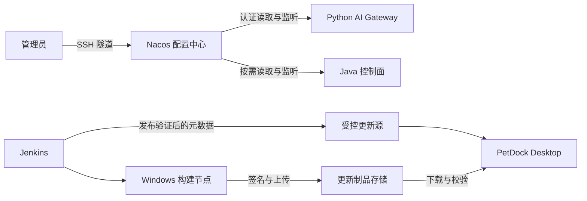

# Nacos 配置中心与桌面自动更新实施方案

状态：Tracking。2026-09-15：P0 独立底座与 Python SDK 本地验证完成，服务器门禁待执行；Chat 热更新和桌面更新尚未开发。依据本次对话和当前仓库实现编写。已确认选择 Nacos 配置中心，以及桌面整体自动更新；不实施前端资源热更新。

## 1. 目标与已确认边界

1. 将高频业务配置从生产 `.env` 迁入 Nacos，提供集中编辑、历史记录、发布与回退，减少 SSH 手改文件。
2. 让 AI Gateway 在不重建容器的情况下应用有效的新提供商配置；保持在途请求的一致性。
3. 为 Windows NSIS 安装版提供检查、下载和重启安装更新，用户无需反复手动下载安装包。
4. 结合 Jenkins 建立“构建制品、验证、发布配置或更新入口”的流程，不把一次构建成功等同于已对用户发布。
5. 通过真实项目学习 Nacos，但先完成可验证的小闭环；不同时重做服务发现、部署架构和所有客户端组件更新。

环境：单台 Ubuntu Server 26.04 LTS、4 核 8G，运行现有 Cloud/Web、Jenkins 与相关数据服务；用户此前反馈剩余磁盘约 20G，Jenkins 串行构建压力较小。最新截图中所选时间段 CPU 平均约 4.168%、峰值 66.9%，内存平均约 3159MB/45.22%、峰值约 3401MB/48.246%。这些是该时间段监控值，不代替引入 Nacos 后的压力及磁盘测试。

Nacos 第一阶段只作为服务端配置中心。桌面端不连接 Nacos、不持有 Nacos 凭据、不接收官方 Provider API Key；服务发现继续使用现有 Compose 网络。BYOK 是用户本机配置，本期不迁入服务器。

## 2. 待确认决策

下表区分用户已确认的结论与仍需确定的实施细节；尚未明确的选项不能在实施中静默视为授权。

| 编号 | 决策 | 建议/选项 | 当前状态与影响 |
| --- | --- | --- | --- |
| D1 | Provider Key 管理 | 首期 Nacos 只保存凭据引用，真实 Key 留在服务器 Secret | 已确认；首期不将明文或加密 Key 迁入 Nacos |
| D2 | 首期迁移范围 | 先跑通单机配置中心与 Chat 热更新，再扩展 | 已确认；P1 不一次迁移全部能力 |
| D3 | 更新包存储 | 腾讯云 COS 为选型方向，通过 `download.petdock.site` 分发 | 腾讯云现有服务器、用户主要中国大陆；尚未购买对象存储或 CDN |
| D4 | 更新交互 | 用户主动下载、选择重启，任务执行期间延后更新 | 已确认；不默认后台下载或强制打断任务 |
| D5 | Windows 构建与代码签名 | 当前没有代码签名证书；先用当前 Windows 开发电脑打包 | 用户已确认现状；正式分发信任方案、电脑在线时段与接入权限待 P3 明确 |
| D6 | Nacos 首期运行与访问 | 单机验证、SSH 隧道、验证后锁定版本与存储 | 已确认；控制台不直接公开到公网 |
| D7 | Nacos/SDK 版本与持久化 | 在 P0 核对支持矩阵、维护状态、授权许可和存储方案 | P0 固定 Nacos 2.5.4 / Python SDK 2.0.11、内嵌 Derby 并完成本地验证；生产采用仍需服务器门禁，Java 客户端未引入 |
| D8 | 客户端范围与渠道 | Windows NSIS 自动更新、Portable 仅提示下载；统一正式更新渠道 | 已确认；不实施 beta 渠道或按用户分组发布，不承诺跨平台同步支持 |
| D9 | 下载域名、地区、预算与访问 | 主域名已备案；大陆用户不超过约 20 人；预算目标约 10 元/月；允许任何人下载，但需防恶意下载费用 | 已确认；COS 具体地域、当前计费、HTTPS 域名接入和费用防护在 P3 验证；10 元不是云厂商硬封顶承诺 |
| D10 | 发布范围与最低版本限制 | 暂不需要灰度，服务端与客户端均统一发布；客户端仍由用户选择下载和重启 | 发布范围已确认；全量可用不等于强制同时安装，不默认最低版本限制或自动降级 |

D1～D6 已获得用户回复，可据此准备 P0。签名方案和对象存储具体选型影响真实更新分发验收，但不阻塞 Nacos 原型；D7 的本地验证见第 13 节；服务器现场验证仍需完成。

代码签名证书用于验证 EXE 发布者与完整性，不是 HTTPS 证书。用户暂无证书：先做开发环境更新验证，并在 P3 明确正式发布信任方案，不默认购买服务、不擅自关闭生产校验。可评估受信任代码签名或专门设计的应用层签名验证；后者不能冒充 Windows 受信任发布者签名，也不能假定 electron-updater 已自动支持。仅靠 HTTPS 和可被同时替换的包摘要不足以替代独立信任根。

Windows 构建先使用当前开发电脑；只有电脑在线且允许执行任务时才构建。P3 定义 Jenkins 连接方式、专用工作目录、发布凭据和资源限制，不让流水线覆盖用户正在工作的检出或自动获取本机其他凭据。

## 3. 现状核对与权威来源

| 模块 | 已核对事实 | 对方案的约束 |
| --- | --- | --- |
| 控制面 | Spring Boot 3.5.5、JDK 21 | 引入 Spring 集成必须核对兼容矩阵；不为 Nacos 无计划升级整个 Spring 栈 |
| AI Gateway | Python 3.13 容器；`GatewaySettings` 是不可变配置；`create_app` 启动时读取环境并创建 Provider/Service | 引入 SDK 只能获取变化，需要独立改造提供商生命周期和请求配置快照 |
| Provider 注册 | 公开逻辑模型与内部 Provider 分离，注册表目前按启动配置创建 | 不能把供应商型号和 Secret 暴露为新的桌面协议字段 |
| 官网 | 已有管理员界面、SSO、统计 | 首期在 Nacos 控制台管理配置；不同时开发一套重复的 Web 通用配置编辑器 |
| Desktop | Electron 43、electron-builder 26 配置，NSIS + Portable，Python Runtime 随包 | 优先整体安装更新；Portable 不承诺与 NSIS 相同的自动安装 |
| 自动更新接入 | 未见主进程调用 autoUpdater 或引入 electron-updater | 现有安装用户至少需要安装一次具备更新器的新版本 |
| Jenkins | Cloud/Web 默认分支锁定 SHA，支持已构建镜像复用 | 配置发布、应用镜像发布与桌面制品发布应独立编号和操作 |

当前方案读取的基线：Desktop `785784d6095e00699eeb3b950757db3f665d2edd`；Cloud `46a0614f45df521a1c6e56e75183633f9699aafd`。这些只是方案调查基线，不是本需求的发布版本。

实现入口：Desktop [package.json](../../package.json)、[主进程](../../src/main/index.ts)；Cloud [配置读取](../../../petdock-office/petdock-cloud/services/ai-gateway/app/config.py)、[应用生命周期](../../../petdock-office/petdock-cloud/services/ai-gateway/app/main.py)、[提供商注册表](../../../petdock-office/petdock-cloud/services/ai-gateway/app/providers/registry.py)。

涉及公共配置协议、更新查询接口或跨端错误码时，先修改 [Cloud Managed v1 权威契约](../../../petdock-office/petdock-cloud/contracts/managed-service/v1/README.md)，再按现有流程同步 Desktop 快照。本文件中的字段、Data ID 和状态仅是方案草案，不是已存在的接口。

## 4. 整体结构与职责

Nacos 负责配置存储、权限、通知和历史；应用负责校验、应用状态、请求切换和降级。Jenkins 负责制品构建和发布编排。桌面更新源只提供公开更新数据，与内部 Nacos 凭据隔离。

客户端正式版本发布策略可以由 Nacos 管理，但安装包、blockmap 等大文件必须放制品存储。首期使用单一正式静态更新源；若之后让 Nacos 驱动发布策略，则由服务端适配输出兼容更新器的元数据，不让客户端依赖内部配置格式。Nacos 不可用不应使已经发布的安装包失去下载入口。

## 5. Nacos 部署与选型验证

P0 必须输出版本矩阵：Nacos Server 的具体版本和镜像摘要、所需 JDK、Java 客户端或 Spring 集成版本、Python SDK 包名与版本、认证/监听机制、网络端口、重连行为、存储方式、备份方式。检查官方支持和维护状态后才生成安装命令。

候选优先使用官方维护的客户端。若 Java 原生 SDK 已满足当前配置监听，就不强行引入整套 Spring Cloud；若选择 Spring Cloud Alibaba，必须证明与 Boot 3.5.5 的组合受支持。Python 侧验证同步/异步模型、TLS/认证、监听回调线程及退出资源释放，不照搬 Java 的自动刷新注解思路。

单机部署使用独立 Compose 项目和持久化目录、受限内网访问、SSH 隧道管理；各版本的控制台、HTTP/gRPC 端口可能不同，按选定版本设计映射，不能直接假设只保护一个端口即可。控制台写账号与服务只读账号分离，验证权限真实生效；不把 Namespace/Group 名称当作访问控制本身。

存储先评估选定版本支持的单机内嵌方式及其生产恢复限制；若需要外部数据库，记录新增数据库的资源与运维成本。不能假定现有 PostgreSQL 原生受支持，更不能未经验证就接第三方插件。最终方案必须能恢复配置、权限及历史。

资源验收包含常态、持续配置通知、Nacos 重启、Jenkins 单个真实构建与运行服务共存。观察进程 RSS、容器 OOM、系统 MemAvailable、磁盘、接口延迟和配置收敛时间。现有构建门槛为 3GiB 可用内存、10GiB 构建前空间，不能为了通过试验直接降低这些门槛。若出现资源冲突，重新定 JVM/容器预算、维护时间或扩容。

官方参考入口（实施时核查具体版本，不代表本方案已完成在线兼容性验证）：[Nacos 文档](https://nacos.io/docs/latest/)、[Java 客户端](https://github.com/alibaba/nacos)、[Python SDK](https://github.com/nacos-group/nacos-sdk-python)、[Spring Cloud Alibaba](https://sca.aliyun.com/)。

## 6. 配置分类、组织与迁移

| 配置 | 首期处理 | 变化约束 |
| --- | --- | --- |
| 数据库/Redis/Nacos 地址、认证、监听、签名根密钥 | 保留环境或 Secret | 启动配置，维护时重启 |
| Chat 提供商模式、地址、型号、Key 引用 | 优先迁移 Nacos | 同一个配置快照原子应用 |
| Vision 提供商、图片预算、超时 | Chat 闭环后迁移 | 需同步校验描述版本及已有图片限制 |
| Web Search 提供商和请求预算 | 后续迁移 | 仅支持已实现的适配器，新增配置不能凭空支持新协议 |
| 并发、超时、重试预算 | 按字段审查迁移 | 改并发池需额外设计；不能把全部 settings 字段都标为可热更新 |
| 能力开关 | 区分运营关闭和紧急撤销 | 普通关闭影响新请求；紧急撤销是否终止在途任务需单独定义 |
| 套餐授权、用户额度、余额、用量账本 | 保留业务数据库 | 不进入 Nacos，不因切模型绕过授权或重复结算 |
| Embedding 模型、维度、描述版本 | 专项迁移 | 向量兼容和重建评估，不作为普通提供商热切换 |
| 客户端正式版本策略 | 可后续进入 Nacos | 单一正式渠道，公开更新信息通过独立受控入口输出 |

建议按环境 Namespace、应用 Group、能力 Data ID 组织；这是待 P0 定稿的命名方案。例如生产 Namespace、`petdock-ai-gateway` Group、`chat-provider.json` Data ID。不要把每个字段拆成独立 Data ID，避免跨文件到达顺序导致半套配置。

配置文档建议包含 `schemaVersion`、应用层 `revision`、提供商类型/端点/模型和凭据引用。revision 是本应用对完整快照的标识，不假定 Nacos 已提供相同语义。修改时先做结构、范围和组合校验，连接探测使用合成输入且明确可能产生费用，不发送用户历史内容。

迁移步骤：盘点键→将现有有效配置整理成草稿→发布 Nacos 文档→应用影子读取/校验→确认结果→按能力切换读取来源→监控→移除该能力旧 `.env` 业务字段。源选择是明确的启动配置；迁入后 Nacos 是唯一业务配置源，不能逐字段混合回退 `.env`。保留已脱敏的映射清单和受限原配置备份。

回退到旧来源是显式维护操作；迁移运行期间失联优先使用最后有效快照，不偷偷启用历史 `.env` 中的另一家提供商。

## 7. Python 热更新的正确性

状态建议：收到候选→解析校验→准备新 Provider→原子切换有效快照→旧快照排空→释放连接。校验/准备失败进入“拒绝应用”，继续保留有效版本。

每个请求开始时获取完整快照引用，并在本次请求、流式输出和用量记录过程中保持它。切换发生后新请求使用新版本；旧 Provider 只在引用归零或受控退出时释放。不得因改配置在流中间改变模型、密钥、费用归属或重试到新版本。

SDK 监听可能在独立线程调用；回调只提交候选通知，通过应用事件循环串行协调校验与切换，不能直接在 SDK 线程修改异步客户端。合并重复通知，抵抗乱序和“慢校验覆盖新配置”；应用最新有效候选时要校验它仍为预期发布版本。

Nacos 历史回退要作为一次新的发布操作，携带旧内容与新的应用层 revision，不能因简单数字大小判断永远拒绝回退。配置对目标服务统一发布，不做按用户或实例灰度；能力分阶段开发不代表线上灰度。不同实例若未来扩容，分别报告实际应用版本，不能把通知声称为跨实例原子切换。在途请求仍按原快照完成，全量发布不要求中断它们。

运行态失联：继续最后有效内存配置并标记 stale；无有效配置的首次启动：相关能力不可用、返回既有稳定错误，不使用任意默认 Provider。是否允许重启后加载持久化快照在 P0 明确，若启用则限制权限、校验摘要和结构，不在普通缓存落盘明文 Key；不能把 SDK 存在缓存等同于业务恢复已经可靠。

至少记录能力、候选 revision、有效 revision、最后成功应用时间、拒绝原因类别、旧请求数量。禁止记录完整配置、API Key、Cookie、用户正文；管理页面或运维探测必须区分“Nacos 发布成功”与“Gateway 应用成功”。首期可先以受限日志/指标验收，后续再加 Web 应用状态面板。

## 8. 密钥与备份

D1 选择“引用”时：Nacos 保存受控逻辑引用，不接受任意本机文件路径；由服务侧映射到 Secret。轮换使用新引用、新密钥和完整配置一起发布，旧密钥在旧请求排空后撤销。只覆盖同一个文件不一定会刷新已经创建的客户端，不能称为完整在线轮换。

用户已选择引用方案，首期不实施 Nacos 内密钥加密管理。未来若迁入密钥，必须单独验证插件或应用层加密格式的 Java/Python 兼容性；主密钥/KMS 凭据保存在 Nacos 外，配置历史、导出、数据库、日志及客户端缓存均不得残留明文。TLS、登录权限与加密存储是不同能力。

备份覆盖 Nacos 配置/权限/历史、持久化或外部数据库、服务侧 Secret、必要解密材料以及版本清单。主密钥备份与密文分开、主机外加密保管；Nacos 自带历史不替代独立备份。至少进行一次隔离恢复演练，并验证恢复后提供商配置及权限可用。

## 9. 桌面自动更新范围与行为

建议采用与当前 electron-builder 相容的 electron-updater；具体版本、NSIS 差量行为、元数据格式和签名校验在 P3 验证。不要将 SHA-512/摘要校验当成发布者身份验证；更新源、制品签名和客户端校验共同构成信任链。

NSIS 安装版：启动后合适时机检查，也提供手动检查；下载行为由 D4 决定；下载完成后由用户选择立即重启或稍后。聊天流、工具任务、知识库写入等执行中不得强制退出，需维护统一 busy 判断。托盘关闭通常不等于真正退出，要审查 quit/安装事件、flush 本地状态、停止 Runtime 进程和单实例锁。

Portable：显示新版本和官方下载入口，第一期不实现原地替换自身。开发态和解包目录默认关闭真实更新，验收必须用正式打包安装态；不以浏览器下载测试代替更新器安装测试。

整体更新包含 Electron 主进程、Renderer 和打包的 Python Runtime，版本兼容一起验证；大模型/用户数据不随每次更新重下。数据库、配置和安全存储迁移要向后兼容；不承诺安装失败后自动降级旧程序，紧急情况下先暂停新版本推送并发布更高版本修复包。

公开更新内容只包含版本、渠道、平台/架构、更新说明、制品地址、完整性及签名所需信息。客户端内置可信更新源，拒绝非预期协议、任意下载域名和明文降级；签名证书/发布者变更要单独设计，不能让普通业务配置修改签名信任根。

首次带更新器的引导版本仍需用户手动安装一次。后续每次仍有唯一递增应用版本和可追溯制品；可以不发公开公告，但不能反复覆盖同版本安装包。

## 10. 制品分发与 Jenkins

已确认使用对象存储和独立下载地址，不把正式更新包长期放在当前业务服务器的 20G 剩余磁盘中。选型方向为腾讯云 COS、大陆地域、标准存储，下载域名 `download.petdock.site`，主域名已备案。服务商、地域、HTTPS 自定义域名和签名 URL 的实际接入能力要按腾讯云当前文档核验，不能先假定必须购买 CDN 或所有域名功能均免费。

用户尚未购买 COS/CDN；第一期不默认开通 CDN、全球加速或额外安全付费套餐。最多约 20 位大陆用户，先评估 COS 下载能否满足速度与预算，确有必要再提出 CDN 的成本和防护方案。月预算目标约 10 元，包含容量、外网下行、请求及可能的其他服务费用；不把容量包误当成包含全部下载流量。

本地已有 `PetDock Setup 0.2.1.exe` 约 191.6MiB，仅作为容量估算，不代表未来包大小不变。20 人各完整下载一次约 3.74GiB（约 4.02GB），每月 4 次全量更新约 15GiB（约 16.1GB）；重试、新安装和 Portable 另计。差量下载能否节省流量需实测，预算先按完整下载估算。P3 核对当前 COS 单价后计算正常费用，未核价前不承诺每月一定小于 10 元。

公开下载表示用户无需登录，不等于存储桶必须允许匿名无限读取。费用保护优先评估以下方案：COS 桶保持私有，公开下载入口不要求账号登录，通过受限服务签发短时只读链接；签发入口做单 IP 和全局速率限制，并设置异常流量时停止发新链接的开关。上传账号只允许写目标制品路径，下载只允许读取确定的版本文件，不允许匿名列举、上传或删除。

短时链接在过期前仍可被重复使用，限制链接签发不等于限制所有下载字节；Referer 防盗链也不能作为费用防护的唯一措施。需要验证 electron-updater 的 HEAD、Range、断点续传、blockmap、重试和链接到期兼容性，下载时效不能仅按很小文件设计。若选择 CDN，必须同时核查源站绕过、缓存费用、计量与停止服务延迟。

计划设置低额预算通知（具体阈值随核价确定）、下载流量/请求异常告警和独立的暂停下载入口，确保暂停行为可演练。云账单告警通常有延迟，不是绝对费用封顶；已经开始的下载或仍有效的链接也可能继续产生流量。如果需要不可超出的硬预算，必须另外评估可计量的受控下载代理或供应商明确支持的限额机制，说明其额外带宽、运维和延迟成本；当前方案不把“约 10 元目标”包装成硬保证。

P3 上线前交付：COS/域名 HTTPS 接入表、费用测算、最小权限、版本保留策略、完整/差量下载测试，以及异常下载的告警和暂停演练。暂不要求用户提供 AccessKey/SecretKey，也不授权自动购买资源；所需凭据在实际接入时通过 Jenkins Credentials 或服务器 Secret 配置。

更新源文件先暂存，所有安装包及辅助文件上传完整并验证可下载、签名/摘要正确后，再原子切换正式更新元数据。部分上传失败不改变当前正式版本。配置回退与客户端二进制回退含义不同：撤下版本只能阻止后续下载，不会让已升级客户端自动回到旧版本。

Windows 构建节点执行已有 `npm run dist` 相关流程、Runtime 打包、安装态测试和确定后的签名步骤；Ubuntu Jenkins 负责编排，不把 Windows EXE 打包直接套进服务端 Linux Dockerfile。已确定先使用当前开发电脑，P3 再明确连接方式及可用时段；未来签名凭据限可信发布任务，避免普通分支/PR 获得它。

发布状态：构建完成→制品验证通过→人工验收→全量正式可用→暂停。用户已确认暂不需要灰度，不开发 beta、百分比分桶、用户白名单或灰度标识。正式元数据发布后，所有符合平台与架构条件的客户端在下一次检查时看到同一正式版本，下载和安装继续由用户决定。

Jenkins 区分三个入口：服务镜像发布（沿用当前流程）、Nacos 配置变更（校验+发布+确认应用版本）、桌面制品发布（Windows 构建+签名+上传+元数据切换）。普通服务器发版不覆盖 Nacos 配置；普通配置变更不重建应用。Nacos 手动编辑需与流水线约定单一写入窗口/并发校验，不能两边同时覆盖。

## 11. 分阶段任务与角色编排

按 [角色手册](../guides/multi-agent/README.md) 执行；每次分派附共同约定、角色文件和任务单。同一任务及跨仓子任务总计最多两个代理，包含主代理；主代理始终占一名额，最多一个未结束子代理，子代理禁止派生。下表是顺序角色职责，不代表同时启动全部角色。

| 阶段 | 工作与产物 | 主要角色 | 验收后才能继续 |
| --- | --- | --- | --- |
| P0 选型/原型 | 版本矩阵、Nacos 单机配置、Python 监听与故障样例（Java 按需后置）、资源/恢复报告 | coordinator + release；完成后切换 cloud/qa | D1/D2/D6 明确；存储、权限、监听和资源通过 |
| P1 Chat 闭环 | 配置 Schema、影子读取、快照切换、旧请求排空、指标、迁移/回退命令 | coordinator + cloud，之后 reviewer/qa | 真实流中切换、无效配置拒绝、失联恢复、用量一致 |
| P2 扩展配置 | Vision/Web Search，按需 Java 开关，配置键清单与 `.env` 精简 | cloud，按需 web | 每种能力有独立验证，不批量标记全部字段可刷新 |
| P3 自动更新底座 | Windows 构建与签名、更新源、NSIS 更新器、Portable 提示、任务忙碌策略 | desktop + 主代理整合；release 顺序接手 | D3/D4/D5/D8 确认；真实安装更新成功 |
| P4 发布整合 | Jenkins 制品登记与全量发布、Nacos 配置发布流程、运行手册 | release，按需 cloud/web | 部分上传失败不发布、暂停有效、管理权限通过 |
| P5 联合验收 | 旧客户端引导、离线、磁盘不足、签名失败、配置恢复、全量发布 | qa，之后 reviewer | 阶段证据完整，生产操作单独执行并记录 |

依赖关系：P0→P1→P2；P0 的信任/版本规则确定后可设计 P3，不必等待所有能力迁移；P3→P4→P5。受代理上限约束，独立工作可由主代理与一个子代理交错推进，其余角色排队。一次只发布一个可验收闭环，不把 Nacos、Provider 切换和全量客户端升级放进同一个生产维护窗口。

## 12. 验收与回退矩阵

| 场景 | 预期 |
| --- | --- |
| 正常改 Chat 模型 | 新请求使用新版本；在途输出与用量保持原快照 |
| 地址/Key 引用/Schema 错误 | 拒绝应用，保留有效配置；错误可定位但不泄密 |
| 通知重复/乱序/快速连续修改 | 不重复创建资源；旧候选不能覆盖新配置 |
| Nacos 停止、重连、权限撤销 | 可观察 stale/认证失败；已有有效服务按既定策略运行 |
| 首次启动无有效配置 | 相关能力不可用，不使用危险默认值 |
| Nacos 备份恢复 | 恢复配置与权限；验证历史、凭据引用和实际生效版本 |
| 桌面正常更新 | 下载校验后，用户选择空闲时安装，数据和登录态保留 |
| 聊天/工具/知识库任务运行中 | 不自动强制退出；完成后允许更新 |
| 网络断开、磁盘不足、包损坏或签名无效 | 明确失败、保留现有可运行应用，不安装未验证内容 |
| 元数据发布前上传中断 | 正式更新源仍指向原完整版本 |
| 新客户端故障 | 暂停推送、保留下载与诊断；发布更高修复版本，不盲目降级本地数据 |
| 同机运行 Nacos 与 Jenkins 构建 | 无 OOM；接口和配置收敛满足 P0 记录的目标 |

涉及 Provider 连通性的真实调用使用专用测试凭据和合成输入，事先明确费用；文档、代码和测试日志均不保存生产 Key、用户正文或安装签名私钥。

## 13. P0 交付与下一步（2026-09-15）

第一批已在 Cloud 实现独立 Nacos Compose、文件式随机凭据初始化、组级只读权限、固定版本 Python SDK 原型及冷备恢复步骤。现行入口：[P0 部署指南](../../../petdock-office/petdock-cloud/docs/guides/NACOS_P0_DEPLOYMENT.md)；实际证据：[P0 验证归档](../../../petdock-office/petdock-cloud/docs/archive/2026-09/reviews/NACOS_P0_VERIFICATION.md)。

本地验证通过：真实发布/读取/明确拒写、匿名与跨组拒读、监听、原进程断线重连、冷备恢复配置/历史/权限；Windows 与 Linux Python 3.13 的 SDK 13 项测试分别通过，Cloud 根测试 38 项通过。SDK 2.0.11 批量监听在 Server 2.5.4 上需要固定资源的单实例鉴权字段适配；该限制已记录，不能把探针直接复制进 Gateway。

本批不修改 Gateway 配置源或生产 `.env`，不引入 Java SDK，不更改公共契约，不开发其他模型能力或桌面更新。P0 名称与资源预算仅用于隔离验证；服务器尚未部署或验收，Jenkins 同机资源、SSH/外网隔离、长期日志和加密离机恢复必须现场执行。

下一批完成服务器 P0 门禁后，推进 P1 Chat 配置 Schema、凭据引用、请求快照、Provider 排空与实际应用状态。P2 多能力迁移按需求后置，不阻塞后续桌面更新底座；本轮尚未确定的 COS、签名与 Windows 构建接入事项在对应阶段继续确认。

每轮以小闭环交付并提交，进度继续维护现有文档，详细证据进入日期归档。阶段记录区分代码完成、本地验证、用户报告上线和实际生产验收；不因额度中断自动将未执行项标记通过。
