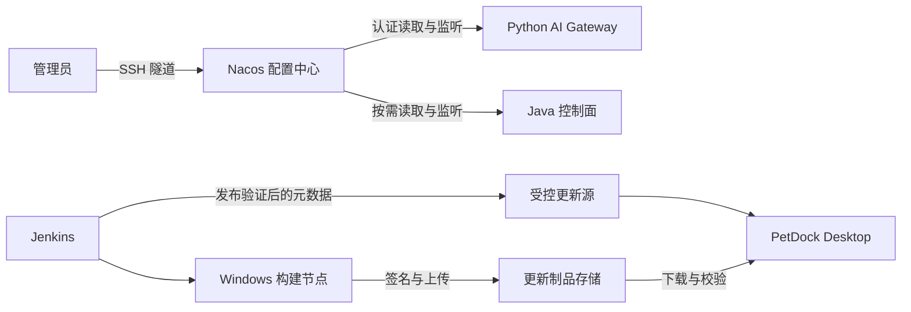

# Nacos 配置中心与桌面自动更新实施方案

状态：Tracking。2026-09-26：用户已确认 P0、P1-B、P1-C 服务器验收通过；P1-D Chat 的生产切源、模型热更新、真实 SSE/用量闭合与两种回退也已由用户现场验收，P1 Chat 闭环结束。2026-10-04 进入 P3-B3：P3-B2 正式 `0.2.2` HTTPS 整包及暂停/恢复已由用户验收，本批在 `0.2.3` 源码内置正式信任/更新源，并准备下载页与真实安装步骤。NSIS 两版本升级仍待现场验收，P3 整阶段未完成，当前交接见第 22 节。已确认选择 Nacos 配置中心，以及桌面整体自动更新；不实施前端资源热更新。

2026-10-02 版本准备：用户指定 Desktop 源码版本升为 `0.2.2`，并自行执行 `npm run dist` 构建。应用与锁文件的根版本同步更新，Managed 登录从调用方取得实际应用版本，Runtime 优先接收 Main 注入，独立启动读取源码或随包的 `package.json`；不再硬编码客户端版本。第 18～21 节记录当时快照，不能据其历史“正式更新关闭”描述判断当前源码；P3-B3 引导版现状见第 22 节。

## 1. 目标与已确认边界

1. 将高频业务配置从生产 `.env` 迁入 Nacos，提供集中编辑、历史记录、发布与回退，减少 SSH 手改文件。
2. 让 AI Gateway 在不重建容器的情况下应用有效的新提供商配置；保持在途请求的一致性。
3. 为 Windows NSIS 安装版提供检查、下载和重启安装更新，用户无需反复手动下载安装包。
4. 结合 Jenkins 建立“构建制品、验证、发布配置或更新入口”的流程，不把一次构建成功等同于已对用户发布。
5. 通过真实项目学习 Nacos，但先完成可验证的小闭环；不同时重做服务发现、部署架构和所有客户端组件更新。

环境：单台 Ubuntu Server 26.04 LTS、4 核 8G，运行现有 Cloud/Web、Jenkins 与相关数据服务；用户此前反馈剩余磁盘约 20G，Jenkins 串行构建压力较小。最新截图中所选时间段 CPU 平均约 4.168%、峰值 66.9%，内存平均约 3159MB/45.22%、峰值约 3401MB/48.246%。这些是该时间段监控值，不代替引入 Nacos 后的压力及磁盘测试。

Nacos 第一阶段只作为服务端配置中心。桌面端不连接 Nacos、不持有 Nacos 凭据、不接收官方 Provider API Key；服务发现继续使用现有 Compose 网络。BYOK 是用户本机配置，本期不迁入服务器。

## 2. 待确认决策

下表区分用户已确认的结论与仍需确定的实施细节；尚未明确的选项不能在实施中静默视为授权。

| 编号 | 决策 | 建议/选项 | 当前状态与影响 |
| --- | --- | --- | --- |
| D1 | Provider Key 管理 | 首期 Nacos 只保存凭据引用，真实 Key 留在服务器 Secret | 已确认；首期不将明文或加密 Key 迁入 Nacos |
| D2 | 首期迁移范围 | 先跑通单机配置中心与 Chat 热更新，再扩展 | 已确认；P1 不一次迁移全部能力 |
| D3 | 更新包存储 | 腾讯云轻量对象存储（Lighthouse 版），私有桶与 `download.petdock.site` 受限入口 | 用户确认已建广州桶；官方文档表明不支持自定义源站域名，入口重定向到默认桶 HTTPS 域名；真实权限/源/SDK 尚未接入，暂不开 CDN |
| D4 | 更新交互 | 用户主动下载、选择重启，任务执行期间延后更新 | 已确认；不默认后台下载或强制打断任务 |
| D5 | Windows 构建与代码签名 | 当前没有代码签名证书；先用当前 Windows 开发电脑打包 | 用户选择暂不购买证书；P3-B1 实现 Ed25519 清单、内置信任表及轮换/撤销规则，生产密钥及保管尚未落实；Windows 未知发布者提示仍存在，Jenkins 构建接入未落实 |
| D6 | Nacos 首期运行与访问 | 单机验证、SSH 隧道、验证后锁定版本与存储 | 已确认；控制台不直接公开到公网 |
| D7 | Nacos/SDK 版本与持久化 | 在 P0 核对支持矩阵、维护状态、授权许可和存储方案 | P0 固定 Nacos 2.5.4 / Python SDK 2.0.11、内嵌 Derby 并完成本地验证；用户已确认服务器部署与 SDK 真实验收通过，Java 客户端未引入 |
| D8 | 客户端范围与渠道 | Windows NSIS 自动更新、Portable 仅提示下载；统一正式更新渠道 | 已确认；不实施 beta 渠道或按用户分组发布，不承诺跨平台同步支持 |
| D9 | 下载域名、地区、预算与访问 | 主域名已备案；大陆用户不超过约 20 人；预算目标约 10 元/月；允许任何人下载，但需防恶意下载费用 | 用户选择私有桶与受限匿名入口，接受小幅超支，要求告警、限流、暂停；已确认广州并核查 Lighthouse 现价，旧包正常用量约 7.62 元/月；HTTPS、实际续签与防护演练未落实，10 元不是硬封顶 |
| D10 | 发布范围与最低版本限制 | 暂不需要灰度，服务端与客户端均统一发布；客户端仍由用户选择下载和重启 | 发布范围已确认；全量可用不等于强制同时安装，不默认最低版本限制或自动降级 |

D1～D6 已获得用户回复，可据此准备 P0。签名方案和对象存储具体选型影响真实更新分发验收，但不阻塞 Nacos 原型；D7 的本地验证见第 13 节；服务器部署与 SDK 真实验收已获用户确认，资源共存等专项结果仍需分别留证。

代码签名证书用于验证 EXE 发布者与完整性，不是 HTTPS 证书。用户暂无证书：先做开发环境更新验证，并在 P3 明确正式发布信任方案，不默认购买服务、不擅自关闭生产校验。可评估受信任代码签名或专门设计的应用层签名验证；后者不能冒充 Windows 受信任发布者签名，也不能假定 electron-updater 已自动支持。仅靠 HTTPS 和可被同时替换的包摘要不足以替代独立信任根。

Windows 构建先使用当前开发电脑；只有电脑在线且允许执行任务时才构建。P3 定义 Jenkins 连接方式、专用工作目录、发布凭据和资源限制，不让流水线覆盖用户正在工作的检出或自动获取本机其他凭据。

## 3. 现状核对与权威来源

| 模块 | 已核对事实 | 对方案的约束 |
| --- | --- | --- |
| 控制面 | Spring Boot 3.5.5、JDK 21 | 引入 Spring 集成必须核对兼容矩阵；不为 Nacos 无计划升级整个 Spring 栈 |
| AI Gateway | Python 3.13 容器；`GatewaySettings` 是不可变配置；`create_app` 启动时读取环境并创建 Provider/Service | 引入 SDK 只能获取变化，需要独立改造提供商生命周期和请求配置快照 |
| Provider 注册 | 公开逻辑模型与内部 Provider 分离，注册表目前按启动配置创建 | 不能把供应商型号和 Secret 暴露为新的桌面协议字段 |
| 官网 | 已有管理员界面、SSO、统计 | 首期在 Nacos 控制台管理配置；不同时开发一套重复的 Web 通用配置编辑器 |
| Desktop | Electron 43、electron-builder 26 配置，NSIS + Portable，Python Runtime 随包 | 优先整体安装更新；Portable 不承诺与 NSIS 相同的自动安装 |
| 自动更新接入 | 未见主进程调用 autoUpdater 或引入 electron-updater | 现有安装用户至少需要安装一次具备更新器的新版本 |
| Jenkins | Cloud/Web 默认分支锁定 SHA，支持已构建镜像复用 | 配置发布、应用镜像发布与桌面制品发布应独立编号和操作 |

当前方案读取的基线：Desktop `785784d6095e00699eeb3b950757db3f665d2edd`；Cloud `46a0614f45df521a1c6e56e75183633f9699aafd`。这些只是方案调查基线，不是本需求的发布版本。

实现入口：Desktop [package.json](../../package.json)、[主进程](../../src/main/index.ts)；Cloud [配置读取](../../../petdock-office/petdock-cloud/services/ai-gateway/app/config.py)、[应用生命周期](../../../petdock-office/petdock-cloud/services/ai-gateway/app/main.py)、[提供商注册表](../../../petdock-office/petdock-cloud/services/ai-gateway/app/providers/registry.py)。

涉及公共配置协议、更新查询接口或跨端错误码时，先修改 [Cloud Managed v1 权威契约](../../../petdock-office/petdock-cloud/contracts/managed-service/v1/README.md)，再按现有流程同步 Desktop 快照。本文件中的字段、Data ID 和状态仅是方案草案，不是已存在的接口。

## 4. 整体结构与职责


```mermaid
flowchart LR
  Admin[管理员] -->|SSH 隧道| Nacos[Nacos 配置中心]
  Nacos -->|认证读取与监听| Gateway[Python AI Gateway]
  Nacos -->|按需读取与监听| Control[Java 控制面]
  Jenkins[Jenkins] --> Win[Windows 构建节点]
  Win -->|签名与上传| Storage[更新制品存储]
  Jenkins -->|发布验证后的元数据| Feed[受控更新源]
  Feed --> Desktop[PetDock Desktop]
  Storage -->|下载与校验| Desktop
```

Nacos 负责配置存储、权限、通知和历史；应用负责校验、应用状态、请求切换和降级。Jenkins 负责制品构建和发布编排。桌面更新源只提供公开更新数据，与内部 Nacos 凭据隔离。

客户端正式版本发布策略可以由 Nacos 管理，但安装包、blockmap 等大文件必须放制品存储。首期使用单一正式静态更新源；若之后让 Nacos 驱动发布策略，则由服务端适配输出兼容更新器的元数据，不让客户端依赖内部配置格式。Nacos 不可用不应使已经发布的安装包失去下载入口。

## 5. Nacos 部署与选型验证

P0 必须输出版本矩阵：Nacos Server 的具体版本和镜像摘要、所需 JDK、Java 客户端或 Spring 集成版本、Python SDK 包名与版本、认证/监听机制、网络端口、重连行为、存储方式、备份方式。检查官方支持和维护状态后才生成安装命令。

候选优先使用官方维护的客户端。若 Java 原生 SDK 已满足当前配置监听，就不强行引入整套 Spring Cloud；若选择 Spring Cloud Alibaba，必须证明与 Boot 3.5.5 的组合受支持。Python 侧验证同步/异步模型、TLS/认证、监听回调线程及退出资源释放，不照搬 Java 的自动刷新注解思路。

单机部署使用独立 Compose 项目和持久化目录、受限内网访问、SSH 隧道管理；各版本的控制台、HTTP/gRPC 端口可能不同，按选定版本设计映射，不能直接假设只保护一个端口即可。控制台写账号与服务只读账号分离，验证权限真实生效；不把 Namespace/Group 名称当作访问控制本身。

存储先评估选定版本支持的单机内嵌方式及其生产恢复限制；若需要外部数据库，记录新增数据库的资源与运维成本。不能假定现有 PostgreSQL 原生受支持，更不能未经验证就接第三方插件。最终方案必须能恢复配置、权限及历史。

资源验收包含常态、持续配置通知、Nacos 重启、Jenkins 单个真实构建与运行服务共存。观察进程 RSS、容器 OOM、系统 MemAvailable、磁盘、接口延迟和配置收敛时间。现有构建门槛为 3GiB 可用内存、10GiB 构建前空间，不能为了通过试验直接降低这些门槛。若出现资源冲突，重新定 JVM/容器预算、维护时间或扩容。

官方参考入口（实施时核查具体版本，不代表本方案已完成在线兼容性验证）：[Nacos 文档](https://nacos.io/docs/latest/)、[Java 客户端](https://github.com/alibaba/nacos)、[Python SDK](https://github.com/nacos-group/nacos-sdk-python)、[Spring Cloud Alibaba](https://sca.aliyun.com/)。

## 6. 配置分类、组织与迁移

| 配置 | 首期处理 | 变化约束 |
| --- | --- | --- |
| 数据库/Redis/Nacos 地址、认证、监听、签名根密钥 | 保留环境或 Secret | 启动配置，维护时重启 |
| Chat 提供商模式、地址、型号、Key 引用 | 优先迁移 Nacos | 同一个配置快照原子应用 |
| Vision 提供商、图片预算、超时 | Chat 闭环后迁移 | 需同步校验描述版本及已有图片限制 |
| Web Search 提供商和请求预算 | 后续迁移 | 仅支持已实现的适配器，新增配置不能凭空支持新协议 |
| 并发、超时、重试预算 | 按字段审查迁移 | 改并发池需额外设计；不能把全部 settings 字段都标为可热更新 |
| 能力开关 | 区分运营关闭和紧急撤销 | 普通关闭影响新请求；紧急撤销是否终止在途任务需单独定义 |
| 套餐授权、用户额度、余额、用量账本 | 保留业务数据库 | 不进入 Nacos，不因切模型绕过授权或重复结算 |
| Embedding 模型、维度、描述版本 | 专项迁移 | 向量兼容和重建评估，不作为普通提供商热切换 |
| 客户端正式版本策略 | 可后续进入 Nacos | 单一正式渠道，公开更新信息通过独立受控入口输出 |

建议按环境 Namespace、应用 Group、能力 Data ID 组织；这是待 P0 定稿的命名方案。例如生产 Namespace、`petdock-ai-gateway` Group、`chat-provider.json` Data ID。不要把每个字段拆成独立 Data ID，避免跨文件到达顺序导致半套配置。

配置文档建议包含 `schemaVersion`、应用层 `revision`、提供商类型/端点/模型和凭据引用。revision 是本应用对完整快照的标识，不假定 Nacos 已提供相同语义。修改时先做结构、范围和组合校验，连接探测使用合成输入且明确可能产生费用，不发送用户历史内容。

迁移步骤：盘点键→将现有有效配置整理成草稿→发布 Nacos 文档→应用影子读取/校验→确认结果→按能力切换读取来源→监控→移除该能力旧 `.env` 业务字段。源选择是明确的启动配置；迁入后 Nacos 是唯一业务配置源，不能逐字段混合回退 `.env`。保留已脱敏的映射清单和受限原配置备份。

回退到旧来源是显式维护操作；迁移运行期间失联优先使用最后有效快照，不偷偷启用历史 `.env` 中的另一家提供商。

## 7. Python 热更新的正确性

状态建议：收到候选→解析校验→准备新 Provider→原子切换有效快照→旧快照排空→释放连接。校验/准备失败进入“拒绝应用”，继续保留有效版本。

每个请求开始时获取完整快照引用，并在本次请求、流式输出和用量记录过程中保持它。切换发生后新请求使用新版本；旧 Provider 只在引用归零或受控退出时释放。不得因改配置在流中间改变模型、密钥、费用归属或重试到新版本。

SDK 监听可能在独立线程调用；回调只提交候选通知，通过应用事件循环串行协调校验与切换，不能直接在 SDK 线程修改异步客户端。合并重复通知，抵抗乱序和“慢校验覆盖新配置”；应用最新有效候选时要校验它仍为预期发布版本。

Nacos 历史回退要作为一次新的发布操作，携带旧内容与新的应用层 revision，不能因简单数字大小判断永远拒绝回退。配置对目标服务统一发布，不做按用户或实例灰度；能力分阶段开发不代表线上灰度。不同实例若未来扩容，分别报告实际应用版本，不能把通知声称为跨实例原子切换。在途请求仍按原快照完成，全量发布不要求中断它们。

运行态失联：继续最后有效内存配置并标记 stale；无有效配置的首次启动：相关能力不可用、返回既有稳定错误，不使用任意默认 Provider。是否允许重启后加载持久化快照在 P0 明确，若启用则限制权限、校验摘要和结构，不在普通缓存落盘明文 Key；不能把 SDK 存在缓存等同于业务恢复已经可靠。

至少记录能力、候选 revision、有效 revision、最后成功应用时间、拒绝原因类别、旧请求数量。禁止记录完整配置、API Key、Cookie、用户正文；管理页面或运维探测必须区分“Nacos 发布成功”与“Gateway 应用成功”。首期可先以受限日志/指标验收，后续再加 Web 应用状态面板。

## 8. 密钥与备份

D1 选择“引用”时：Nacos 保存受控逻辑引用，不接受任意本机文件路径；由服务侧映射到 Secret。轮换使用新引用、新密钥和完整配置一起发布，旧密钥在旧请求排空后撤销。只覆盖同一个文件不一定会刷新已经创建的客户端，不能称为完整在线轮换。

用户已选择引用方案，首期不实施 Nacos 内密钥加密管理。未来若迁入密钥，必须单独验证插件或应用层加密格式的 Java/Python 兼容性；主密钥/KMS 凭据保存在 Nacos 外，配置历史、导出、数据库、日志及客户端缓存均不得残留明文。TLS、登录权限与加密存储是不同能力。

备份覆盖 Nacos 配置/权限/历史、持久化或外部数据库、服务侧 Secret、必要解密材料以及版本清单。主密钥备份与密文分开、主机外加密保管；Nacos 自带历史不替代独立备份。至少进行一次隔离恢复演练，并验证恢复后提供商配置及权限可用。

## 9. 桌面自动更新范围与行为

建议采用与当前 electron-builder 相容的 electron-updater；具体版本、NSIS 差量行为、元数据格式和签名校验在 P3 验证。不要将 SHA-512/摘要校验当成发布者身份验证；更新源、制品签名和客户端校验共同构成信任链。

NSIS 安装版：启动后合适时机检查，也提供手动检查；下载行为由 D4 决定；下载完成后由用户选择立即重启或稍后。聊天流、工具任务、知识库写入等执行中不得强制退出，需维护统一 busy 判断。托盘关闭通常不等于真正退出，要审查 quit/安装事件、flush 本地状态、停止 Runtime 进程和单实例锁。

Portable：显示新版本和官方下载入口，第一期不实现原地替换自身。开发态和解包目录默认关闭真实更新，验收必须用正式打包安装态；不以浏览器下载测试代替更新器安装测试。

整体更新包含 Electron 主进程、Renderer 和打包的 Python Runtime，版本兼容一起验证；大模型/用户数据不随每次更新重下。数据库、配置和安全存储迁移要向后兼容；不承诺安装失败后自动降级旧程序，紧急情况下先暂停新版本推送并发布更高版本修复包。

公开更新内容只包含版本、渠道、平台/架构、更新说明、制品地址、完整性及签名所需信息。客户端内置可信更新源，拒绝非预期协议、任意下载域名和明文降级；签名证书/发布者变更要单独设计，不能让普通业务配置修改签名信任根。

首次带更新器的引导版本仍需用户手动安装一次。后续每次仍有唯一递增应用版本和可追溯制品；可以不发公开公告，但不能反复覆盖同版本安装包。

## 10. 制品分发与 Jenkins

已确认使用对象存储和独立下载地址，不把正式更新包长期放在当前业务服务器的 20G 剩余磁盘中。2026-10-01 用户确认已建腾讯云轻量对象存储（Lighthouse 版）广州桶。下载域名 `download.petdock.site` 作为自有受限 HTTPS 入口，重定向到私有桶默认 HTTPS 域名；Lighthouse 版不支持自定义源站域名，不能沿用标准 COS 的域名接入假设。上传的 `StorageClass` 省略或使用 `DEFAULT`，不使用 `STANDARD`，也不依赖生命周期和版本控制等高级桶功能。

第一期不开通 CDN、全球加速或额外安全付费套餐。最多约 20 位大陆用户，先验证默认桶域名直接下载的速度与预算。Lighthouse 广州容量 `0.00393333 元/GB/日`、大陆下行 `0.5 元/GB`，按 1024 进制计量，不另收请求费；套餐超出仍按量计费。月预算目标约 10 元，不把容量包误当成包含全部下载流量。2026-10-01 官方核查链接及限制见 [签名与下载边界](../features/DESKTOP_UPDATE_TRUST.md) 第 5 节；正式启用前复核价格。

旧 Setup 约 191.6 MiB，仅作为估算。20 人每月 4 次全量更新约 `14.97 GiB`，最近三版 Setup/Portable 合计约 `1.12 GiB`；按 30 天现价估算容量 `0.13 元`、下行 `7.49 元`，合计约 `7.62 元/月`。重试、新安装、额外 Portable、包增大、现有桶其他用量及入口增量费用另计，不能承诺每月一定小于 10 元。差量默认关闭，节省效果留到实测。

公开下载表示用户无需登录，不等于存储桶必须允许匿名无限读取。费用保护优先评估以下方案：COS 桶保持私有，公开下载入口不要求账号登录，通过受限服务签发短时只读链接；签发入口做单 IP 和全局速率限制，并设置异常流量时停止发新链接的开关。上传账号只允许写目标制品路径，下载只允许读取确定的版本文件，不允许匿名列举、上传或删除。

短时链接在过期前仍可被重复使用，限制链接签发不等于限制所有下载字节；Referer 防盗链也不能作为费用防护的唯一措施。需要验证 electron-updater 的 HEAD、Range、断点续传、blockmap、重试和链接到期兼容性，下载时效不能仅按很小文件设计。若选择 CDN，必须同时核查源站绕过、缓存费用、计量与停止服务延迟。

计划设置低额预算通知（具体阈值随核价确定）、下载流量/请求异常告警和独立的暂停下载入口，确保暂停行为可演练。云账单告警通常有延迟，不是绝对费用封顶；已经开始的下载或仍有效的链接也可能继续产生流量。如果需要不可超出的硬预算，必须另外评估可计量的受控下载代理或供应商明确支持的限额机制，说明其额外带宽、运维和延迟成本；当前方案不把“约 10 元目标”包装成硬保证。

P3 上线前交付：Lighthouse/入口 HTTPS 接入表、费用测算、最小权限、明确对象清单的版本保留策略、完整下载与短时链接测试，以及异常下载的告警和暂停演练；差量启用前另验收。下一批需要确切的桶默认主机与受控服务器配置，不要求用户把 AccessKey/SecretKey 或带签名 URL 发到聊天，也不授权自动购买资源；所需凭据在实际接入时通过服务器 Secret 配置，发布编排的 Jenkins Credentials 属于 P4。

更新源文件先暂存，所有安装包及辅助文件上传完整并验证可下载、签名/摘要正确后，再原子切换正式更新元数据。部分上传失败不改变当前正式版本。配置回退与客户端二进制回退含义不同：撤下版本只能阻止后续下载，不会让已升级客户端自动回到旧版本。

Windows 构建节点执行已有 `npm run dist` 相关流程、Runtime 打包、安装态测试和确定后的签名步骤；Ubuntu Jenkins 负责编排，不把 Windows EXE 打包直接套进服务端 Linux Dockerfile。已确定先使用当前开发电脑，P3 再明确连接方式及可用时段；未来签名凭据限可信发布任务，避免普通分支/PR 获得它。

发布状态：构建完成→制品验证通过→人工验收→全量正式可用→暂停。用户已确认暂不需要灰度，不开发 beta、百分比分桶、用户白名单或灰度标识。正式元数据发布后，所有符合平台与架构条件的客户端在下一次检查时看到同一正式版本，下载和安装继续由用户决定。

Jenkins 区分三个入口：服务镜像发布（沿用当前流程）、Nacos 配置变更（校验+发布+确认应用版本）、桌面制品发布（Windows 构建+签名+上传+元数据切换）。普通服务器发版不覆盖 Nacos 配置；普通配置变更不重建应用。Nacos 手动编辑需与流水线约定单一写入窗口/并发校验，不能两边同时覆盖。

## 11. 分阶段任务与角色编排

按 [角色手册](../guides/multi-agent/README.md) 执行；每次分派附共同约定、角色文件和任务单。同一任务及跨仓子任务总计最多两个代理，包含主代理；主代理始终占一名额，最多一个未结束子代理，子代理禁止派生。下表是顺序角色职责，不代表同时启动全部角色。

| 阶段 | 工作与产物 | 主要角色 | 验收后才能继续 |
| --- | --- | --- | --- |
| P0 选型/原型 | 版本矩阵、Nacos 单机配置、Python 监听与故障样例（Java 按需后置）、资源/恢复报告 | coordinator + release；完成后切换 cloud/qa | D1/D2/D6 明确；存储、权限、监听和资源通过 |
| P1 Chat 闭环 | 配置 Schema、影子读取、快照切换、旧请求排空、指标、迁移/回退命令 | coordinator + cloud，之后 reviewer/qa | 真实流中切换、无效配置拒绝、失联恢复、用量一致 |
| P2 扩展配置 | Vision/Web Search，按需 Java 开关，配置键清单与 `.env` 精简 | cloud，按需 web | 每种能力有独立验证，不批量标记全部字段可刷新 |
| P3 自动更新底座 | Windows 构建与签名、更新源、NSIS 更新器、Portable 提示、任务忙碌策略 | desktop + 主代理整合；release 顺序接手 | D3/D4/D5/D8 确认；真实安装更新成功 |
| P4 发布整合 | Jenkins 制品登记与全量发布、Nacos 配置发布流程、运行手册 | release，按需 cloud/web | 部分上传失败不发布、暂停有效、管理权限通过 |
| P5 联合验收 | 旧客户端引导、离线、磁盘不足、签名失败、配置恢复、全量发布 | qa，之后 reviewer | 阶段证据完整，生产操作单独执行并记录 |

依赖关系：P0→P1→P2；P0 的信任/版本规则确定后可设计 P3，不必等待所有能力迁移；P3→P4→P5。受代理上限约束，独立工作可由主代理与一个子代理交错推进，其余角色排队。一次只发布一个可验收闭环，不把 Nacos、Provider 切换和全量客户端升级放进同一个生产维护窗口。

## 12. 验收与回退矩阵

| 场景 | 预期 |
| --- | --- |
| 正常改 Chat 模型 | 新请求使用新版本；在途输出与用量保持原快照 |
| 地址/Key 引用/Schema 错误 | 拒绝应用，保留有效配置；错误可定位但不泄密 |
| 通知重复/乱序/快速连续修改 | 不重复创建资源；旧候选不能覆盖新配置 |
| Nacos 停止、重连、权限撤销 | 可观察 stale/认证失败；已有有效服务按既定策略运行 |
| 首次启动无有效配置 | 相关能力不可用，不使用危险默认值 |
| Nacos 备份恢复 | 恢复配置与权限；验证历史、凭据引用和实际生效版本 |
| 桌面正常更新 | 下载校验后，用户选择空闲时安装，数据和登录态保留 |
| 聊天/工具/知识库任务运行中 | 不自动强制退出；完成后允许更新 |
| 网络断开、磁盘不足、包损坏或签名无效 | 明确失败、保留现有可运行应用，不安装未验证内容 |
| 元数据发布前上传中断 | 正式更新源仍指向原完整版本 |
| 新客户端故障 | 暂停推送、保留下载与诊断；发布更高修复版本，不盲目降级本地数据 |
| 同机运行 Nacos 与 Jenkins 构建 | 无 OOM；接口和配置收敛满足 P0 记录的目标 |

涉及 Provider 连通性的真实调用使用专用测试凭据和合成输入，事先明确费用；文档、代码和测试日志均不保存生产 Key、用户正文或安装签名私钥。

## 13. P0 交付与下一步（2026-09-15）

第一批已在 Cloud 实现独立 Nacos Compose、文件式随机凭据初始化、组级只读权限、固定版本 Python SDK 原型及冷备恢复步骤。现行入口：[P0 部署指南](../../../petdock-office/petdock-cloud/docs/guides/NACOS_P0_DEPLOYMENT.md)；实际证据：[P0 验证归档](../../../petdock-office/petdock-cloud/docs/archive/2026-09/reviews/NACOS_P0_VERIFICATION.md)。

本地验证通过：真实发布/读取/明确拒写、匿名与跨组拒读、监听、原进程断线重连、冷备恢复配置/历史/权限；Windows 与 Linux Python 3.13 的 SDK 13 项测试分别通过，Cloud 根测试 38 项通过。SDK 2.0.11 批量监听在 Server 2.5.4 上需要固定资源的单实例鉴权字段适配；该限制已记录，不能把探针直接复制进 Gateway。

本批不修改 Gateway 配置源或生产 `.env`，不引入 Java SDK，不更改公共契约，不开发其他模型能力或桌面更新。P0 名称与资源预算仅用于隔离验证；该记录形成时服务器尚未验收；2026-09-19 用户已确认服务器部署与 SDK 真实验收通过。Jenkins 同机资源、SSH/外网隔离、长期日志和加密离机恢复的逐项结果仍需现场留证，不能由 SDK 通过推定全部通过。

P1 拆为可独立验收的小批次：P1-A 完成 Chat 配置 Schema、凭据引用、请求快照与 Provider 排空；P1-B 接入监听及影子校验；P1-C 完成影子长期运行和回退演练；P1-D 完成生产源迁移与两种回退，2026-09-26 用户确认生产验收通过，P1 Chat 闭环结束。P2 多能力迁移按需求后置，不阻塞后续桌面更新底座；本轮尚未确定的 COS、签名与 Windows 构建接入事项在对应阶段继续确认。

每轮以小闭环交付并提交，进度继续维护现有文档，详细证据进入日期归档。阶段记录区分代码完成、本地验证、用户报告上线和实际生产验收；不因额度中断自动将未执行项标记通过。

## 14. P1-A 配置与请求生命周期交接（2026-09-20）

本批范围：只为 AI Gateway 的 Chat 建立配置与 Provider 生命周期底座。生产仍由 `GatewaySettings.from_environment()` 读取现有 `.env`；没有 Nacos 订阅、生产源选择开关、配置写入 API 或新增桌面协议。本批不发起真实 Provider 探测或付费调用。

### 14.1 完整候选格式

以下是内部完整候选样例，不是本批需要发布到 Nacos 的配置。所有字段都必须显式提供；不接受未知字段、字符串布尔值、浮点预算或缺字段的部分更新。

```json
{
  "schemaVersion": 1,
  "revision": 1,
  "enabled": true,
  "mode": "openai_compatible",
  "baseUrl": "https://api.example.test/v1",
  "model": "synthetic-chat-model",
  "apiKeyRef": "secret://chat/default",
  "maxOutputUnits": 2400,
  "inputBytesPerUnit": 3,
  "firstEventTimeoutSeconds": 15,
  "idleTimeoutSeconds": 30,
  "totalTimeoutSeconds": 120
}
```

`schemaVersion` 固定为 1；`revision` 为 0～2^63−1 整数。启动快照 revision 为 0，候选必须使用更大的 revision；同 revision 同内容是幂等空操作，同 revision 不同内容及旧 revision 拒绝。回退使用旧内容加新的 revision。`mode` 允许 `disabled`、`fake`、`openai_compatible`，生产禁止 `fake`。禁用候选也须完整，地址、模型及引用可显式为 `null`；已填写的字段仍参与格式校验。

输出预算范围 1～100000，输入估算每单位字节数范围 1～16，三类超时均为 1～300 秒，首事件和空闲超时不能超过总超时。地址必须为 HTTPS，拒绝 URL 内用户名/密码、查询参数、片段、空白及无效端口。本文候选 Schema 是服务内部格式，不能代替 Managed Service v1 公共契约。

### 14.2 Secret 与现有环境变量

`PETDOCK_CHAT_PROVIDER_API_KEY_FILE` 仍保留，启动时映射为 `secret://chat/default`。候选只接受 `secret://chat/<name>` 格式并经服务侧映射白名单解析，不允许候选指定文件路径。白名单在进程启动时复制固定，本批没有新增白名单环境变量或远程编辑入口。

Secret 读取限制为 64 KiB，拒绝不可读、空、无效编码和不适用于 HTTP 请求头的内容，异常不返回路径或正文。新增凭据及轮换须在后续接入中先登记新逻辑引用和服务器 Secret，再以新 revision 发布完整配置；不要覆盖同一文件后期待当前实例自动重读。旧凭据须待旧请求排空后撤销。

其他现有 Chat 环境字段分别适配 `enabled`、`mode`、`baseUrl`、`model`、输出预算、输入估算和三类超时。HTTP 正文与工具定义预算、认证、额度事实源及其他能力仍按原启动配置运行。

### 14.3 请求与 Provider 所有权

`ProviderManager.apply()` 是事件循环内的内部候选入口：严格校验、准备 Provider、一次替换快照，失败保留原有效版本。准备阶段只构造客户端配置、读取 Secret，不声称已经验证上游连通性。生命周期管理必须由所属事件循环串行调用，未来 SDK 线程只能投递通知，不能直接调用它。

请求在额度预占前获取租约，将 Provider、revision、开关、预算与超时一起绑定到专属 `ChatStreamService`。流式输出、日志别名和用量结算沿用这个实例；新的配置只影响后续请求。Capabilities 查询也读取当前有效 Chat 快照。

旧 Provider 在引用归零后独立关闭，不让慢关闭阻塞新请求。当前 OpenAI-compatible 实现每请求持有独立 HTTP 客户端，流关闭释放连接；Provider 排空关闭后清除对旧凭据的引用，这不等同于可证明的内存安全擦除。已打开但未迭代的流、响应首发失败、建流取消以及正常停机均须显式清理。停机先拒绝新 Chat 请求、闭合在途流和租约，再关闭 Provider 与用量客户端。

### 14.4 下一批与服务器动作

P1-B：接入固定版本 Nacos SDK 的监听与影子校验；收到通知后回到 Gateway 事件循环，处理重复通知、乱序与最新候选确认；暴露受限的候选/有效 revision、拒绝类别及失联 stale 状态。影子阶段只验证，不能调用 `apply()` 改变生产有效快照。明确 Data ID、Group、启动认证与 Secret 白名单登记方案后，再准备生产源迁移及回退命令。

本批服务器无需修改 `.env`、发布 Nacos Chat 配置或重启 Nacos。若发布本批 Gateway 镜像，沿用现有 Jenkins 流程和 `.env`；先验证健康、Capabilities 和一次合成 Chat 请求的 SSE 顺序/用量闭合，再检查停机日志。真实流中模型切换、Nacos 断线重连及 stale 恢复的生产验收留给后续批次，不因本地模拟测试通过而标记完成。

P0 的服务器部署与 SDK 真实验收已由用户确认；Jenkins 共存资源、长期日志、外网隔离和离机恢复若尚无逐项记录，继续按 P0 指南留证，不重复部署已验收的实例。

## 15. P1-B Chat Nacos 影子监听交接（2026-09-21）

P1-B 已完成 Gateway 侧影子监听底座。固定资源为 Namespace `petdock-production`、Group `PETDOCK_AI_GATEWAY`、Data ID `chat-provider.json`；只读账号为 `petdock-ai-gateway-reader`。生产默认关闭 `PETDOCK_CHAT_NACOS_SHADOW_ENABLED`，开启后只读取、校验和报告候选，不调用 `ProviderManager.apply()`，有效 Chat 配置仍是 `.env` 启动快照。

监听器使用锁定的 `nacos-sdk-python==2.0.11`，为 Server 2.5.4 的单资源批量监听补齐顶层鉴权字段；回调只投递到 Gateway 事件循环，队列满时丢弃旧通知并重新读取服务端当前内容。候选按完整 Schema 校验，处理重复、同 revision 冲突、旧 revision、未登记 Secret 引用和错误资源；有效候选只更新影子 candidate revision。网络或 SDK 故障经过 stale 阈值后报告 `stale`，恢复读取后回到 `healthy`。候选、有效 revision、拒绝类别和连接时间通过内网状态端点 `/internal/v1/config/chat/status` 与低基数 Prometheus 指标暴露，不暴露凭据或配置正文。

Cloud 新增 P1-B 部署入口：[Chat Nacos 影子监听部署与验收](../../../petdock-office/petdock-cloud/docs/guides/NACOS_P1B_CHAT_SHADOW_DEPLOYMENT.md)。服务器部署需要先让 Nacos P0 栈创建固定共享网络，再使用 `prepare-shadow`、`bootstrap-shadow` 初始化生产 Namespace 和只读账号，发布合成候选后再通过 Jenkins 发布 Gateway。Nacos 端口仍只绑定回环；生产 Compose 通过外部 Docker 网络连接，不新增公网端口。

本批本地验证：AI Gateway 124 项通过，Ruff 和 Mypy 通过；Cloud Nacos 部署测试 7 项通过，P1-B 影子监听测试 4 项通过。2026-09-21 用户报告服务器影子监听验收通过：状态为 `healthy`，候选 revision 1 有效，`effectiveRevision=0`，指标与状态一致；该结果属于用户现场报告，不替代本地 Linux 容器回归或代理实际生产操作记录。生产真实 Provider 调用和配置源切换仍未执行。下一批是 P1-C：先做影子长期运行与回退演练，再单独评审是否允许生产配置源切换。

## 16. P1-C 服务器演练交接与 P1-D 边界（2026-09-22）

用户报告已完成 P1-C 影子长期运行、故障恢复和影子回退演练，未发现问题；代理未直接操作服务器，也未收到逐项日志归档，因此只记录为用户现场验收。P1-C 不改变生产配置源，Nacos 监听仍只形成候选，生产有效 Chat 配置继续来自 `.env`。

P1-D 已实现 Chat 生产源迁移与显式回退：增加默认值为 `env` 的源选择；选择 `nacos` 时完整候选经现有 Schema、Secret 白名单和 revision 校验后，才在 Gateway 事件循环调用 `ProviderManager.apply()`；运行期间 Nacos 失联保留最后有效快照，不自动回退到 `.env` 或另一 Provider。迁移前须生成与现网一致的 Nacos 完整配置、保留受限 `.env` 回退快照，并提供“旧内容加新 revision”的配置回退和显式切回 `env` 的维护步骤，具体见 Cloud 的 [P1-D 部署指南](../../../petdock-office/petdock-cloud/docs/guides/NACOS_P1D_CHAT_SOURCE_MIGRATION.md)。

P1-D 已在本地覆盖首次有效配置、无效候选、重复/乱序、旧 Provider 排空、Nacos 失联和默认健康门槛；默认配置和本地测试不触发真实 Provider 请求。2026-09-26 用户报告生产切源、模型热更新、真实 Chat SSE/用量闭合、Nacos revision 回退和显式 `.env` 源回退均通过；代理未直接操作生产服务器或归档逐项日志。P1-D 不扩展 Vision、Web Search、Embedding、Rerank 或桌面更新。

## 17. P1-D Chat 生产源迁移交接（2026-09-22）

Cloud 已完成 P1-D 实现：`PETDOCK_CHAT_CONFIG_SOURCE` 默认 `env`，切换为 `nacos` 时不复用 `.env` Provider，而是先以禁用 revision 0 启动；首个有效 Nacos 候选应用后才报告健康并服务 Chat。候选应用复用 P1-A 的完整请求快照、Provider 排空和旧请求租约，失联保留最后有效快照并标记 stale，不隐式回退到 `.env`。

运维命令覆盖 `.env` 脱敏快照、当前 Nacos 配置备份、候选发布、只读验证、Nacos 旧内容新 revision 回退和显式 `env` 源回退。Nacos 只保存逻辑 Secret 引用，真实 Provider Key 仍由服务器 Secret 提供。实现与测试结果记录在 Cloud [进度文档](../../../petdock-office/petdock-cloud/docs/roadmap/MANAGED_SERVICE_PROGRESS.md) 和 [部署指南](../../../petdock-office/petdock-cloud/docs/guides/NACOS_P1D_CHAT_SOURCE_MIGRATION.md)。

本地验证已完成：AI Gateway 128 项、Cloud 根测试 41 项、Nacos 部署测试 10 项、Ruff、Mypy 34 个源码文件、Managed Service v1 契约快照和差异检查通过。用户随后确认生产切源、模型热更新、真实 Chat SSE/用量闭合及两种回退通过，P1 按用户现场验收结束。旧 `.env` Chat 业务字段清理另行评审；P0 资源与备份专项继续独立留证。

### 14.5 本批验证与未执行项

验证日期：2026-09-20。验证对象为 Cloud 实现提交 `d684453` 对应的业务源码与测试工作区；Cloud 基线 `ed7910e`，契约版本 v1，无公共契约改动。验证使用 Windows Python 3.13.2，pytest 临时目录显式指定到可写的独立测试目录；下表省略本机绝对目录值。Cloud 的解释器命令以下用 `python` 表示仓库 `.venv`。

| 工作目录 | 命令/检查 | 实际结果 |
| --- | --- | --- |
| Cloud `services/ai-gateway` | `python -m pytest -q -p no:cacheprovider --basetemp=<隔离临时目录>` | 120 passed |
| Cloud `services/ai-gateway` | `python -m ruff check app tests --no-cache --output-format concise` | 通过 |
| Cloud `services/ai-gateway` | `python -m mypy app --cache-dir <隔离缓存目录>` | 33 个源码文件通过 |
| Cloud 根目录 | `python -m pytest -q -p no:cacheprovider --basetemp=<另一个隔离临时目录>` | 38 passed |
| Cloud 根目录 | `python tools/compare_contract_snapshot.py ../../desktop-pet` | v1 的 57 个文件 SHA-256 一致 |
| 两仓 | `git diff --check`、源码/文档与临时输出忽略检查 | 交付前检查；构建、缓存、日志和本地脚本不进入提交 |

新增测试覆盖完整配置类型/范围、URL 与 Secret 引用边界、Secret 内容脱敏、失败候选保留有效版本、revision 幂等及回退、请求预算与超时冻结、连续切换及乱序归还、慢关闭、禁用配置、未消费流、响应发送失败、ASGI 断连、预占期间重复取消、OpenAI 握手取消以及应用级 Capabilities/Chat 门禁一致性。测试使用合成 Provider/HTTP 传输，不等同于真实上游切换验收。

并发始终最多主代理加一个子代理；Cloud、QA 与 Reviewer 角色依次执行。独立审查未发现可确认问题；主代理在新增快速切换测试中发现 Python 3.13 已完成清理任务可能触发停机忙等，修复为等待后显式移除已完成批次，再经 Reviewer 复核无新增确认问题。

未执行：生产部署、真实付费 Provider 请求、生产 Nacos 业务订阅/切换、Linux 容器内本批回归，以及本批不涉及的 TypeScript/Spring 测试、镜像构建与桌面更新验收。契约未变，不重新生成或同步桌面快照；服务器验证按第 14.4 节执行。

## 18. P3-A 桌面更新本地底座（2026-10-01）

本节保留 P3-A 当时的结果；Lighthouse 选型、签名实现和后续验证以第 19 节为准。

### 18.1 范围与现状核对

三仓开始时均无未提交修改：Desktop `master / 2090dab`、Cloud `master / 03308af`、Web `main / 47b07e9`。本批只修改 Desktop，不重复开发 P1，不开发 P2/P4，不新增 Cloud 更新查询接口或修改 Managed v1 权威契约。

当前应用版本保持 `0.2.1`，该工作区不是新的正式发布版本；首次带更新器的引导版须另分配递增版本并手动安装一次。Electron `43.1.1`、electron-builder `26.15.3`，新增锁定 `electron-updater 6.8.3`。NSIS 是可选择目录的 assisted installer，同时生成 Portable。PyInstaller onefile Runtime 随应用资源整体替换；数据库、配置、附件、Skill、向量索引继续位于 `userData`，不纳入更新制品。

旧 `release` 制品来自 2026-09-13，并非当前提交构建：Setup `200942357` 字节（约 `191.63 MiB`），Portable `200577840` 字节，Runtime `96624759` 字节。Setup、Portable、解包 Electron 和 Runtime 的 Authenticode 均为 `NotSigned`；旧 `app-update.yml` 是 builder 推断的 GitHub 源且无 `publisherName`。builder 默认开启签名校验不能证明无发布者信息的包获得信任验证。

### 18.2 已实现的本地闭环

- `src/main/update` 提供更新状态机、真实引擎适配与托盘原生确认；启动延迟检查与手动检查共用入口，下载和重启是两次明确选择。重复点击合并；下载失败可重试；任务结束不会自动安装。
- NSIS 才可下载并调用安装器；Portable 只检查与打开固定下载入口。开发态、非 Windows、无安装证据的解包目录关闭真实更新。当前 Windows 安装证据为应用同目录的 `Uninstall PetDock.exe`，Portable 环境标记优先；这是保守运行形态识别，不是发布者信任验证。
- Main 的 IPC 全周期、原生文件对话框/写入、截图与自动工具执行共用活动互锁；预留安装后拒绝新操作。聊天与待确认工具必须结束，截图覆盖层也视为忙碌。
- Runtime 新增本机令牌保护的 `POST /v1/update/prepare` 与 `/v1/update/resume`。在同一事件循环原子核对完整 HTTP/SSE 生命周期、真实助手协程、后台知识库索引和后台记忆分析；检查成功后冻结新业务请求，失败可恢复。流断开不把仍运行的助手协程误判为空闲。
- 安装前先 flush 设置，再要求 Runtime 优雅退出；更新路径超时不强杀，状态不可确认时禁止新建第二个 Runtime。资源关闭先收束助手和记忆任务再关数据库。普通退出继续沿用现有退出流程，并修复重复退出可能绕过未完成停机的窗口。
- 引擎显式关闭 `autoDownload`、`autoInstallOnAppQuit`、预发布、自动降级与 Web Installer。首批先完整下载，差量默认关闭。下载与安装前都要求独立制品验证回调，缓存命中不豁免；底层下载地址/异常不写日志。NSIS 参数与提权由现有引擎编排，新增启动确认等待子进程 `spawn/error`，成功启动才退出；异步启动失败与提权失败保留应用并允许重试，不使用原始 `quitAndInstall` 提前安排退出的行为。
- 正式工厂保持关闭：源与下载入口为 `null`，正式验证器不存在，不接受环境变量或 Renderer 覆盖源，也不会回退到旧 GitHub 源。`build.publish=null` 与 `pack/dist --publish never` 防止默认构建生成推断源或隐式发布。没有提供生产跳过签名的开关。

### 18.3 用户决定与尚未落实事项

用户本轮选择：暂不购买代码签名证书，下一批评估独立应用层签名；私有 COS 与不要求登录的受限下载入口，暂不开 CDN；约 10 元/月是目标，接受小幅超支风险，要求告警、限流和暂停开关。应用层签名不能消除 Windows 未知发布者提示。

未落实：独立签名清单、公钥信任根、算法/轮换/撤销、签名私钥保管；COS 购买、地域、当前单价核查、下载域名 HTTPS 接入、短时只读链接与最小权限；预算阈值、异常流量计量、限流与暂停演练；Windows 构建接入；真实 NSIS 两版本安装更新、数据/登录态保留。未采购资源、未索取生产凭据、未改变服务器配置。

以旧包估算，20 人各完整下载一次约 `3.74 GiB`，每月四次约 `14.97 GiB`，新安装、Portable、重试和存储/请求另计。没有完成腾讯云现价核查，不能宣称满足 10 元/月。短期链接在有效期内可重复使用；账单告警和链接签发限流都不是费用硬封顶。

### 18.4 验证与限制

验证对象：Desktop `2090dab` 上的本批工作区；Cloud/Web 未改动。更新状态机使用合成安装器；真实 `electron-updater` 使用隔离回环 HTTP 传输和不可执行的合成 EXE 字节，校验检查不自动下载、完整下载、损坏摘要拒绝、独立验证拒绝、安装前二次验证；没有启动真实安装器，也没有测试生产签名。

完整 `npm run check` 通过：TypeScript 检查、38 个文件 / 227 项 Vitest、30 项契约测试、110 项 Runtime 测试、检索评测（六项指标符合既有门槛）、生产构建与端点检查。Runtime 测试有一条故意构造重复 Office ZIP entry 的既有警告。独立 QA 发现的异步安装启动失败恢复与严格退出重复通知均已修复；Reviewer 对修复快照复验 44 项定向 Vitest 与 4 项 Runtime 更新测试，通过且未发现新的确认问题。

PyInstaller Runtime 重建成功；Windows 入口在日志配置前将 stdout/stderr 显式设为 UTF-8，解决打包中文日志乱码。最终 `npm run test:runtime:packaged` 输出 `RUNTIME_UPDATE_BARRIER_OK`、`RUNTIME_SMOKE_OK`，验证完整解析器、无令牌拒绝、空闲冻结、冻结期间拒绝业务请求、解除冻结及优雅退出；新增更新请求均有独立 5 秒超时。该冒烟使用临时数据目录和 mock 后端。

`npx electron-builder --dir --publish never --config.directories.output=release-p3-a` 成功，隔离输出不覆盖旧 `release`。最新随包 Runtime 与本次重建文件 SHA-256 均为 `27632c5290a1c11490151467174b7ac201dc91ab8ba9391b85921f7537c0fe9c`；`resources/app-update.yml` 不存在，Electron 与 Runtime 的 Authenticode 仍为 `NotSigned`。使用该隔离解包制品、临时用户目录、合成数据和软件渲染执行 C2 应用冒烟，输出 `ASSISTANT_C2_SMOKE_OK`。脚本将已移除的布局追踪诊断调用改为可选，核心助手打开及窗口/DOM 断言仍须通过；补审发现的请求超时缺口已修复并复跑通过。构建、缓存、冒烟输出不进入源码提交。

许可生成更新到 Node 67 / Python 116；`lazy-val@1.0.5` 的 npm 包声明 MIT，但缺少许可证正文，上游 GitHub license 查询返回 404。生成命令成功不代表许可正文齐全；正式分发前须取得并补齐该上游许可材料，本批没有发布制品。未把测试验证器替身记为独立签名实现，也未把源码或解包验证记为 NSIS 安装升级通过。

### 18.5 下一批 P3-B

先评审独立签名信任设计：内置公钥、绑定应用/版本/渠道/平台/架构/制品摘要的签名清单、密钥保管与轮换、失败闭合和缓存重验。评审通过并实现后，才能接通正式验证器；不以 SHA-512 或 HTTPS 替代签名。

准备私有 COS/HTTPS 与受限匿名入口的接入表和当前价格测算；明确源与对象 key，验证 HEAD/Range、短时链接重复使用/到期/续签和重试。当前静态源适配不支持带查询凭据的任意下载 URL，不能直接接上 COS 签名链接就宣称可用；下一批按已选方案核对引擎重定向与缓存，并加入地址边界测试。

完成隔离的两版 NSIS 安装更新验收：下载后用户选择重启，忙碌延后再选择，Runtime 版本随包替换、单实例和用户数据/登录态保留；Portable 只进入下载页。真实安装验收前继续保持正式更新关闭。Jenkins 制品登记、上传编排和正式元数据发布属于 P4，不纳入本批。

## 19. P3-B1 签名与 Lighthouse 下载本地底座（2026-10-01）

### 19.1 范围与确认信息

延续 Desktop `2090dab` 的 P3-A 未提交工作区；Cloud `03308af` 和 Web `47b07e9` 核查干净，本批只修改 Desktop。用户确认使用 Lighthouse 版，已创建广州地域桶；本批没有访问该桶、取得凭据、采购资源或修改生产服务。P1 已完成，P2 后置，不开发 P4。

本批闭环：离线工具签发合成安装包清单，真实更新引擎检查独立签名、只在用户命令后完整下载、验证缓存，并在安装前重验。网络使用隔离回环映射，安装器不执行。实现规则、CLI、密钥保管/轮换限制、下载路径及官方价格来源见 [签名与 Lighthouse 下载边界](../features/DESKTOP_UPDATE_TRUST.md)。

### 19.2 已实现

- Ed25519 签名绑定 keyId、原始清单字节、应用 ID、正式版本、渠道、Windows x64、NSIS 文件名/大小/SHA-512 及签发/过期时间。固定字段、32 KiB 清单、2 GiB 制品上限、最长 30 天有效期，未知/撤销密钥、错误签名或过期清单均拒绝。
- 公钥与撤销表只允许随应用内置。生产公钥仍为空；生产源、桶主机和 Portable 下载页仍为空且 `trustReady=false`，没有开发替身进入正式工厂或跳过签名的开关。
- CLI 只从指定 PEM 文件读取 Ed25519 私钥，流式生成摘要，不接受参数/环境中的明文密钥，拒绝未知/重复选项及覆盖已有输出。测试用临时合成密钥，不建立生产密钥。
- 清单与引擎 `latest.yml` 的候选路径、大小和摘要严格绑定。下载前、下载完成及安装前重验；流式核对本机缓存，符号链接、大小或内容改变均拒绝。安装前信任失效会恢复任务入口并要求重新检查，普通停机失败仍可再次尝试。
- 受限传输逐请求校验入口与确切桶主机、已签名候选路径及短期查询参数；拒绝越界域名、协议、对象、携带 Cookie/Auth、循环重定向、过大响应。截止时间显式使引擎失败，正文提前关闭不永久等待。
- 官方文档核查 Lighthouse 的 SDK 支持、自定义源站域名限制、`DEFAULT` 存储类型及按日容量/外网下行计费，记录约 `7.62 元/月` 的旧包正常用量估算；未把告警或短期 URL 视为硬封顶。

### 19.3 验证与审查

最终源码工作区完整 `npm run check` 通过：TypeScript、41 个文件 / 308 项 Vitest、30 项契约测试、110 项 Runtime 测试、检索六指标及生产构建/端点检查。Runtime 仍仅有故意重复 Office ZIP entry 的既有警告。更新目录 6 文件 / 109 项测试通过，包含真实 Ed25519、CLI/客户端兼容、签名失效/篡改、缓存重验、受限重定向、HEAD/Range、403 后主动重试、超时、提前断流、匿名会话及 ENOENT 禁止 Shell 回退。

`node tools/update_transport_smoke.mjs` 输出 `UPDATE_NET_SMOKE_OK`：使用 Electron `43.1.1` 的真实 `net.request` 与回环映射，验证原生重定向、完整下载、缺少 `app-update.yml` 时缓存初始化、安装前篡改拒绝、越界目标不请求、过大响应拒绝及 15 秒截止时间。真实响应的 `destroy`/`pipe` 均存在；临时应用与会话目录已清理，旧脚本首次运行遗留的独立 AppData 测试目录也已确认后清理。沙箱内 Chromium GPU 子进程失败，最终在获准的沙箱外隔离环境通过。冒烟不启动安装器，也不访问生产桶。

独立 Reviewer 确认的两项问题均已修复并定向复验：真实解包缺少 `app-update.yml` 时引擎下载失败，改为固定本地 `DownloadedUpdateHelper`；`ENOENT` 原始错误触发未跟踪的 Shell 启动，现转为普通启动失败，测试断言 Shell 不被调用。复审当前差异未发现仍待修复的确认问题；公钥撤销仅随应用更新，不支持密钥有效期或在线撤销。

隔离解包构建使用 `npx electron-builder --dir --publish never --config.electronDist=node_modules/electron/dist --config.directories.output=release-p3-b1` 成功。首次默认下载因沙箱 EACCES、随后 GitHub 超时失败，改用已安装的同版本 Electron；没有更改正式发布源。随包主进程与最新 `dist/main/index.js` 字节一致，版本仍 `0.2.1`。随包 Runtime 未改源码也未再次 PyInstaller 重建，其 SHA-256 与 P3-A 已验收制品一致：`27632c5290a1c11490151467174b7ac201dc91ab8ba9391b85921f7537c0fe9c`。`resources/app-update.yml` 不存在，应用与 Runtime Authenticode 均为 `NotSigned`。

使用 `release-p3-b1/win-unpacked/PetDock.exe`、临时用户目录、合成数据和软件渲染执行 C2 应用冒烟，输出 `ASSISTANT_C2_SMOKE_OK`，截图为忽略的 `outputs/assistant-p3-b1-c2.png`。生成物均被 Git 忽略，新文件 UTF-8 无 BOM，`git diff --check` 通过；三仓最终核查仅 Desktop 有预期修改，未提交。上述两种回环中的 COS 参数均为合成值，不是实际 SDK 授权；解包冒烟不代表真实存储或 NSIS 安装升级通过。

### 19.4 未完成与下一批 P3-B2

下一批实现 Cloud 受限匿名下载入口：读取批准制品登记、COS SDK 短期只读签发、可信代理后的单 IP/全局限流、暂停开关；使用已建广州桶完成权限、HTTPS、实际 SDK 链接、HEAD/Range、到期/重试及暂停效果验收。尚缺确切默认桶主机，凭据应在服务器 Secret 中受控配置，不进入聊天或仓库。

生产 Ed25519 公钥和私钥保管、首次可信引导安装、密钥轮换/泄露恢复实操尚未落实；在线撤销未实现，过期清单需离线重签刷新。告警阈值/下行观测及运维配置仍待真实防护演练。

仍需隔离两版本 NSIS 升级、任务忙碌后再次确认、Runtime 随包替换、用户数据/登录态保留、单实例与 UAC 取消验证。首次携带更新器的引导版需另分配递增版本并手动安装一次。当前版本仍为 `0.2.1`，正式更新关闭；`lazy-val@1.0.5` 许可证正文缺失仍为正式分发待办。P3-B/P3 整体不标完成；P4 Jenkins 发布整合另行开展。

## 20. P3-B2 受限入口与真实 COS 验收（2026-10-01）

### 20.1 范围与交付

延续 Desktop `2090dab` 的 P3-A/P3-B1 未提交工作区，全部保留；本批新增 Cloud `03308af` 上的 `services/desktop-download`、独立部署模板、开关/脱敏状态和 COS 验收工具。Desktop 只扩展网络冒烟和进度文档，未修改正式更新配置；Web `47b07e9` 未改动。P1 不重复开发、P2 后置、P4 Jenkins 发布整合未开展，未提交/推送或部署生产。

Cloud 子代理负责下载服务，完成后释放名额再由独立 Reviewer 只读审查，始终最多主代理加一个子代理。主代理整合部署、跨仓验收与真实桶操作。现行操作指南：[P3-B2 Lighthouse 下载部署](../../../petdock-office/petdock-cloud/docs/guides/DESKTOP_DOWNLOAD_P3B2_DEPLOYMENT.md)。

- 独立 FastAPI 只读批准目录、逐请求验 Ed25519，提供固定元数据/签名信封/制品路由；不修改 Spring、AI Gateway 或 Managed v1 契约。
- 官方 `cos-python-sdk-v5==1.9.44` 对固定广州桶/版本/文件名签 GET/HEAD 短链接，不中转包正文。修正 SDK 起点回拨 60 秒与 Token 不自动进入 URL 的行为，显式签入 STS 参数并约束时效。
- 内置 Host/路由/请求边界、明确单跳反代信任、单 IP/全局限流、有界并发、SQLite 月发链预算、失败闭合和热暂停。预算是保守签发估算，不是实际下行计量或费用硬封顶。
- 非 root、只读根目录和资源/日志限制的独立 Compose/Nginx 模板，配置与 Secret 按目录只读挂载，允许外部原子轮换；只绑定本机回环接入端口，不覆盖现有生产 Nginx。

### 20.2 真实外部结果

官方文档 `436/10199` 是 Java SDK 入门，只提供地域地址；默认域名规则见 `436/6224`，不能从文档推定用户桶。用户确认桶名 `petdock-1467993618`，默认主机 `petdock-1467993618.cos.ap-guangzhou.myqcloud.com`。用户提供的外部 CSV 仅有 `SecretId/SecretKey`，没有 STS Token/到期字段，不将其称为临时凭据或专用最小权限身份。

只读发现账号桶列表返回 `AccessDenied`；指定桶列举 `releases/` 成功且初始为空。用户随后明确授权上传、验证和删除固定合成对象 `releases/0.0.0/PetDock Probe p3b2-20261001.exe`；代理实际上传 46 字节不可执行正文，使用 `StorageClass=DEFAULT` 和私有对象 ACL，没有登记更新源或上传正式安装包。

最终实测：匿名 HEAD `403`、SDK 签名 HEAD `200`、Range `206`/46 字节且 SHA-256 与本地一致、短链可读 `206`/到期后 `403`/新签后 `206`，删除后明确 `404`。独立审查提出的“只核对长度未比较正文”已补摘要断言并再次真实重验、删除。两次均清理成功，不输出或持久化凭据和短链接。此结果只覆盖合成对象，不证明全桶私有或生产下载凭据已最小授权；本次凭据具有写权限，生产另配只读身份。

`download.petdock.site` 本机真实 DNS 检查无法解析；尚无生产 DNS/TLS 或受限入口验收。应用层生产公钥/私钥保管和首次可信引导仍未落实，没有绕过信任开关。

### 20.3 验证与审查

- Desktop 完整 `npm.cmd run check`：41 文件/308 项 Vitest、30 契约、110 Runtime、检索六指标及生产构建/端点检查通过。Runtime 仅有故意重复 ZIP entry 的既有警告。未修改 Runtime 源码或重建 NSIS/PyInstaller，本批没有重复 P3-B1 解包验收。
- Cloud 下载服务与运维：112 项定向 pytest 通过（服务 106、运维 6）；服务 Ruff/Mypy 与新增工具 Ruff 通过。Starlette/AnyIO 有一项弃用警告。Cloud 根契约/工具回归 42 项通过；初次隔离环境缺 jsonschema、沙箱临时目录 ACL 失败，改用既有完整测试环境和沙箱外隔离输出后通过，未改系统 Python。
- 跨仓 `node tools/update_transport_smoke.mjs --cloud-python <隔离Python>` 输出 `UPDATE_CLOUD_SDK_SMOKE_OK`、`UPDATE_NET_SMOKE_OK`。使用真实 Electron 原生网络、真实 Cloud 服务、跨语言签名信封和官方 SDK 普通/STS 参数，验证 HEAD/Range、完整下载、预算 429、热暂停 503。COS 正文为回环，安装器不执行；真实桶证据见上节。
- Docker Compose 语法与 Nginx 1.27.5 模板 `nginx -t` 通过。默认 Docker Hub 下载基础层长时间停顿后取消，Dockerfile 增加默认不变的 `PYTHON_IMAGE` 构建参数，使用镜像代理获取官方刚解析的相同 digest `sha256:7c61056e61ac89e852de05f3dc6fa51a6dd2181797bceed46aa725dd7cb2cd3b` 构建成功；本机镜像 `petdock-desktop-download:p3-b2-local`，未发布或替换现有镜像。Linux 无公网端口、只读/cap-drop 容器实跑 `DOWNLOAD_CONTAINER_DEFAULTS_OK`，验证 UID 10001、健康 200、未配置更新 503、未知接口 404；临时容器已停止并删除。此结果不替代生产多层代理、目录权限和 TLS 验收。独立 Reviewer 对稳定实现、摘要修复及 Dockerfile 参数复审，未发现遗留确认问题。

### 20.4 当前完成度与下一批

P3-B2 的代码、本地下载闭环及真实 COS 合成对象验收已完成；不宣称生产入口上线或 P3 整体结束。正式 `trustReady=false`，公钥为空，源/桶/Portable 入口仍为空，版本保持 `0.2.1`。当前正式工厂不会访问真实桶。

下一批 P3-B3：配置服务器专用只读身份与 Secret 轮换，接通 `download.petdock.site` DNS/TLS 和精确代理，设置账单/下行告警并现场演练暂停；落实离线生产签名和首次可信引导，完成隔离两版本 NSIS 的主动下载/重启、任务忙碌延后、Runtime 替换、数据/登录态、单实例和 UAC 取消验收。Portable 真实下载页与缺失许可证正文仍需正式分发前处理。10 元/月继续是目标预算，告警/发链预算不保证硬封顶。P4 发布登记、上传编排与 Jenkins 自动化继续独立后置。

## 21. Desktop 0.2.2 版本准备与单一版本源（2026-10-02）

用户指定源码版本为 `0.2.2`，由用户自行运行 `npm run dist`。本轮基线 Desktop `71a660d`、Cloud `81cf7d3`；保留历史安装包，不改名旧 EXE，不修改 Managed v1 契约、依赖版本或生产更新信任。

版本以 Desktop 根 `package.json` 为唯一来源，锁文件两处根版本同步。Managed 登录与 Chat 工厂要求调用方显式注入客户端版本，正常装配沿用 `app.getVersion()` 和 `RuntimeConfig`；Runtime 配置优先读取 Main 的 `PETDOCK_CLIENT_VERSION`，独立启动时读取源码或 PyInstaller 随包的同一份 `package.json`。缺失/损坏元数据、非法或显式空注入值均拒绝，不回退固定旧版本。Runtime 构建参数增加元数据资源；Cloud 指南 2.10 也从 Desktop 元数据读取签名版本。后续更新方式见 [开发指南](../guides/DEVELOPMENT.md#windows-打包操作提交前)。

本轮验证：`npm.cmd run typecheck` 通过；Managed 登录与更新适配器 3 文件/40 项定向 Vitest 通过；`python-runtime/.venv/Scripts/python.exe -m pytest -q python-runtime/tests --basetemp temp/pytest-version-dynamic-final` 全套 119 项通过，包含 9 项新增版本来源/随包目录/注入优先级/非法值测试，仅有既有重复 Office ZIP entry 警告。`node --check tools/build_runtime.mjs` 与已安装 PyInstaller 的 `--add-data` 参数解析通过；JSON 结构比对确认锁文件除两处根版本外不变。Cloud 三份部署指南 81 个 Bash、5 个 PowerShell 片段解析通过。独立审查发现 Chat 工厂残留固定默认版本，已改为必传参数并复验、复审通过。

未运行 `npm run dist`、实际 PyInstaller/NSIS/Portable 构建或生产更新验收，按用户要求由其执行构建；本地参数解析与模拟 `_MEIPASS` 不替代真实打包验收。生成包仍需核对生产公钥/更新源、签名信封、许可证与两版本升级；`0.2.2` 版本准备不表示这些前提已落实。

## 22. P3-B3 正式信任与安装验收准备（2026-10-04）

### 22.1 生产证据与范围

本轮开始三仓干净：Desktop `df04e30`、Cloud `f3356cd`、Web `47b07e9`。用户已完成正式 `0.2.2` 的私有 COS 匿名 HEAD 403、签名 HEAD 200、Range 206/4096 字节匹配；随后修复 root 创建 WAL/SHM 的属主问题，确认常驻服务读写正常、正式 HTTPS 元数据/清单 200、制品 HEAD 302、完整 `201242832` 字节包与 SHA-512 一致、暂停 503/恢复 200 和结束状态有效。月度 `monthlyLinks=2/monthlyLinkBytes=201242832` 对应一次 HEAD 和一次 GET，HEAD 计发链次数但不计包字节。以上属于用户现场报告；本轮代理只读正式元数据验签，不操作服务器或 COS。

本批只准备 P3-B3 的可验收客户端与下载页，不重复 P1，不开发 P2、P4、Jenkins 发布登记或采购。主代理整合，release 只读核查与 Reviewer 依次执行，始终最多两个代理。逐步执行入口为 [P3-B3 桌面正式信任与安装更新验收](../guides/DESKTOP_UPDATE_P3B3_ACCEPTANCE.md)。

### 22.2 已实现

- Desktop 源码升为 `0.2.3` 引导版，内置 `https://download.petdock.site/`、确切广州桶、`desktop-release-1` 公钥及 `/download`，`trustReady=true`。实际公钥 SPKI DER SHA-256 为 `3307d64f9d378a546717d0c6b4d120a337ab78e829b64d215c9d3f61a4668ae7`；开发态、非 Windows、未知解包态仍关闭，正式信任不接受环境变量或远程业务配置覆盖。
- `check_desktop_update_feed.mjs` 在内存编译实际客户端验证器，离线验信封或只读两份正式 HTTPS 元数据，不下载 EXE、读取私钥或签发 COS 链接。
- 精确 `resources/elevate.exe` 必须退出 0 且无终止信号才确认启动；UAC 等待或取消不退出应用，失败可重试。普通 NSIS 仍以 spawn 确认，向导随后自行请求 UAC 时取消可能发生在旧应用退出之后；当前没有安装准备握手，现场需验证未安装且旧版可重新启动，不能宣称所有取消都保持旧进程。
- Cloud `/download` GET/HEAD 沿用正式验签、时效、暂停和请求限流，显示实际 PetDock 图标及当前批准 NSIS，浏览不发链；两层 Nginx 白名单均新增页面。Portable 只打开固定页；真实 Portable 制品仍未登记，页面明确未开放。
- `lazy-val@1.0.5` 按明确 MIT/作者声明附标准正文，生成许可材料更新；未取得原始版权行的事实仍保留，不虚构上游通知。指南明确手动 `0.2.3` 引导、后续 `0.2.4` 目标、两种安装模式、Runtime/数据/登录/单实例与回退的现场步骤。

### 22.3 验证与未执行

Desktop 完整 `npm.cmd run check` 通过：43 文件/317 项 Vitest、30 契约、119 Runtime、检索门槛、生产构建及端点检查；仅有既有重复 Office ZIP entry 警告。Cloud 下载服务/运维 121 项 pytest、Ruff 与 Mypy 9 个源码文件通过。跨仓真实 Electron/Cloud/SDK 回环输出 `UPDATE_CLOUD_SDK_SMOKE_OK` 和 `UPDATE_NET_SMOKE_OK`，使用合成制品、不启动安装器。接入检查离线和正式 HTTPS 两种模式通过，公钥及清单匹配；`0.2.2` 清单有效期至 `2026-10-09T15:12:26Z`，即北京时间 10 月 9 日 23:12:26，至少提前两天维护，任何保留版本过期都会阻断整个目录。

下载页在实际 Chrome 的 1280×800、360×740 截图检查通过，图标正常、无横向溢出，截图与合成预览均在忽略目录，测试服务已停止。release 核查了当前 helper 语义及摘要，详情见验收指南。独立 Reviewer 发现升级备份失败后仍可能继续重建，已将完整备份/同步/重建纳入同一失败停止块；主代理合成测试又发现 Git/curl 命令替换可能隐藏失败，改为独立赋值检查退出码后复验，复审无遗留确认问题。

最终补验：受影响 Cloud `test_app.py` 48 项及 Ruff 通过；原文多版本合并 7 个合成场景保留原 trust/目录、拒绝降级/未知密钥/篡改/过期/已有候选；升级失败门禁 19 个、页面失败暂停 9 个 Mock 场景通过。四份关联指南 86 个 Bash/8 个 PowerShell 片段语法、96 个文档文件链接和两仓差异检查通过。Nginx 1.27.5 的两层实际模板在无网络、只读临时容器中 `nginx -t` 通过，外层使用本地合成证书；容器自动删除，不代表生产路由、证书或 Linux 状态权限验收。最终只读正式元数据再验签通过，所有构建/缓存/截图/临时签名材料已忽略，实际图标与 Desktop 源文件摘要一致，无私钥或 COS Secret 进入提交。

未执行 `npm run dist`、本批 PyInstaller/NSIS/Portable 打包、真实安装/UAC/任务互锁现场验证或生产新页面部署，构建与现场操作由用户执行。生产只读身份权限范围、告警通知、私钥保管/备份与首次可信传递仍需逐项留证；应用层签名不消除 Windows 未知发布者提示，费用目标不是硬封顶。P3-B3/P3 整体保持未完成。

### 22.4 下一步

先按指南第 2 节部署新页面并保留预算/安全运维入口；落实只读身份和告警门禁后，手动构建、归档、安装 `0.2.3`。保留合成数据基线，再准备完整 `0.2.4`，用同一密钥签名、暂停合并已有目录、验证正式 HTTPS 后执行第 6 节矩阵。全部必需现场项通过才结束 P3-B3；真实 Portable 下载和未完成运维门禁继续单列，不提前开展 P4。

2026-10-04 2.2 旧配置兼容修正：用户报告 2.1 构建及两容器健康、常驻 UID 正确、目录有效且暂停、预算保留；2.2 仓库模板覆盖原站点后，`nginx -t` 因缺少 `petdock-desktop-download-tls.conf` 停止，失败钩子保持暂停。旧部署可直接使用原证书指令，没有独立 TLS snippet；指南改为从本次原始备份只增加 `download|`，保留证书和现场定制，原备份不覆盖，同一备份可重试。确认备份后任何候选准备/安装/验收失败均尝试暂停、恢复原站点并校验重建，恢复失败明确停止；不重建下载服务、不修改信任/目录/预算。原文候选生成 7 个合成场景、14 个页面失败/恢复门禁、19 个升级门禁、7 个多版本合并及两指南 40 个 Bash 语法通过；保留直接证书配置的实际候选用本地合成证书在无网络只读 Nginx 1.27.5 临时容器验语法通过。独立 Reviewer 发现准备阶段恢复标记过晚，已修复并复审无遗留确认问题。基线 Desktop `4a015dc`、Cloud `0e64e92`；本轮只改文档，未访问生产或读取凭据，服务器恢复与新页面仍待用户执行。

### 22.5 0.2.3 引导版检查与归档修正（2026-10-04）

用户贴出的构建记录中，Runtime 测试为 45 项通过、74 项错误，pytest 清理固定 `temp/pytest-runtime` 时因旧目录属于另一运行身份出现 `WinError 5`。交互式逐条执行 PowerShell 时，前一条 `throw` 没有阻止后续独立命令；随后 `npm run dist` 实际成功、许可缺正文为 0，但不能因此认为此前源码检查通过。已有归档目录报错后仍继续复制，导致 Setup/Portable 与解包目录混合。

代理只读核对：当前 `release/win-unpacked/resources/app.asar` 为 `0.2.3`，旧 `PetDock-P3-B3/0.2.3` 归档内为 `0.2.2`；归档两个 `0.2.3` EXE 与 release 对应文件 SHA-256 一致，但 Runtime 摘要不同，旧归档不能作为完整 `0.2.3` 引导基线。用户确认本轮先统一 `0.2.3`，已对齐应用与锁文件两处根版本，不提前升到 `0.2.4`。

`test:runtime` 改用独立 `mkdtemp` 运行目录、pytest 新子目录及禁用共享缓存，保留真实测试退出码，结束只清理本轮目录，不改旧受限目录。验收指南第 4、4.1、5 节均为完整失败停止块，检查实际解包版本和五项关键文件复制摘要；第 4.1 节保留旧归档、复验源码并创建带时间的新归档，不重复打包。锁文件空名称根包改由 Node 解析，避开 PowerShell 对象转换限制；第 5 节补齐独立 `0.2.4` 归档步骤。

本轮完整 `npm.cmd run check` 退出 0：43 文件/317 项 Vitest、30 契约、119 Runtime、检索门槛及生产构建/端点检查通过，仅有既有重复 Office ZIP entry 警告。指南全部 4 个 PowerShell 块语法、3 段共 21 个合成失败停止场景及 6 条真实只读元数据命令，在 Windows PowerShell 5.1 和 PowerShell 7 均通过；合成归档测试不写仓库外目录。独立审查另发现目标版升版后失败会阻断整块重试，已添加 `--allow-same-version`，在忽略目录的独立合成 package/lock 上实际同版本更新通过，并复验失败门禁；主仓仍为 `0.2.3`。Runtime runner 语法检查、独立复审及差异检查通过，临时验证脚本、制品和测试输出均保持忽略。

代理未重新运行 `dist`、复制用户归档、安装或操作生产。下一步先按指南 4.1 整块生成新的已校验 `0.2.3` 归档，再手动安装并记录合成数据、登录及 Main/Runtime 基线；完成后才准备 `0.2.4` 和真实升级矩阵。服务器与运维待办继续按第 2 节留证，P3-B3 整体仍未验收完成。

### 22.6 两台电脑首次安装窗口异常修复（2026-10-05）

用户现场报告两台个人电脑均能检查到最新版本并下载，但首次选择重启安装后应用关闭，等待超过一分钟没有 UAC 或安装窗口；重开并命中缓存再次安装才显示向导。只记录检查/下载与异常事实，不将重试成功记为完整 NSIS 首次验收。本轮基线 Desktop `76c3ba3`；保留用户已升 `0.2.4` 的 package/lock 和 Cloud 部署文档修改，不改版本、签名、生产对象或登记。

核查确认原普通安装分支仅凭 `spawn` 就退出，且向交互安装器传递 `windowsHide=true`。冷下载/缓存安装参数一致，下载与验签均等待关闭文件，没有确认文件句柄残留。NSIS 模板第二实例会恢复已有安装窗口，现象与隐藏窗口相关的可能性较高，但没有原两机进程证据，不能认定已证明现场根因。

普通分支改为显式可见启动；固定系统 PowerShell 的只读 Win32 查询按确切 PID 等待可见顶层窗口，30 秒观察/35 秒截止，普通进程提前退出不关闭应用。观察失败先结束并等待本次安装器；无法确认结束时交付真实退出通知，Manager 保持 Runtime 停机和任务互锁，禁止重复启动，仅该进程结束后恢复下载态，仍需用户主动重试。新增固定中文阶段/PID/退出码日志，不输出命令、路径、URL 或底层异常。helper 接受启动语义保持原样，窗口确认不是 NSIS 安装准备握手或完成证明。

本轮完整 `npm.cmd run check` 退出 0：43 文件/325 项 Vitest、30 契约、119 Runtime、检索门槛、生产构建与端点检查通过，仅有既有重复 Office ZIP entry 警告。Windows 实际合成窗口、提前退出和取消观察三场景通过，不执行 NSIS；相同合成窗口使用原隐藏标志时无法确认可见。独立审查发现观察失败会残留安装器且释放互锁、kill 的 EACCES 事件可能绕过退出等待，两项均补实现与测试后复审通过。装配测试替身补上新日志注入边界后全套通过。指南 5 个 PowerShell 块语法、4 段共 28 个合成失败停止场景在 Windows PowerShell 5.1 与 PowerShell 7 均通过，临时探针与合成制品保持忽略。

详细复验见指南 6.1：先由用户构建并手动安装包含修复的客户端，再以更高正式版本分别验收冷下载、缓存、UAC、任务延后、Runtime 与数据。只更新服务器目标包不能修复旧客户端的退出编排；不覆盖已登记同版本对象，不放开降级。本轮未执行 `dist`、真实安装/生产操作，真实两机复验仍待用户，P3-B3 不标完成。
